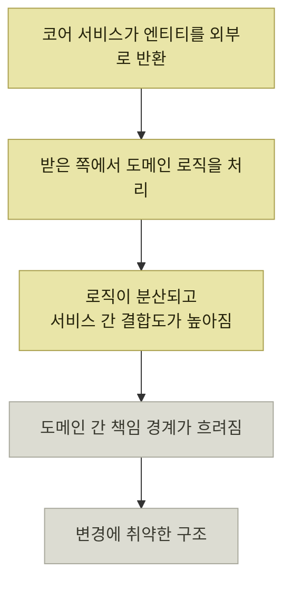

# Step 2 — 모듈 내부 응집도 높이기

> [전체 서비스를 관통하는 도메인 모듈 안전하게 분리하기](./README.md)

## 빠른 복습
- 도메인 간 결합은 끊었지만, **단순히 이동한 재고 도메인 내부 로직은 많이 분산되어 있었고, 이를 사용하는 유스케이스들도 유사한 형태로 반복**되었다.
- 그래서 **흩어진 흐름을 하나로 정리하고 중복된 유스케이스를 정돈해 도메인 내부의 복잡도를 줄이는** 리팩터링을 추가로 했다.
- 역할을 갈랐다 — **코어 서비스는 기본 로직**, **유스케이스 구현체는 밸리데이션 · DTO 변환 · 여러 코어 서비스 조합**만.
- 응집을 해치는 주요 원인은 **엔티티를 외부로 반환하는 방식**이었다. 엔티티가 노출되면 **받은 쪽에서 도메인 로직을 처리하게 되어** 로직이 분산되고 결합도가 높아지며 **책임 경계가 흐려진다.**
- 그래서 두 규칙을 정했다 — **코어 서비스 외부로 엔티티를 직접 반환하지 않는다**, **다른 코어 서비스의 리포지터리는 직접 사용하지 않는다.**
- 대신 **필요한 데이터는 DTO나 인터페이스로 전달하고, 로직은 각 도메인 내부에서 처리**한다.

## 옮기기만 해서는 정돈되지 않는다

> **입/출고 도메인과 재고 도메인 간 직접적인 결합은 끊을 수 있어 도메인 간의 책임은 분리되었지만**, **단순히 이동한 재고 도메인 내부 로직은 많이 분산되어 있었고 이를 사용하는 유스케이스들도 유사한 형태로 반복**되었다.

> 그래서 **재고 도메인 모듈 내부의 응집도를 높이는 리팩터링 작업을 추가로 진행**했다. **흩어진 흐름을 하나로 정리하고 중복된 유스케이스를 정돈하여 도메인 내부의 복잡도를 줄여나갔다.**

**Step 1이 밖의 문제였다면 Step 2는 안의 문제**다. 모듈 경계를 그은 것만으로는 **안쪽이 정리되지 않는다**는 점이 이 절의 전제다.

## 역할을 나눈다

> **코어 서비스에서 기본적인 로직을 수행하도록 했고**, **유스케이스 인터페이스의 구현체에서는 밸리데이션과 코어 서비스 수행을 위한 DTO 변환, 여러 코어 서비스 조합 등의 역할만 하도록** 했다.

| 계층 | 무엇을 하는가 |
| --- | --- |
| **유스케이스 구현체** | **밸리데이션** · **DTO 변환** · **여러 코어 서비스 조합** |
| **코어 서비스** | **기본적인 도메인 로직** |

표를 읽는 법. 위 칸에 **도메인 로직이 없다**는 것이 핵심이다. 이 구분은 [『아키텍트 첫걸음』 2.3의 핵심 로직 ↔ 프로세스 로직](../../아키텍트-첫걸음/2-소프트웨어-설계/3-소프트웨어-설계-원칙과-실천-방법.md#핵심-로직과-프로세스-로직)과 같다 — 그 책은 **프로세스 로직은 스스로 업무 규칙을 갖지 않고 조정자 역할만 한다**고 했고, 여기서 유스케이스 구현체가 정확히 그 자리다.

## 엔티티를 외부로 반환하지 않는다

> **코어 서비스의 로직 응집을 해치는 주요 원인**으로 **엔티티를 외부로 반환하는 방식이 로직 전반에 걸쳐 있음**을 알게 되었다.

*엔티티 하나를 밖으로 내보내는 것에서 시작해 구조가 무너지는 경로*

> **엔티티가 외부로 노출되면 받은 쪽에서 도메인 로직을 처리하는 일이 발생하기 쉽기에, 로직이 분산되고 서비스 간 결합도가 높아지며 도메인 간 책임 경계도 흐려진다.** **변경에 취약한 구조가 되기 쉽다.**

그래서 규칙을 정했다.

| 규칙 |
| --- |
| **코어 서비스 외부로 엔티티를 직접 반환하지 않는다** |
| **다른 코어 서비스의 리포지터리는 직접 사용하지 않는다** |

> 대신 **필요한 데이터는 DTO나 인터페이스를 통해 전달하고, 로직은 각 도메인 내부에서 처리**하도록 했다.

**두 규칙이 같은 것을 막는다**는 점을 눈여겨본다. 첫 규칙은 **데이터가 새어 나가는 것**을, 둘째 규칙은 **남의 데이터에 손을 뻗는 것**을 막는다. 방향만 반대이고 목적은 하나 — **도메인 로직이 그 도메인 안에서만 일어나게 하는 것**이다.

이것은 [『좋은 코드의 기준』 2장이 합계 금액 계산을 `ShoppingCart` 안으로 옮긴 것](../../내-코드가-불안한-개발자를-위한-좋은-코드의-기준/02-움직이는-코드에서-뜻을-전하는-코드로/4-코드로-도메인-지식-표현하기.md#로직을-도메인-객체로-옮기면-중복이-사라진다)과 같은 이야기를 **모듈 규모로** 한 것이다. 그 책은 화면 쪽에 흩어진 계산식을 도메인 객체로 옮겼고, 이 팀은 **서비스 밖으로 나간 엔티티를 통해 흩어진 로직**을 도메인 안으로 되돌렸다.

**규칙을 문서로만 두지 않았다**는 점도 중요하다. [Step 3의 ArchUnit](./4-Step-3-안전하게-배포하기.md#규칙을-코드로-강제한다)이 이 규칙들을 코드 수준에서 지켜준다.

## 함께 읽기
- [다음 절 — 이 변경을 무사히 내보내는 방법](./4-Step-3-안전하게-배포하기.md)
- [『아키텍트 첫걸음』 2.3 핵심 로직과 프로세스 로직](../../아키텍트-첫걸음/2-소프트웨어-설계/3-소프트웨어-설계-원칙과-실천-방법.md#핵심-로직과-프로세스-로직)
