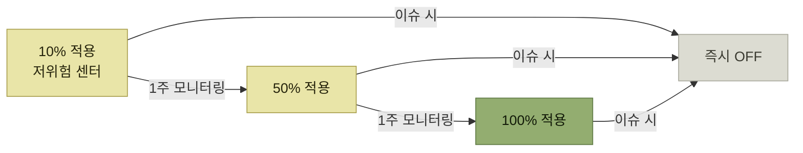

# Step 3 — 안전하게 배포하기

> [전체 서비스를 관통하는 도메인 모듈 안전하게 분리하기](./README.md)

## 빠른 복습
- 도메인 분리는 **클래스 이동을 넘어 연관관계 제거, JOIN 절 제거 등 로직 전반의 구조 변경**이었고 **231개의 API에 영향**을 끼쳤다.
- **재고는 핵심 도메인**이라 작은 이슈 하나도 전반에 영향을 줄 수 있었다. **매번 QA 인력을 투입할 수는 없어** 제한된 리소스로 안정성을 확보할 전략이 필요했다.
- **작은 변경이라도 반드시 피처 플래그를 적용하는 원칙**을 세웠다. **27개 플래그**를 활용했고 **센터 단위**로 제어했다(전체 **약 70여 개 센터**).
- 적용은 **10% → 50% → 100%** 순이며 **각 단계마다 1주 모니터링**, **이슈 시 즉시 OFF**다.
- **2주 스프린트 중 매주 배포**했고 **배포 주기가 최대 2주를 넘지 않도록** 했다.
- **유닛·통합 테스트**를 집중 작성해 QA 리소스가 부족할 때의 사전 검증을 대신했다.
- **주 1회 개발자 밋업 · ADR · 주 1회 도서 스터디 · ArchUnit** 으로 방향과 규칙을 유지했다.

## 영향 범위 — API 231개

> 도메인 분리는 **클래스 이동을 넘어서서 연관관계 제거, JOIN 절 제거 등 로직 전반에 걸친 구조 변경**이 필요했고, 이는 **231개의 API에 영향**을 끼쳤다.

> **재고는 시스템 내에서도 핵심 도메인**이었고 **작은 이슈 하나만 발생해도 전반적인 기능에 영향**을 줄 수 있었다. **장애 없는 안전한 배포가 최우선 과제**였으나 **매번 QA 인력을 투입할 수는 없었기에**, 제한된 리소스 안에서 안정성을 확보하기 위한 다양한 전략이 필요했다.

## 피처 플래그

- **작은 변경이라도 반드시 피처 플래그를 적용하는 원칙**을 수립했다.
- **27개의 플래그**를 활용하고 **점진적 배포와 모니터링을 병행**했다.
- 플래그는 **센터(각 지역 단위의 물류 거점/운영 단위) 단위로 제어**되도록 설계했다.
- **전체 약 70여 개 센터**를 대상으로 **테스트 목적에 따라 적용 대상을 다르게** 설정했다.

| 목적 | 적용 순서 |
| --- | --- |
| **운영 리스크를 최소화해야 할 때** | **주문량이 적은 센터부터** 순차적으로 |
| **영향도를 빠르게 파악하고자 할 때** | **주문량이 많은 센터부터** |

표를 읽는 법. **같은 도구를 반대 방향으로 쓴다.** 안전을 원하면 조용한 곳부터, 정보를 원하면 붐비는 곳부터다. 무엇을 먼저 알고 싶은지가 순서를 정한다.



*[그림] 피처 플래그 적용 단계 — 어느 단계에서든 이슈가 나면 즉시 OFF로 빠진다*

> **피처 플래그 조건을 유연하게 설정한 덕분에 전체 시스템에 영향을 주지 않으면서도 안정적으로 변화된 로직을 운영 환경에 반영**할 수 있었다. **롤백 없이 스위치 ON/OFF만으로 빠르게 대응**할 수 있었기에 안정적으로 운영 가능했다.

> 또한 **플래그를 추가할 때는 제거 시점까지 함께 계획**하여 **일정이 지난 플래그는 코드에 남지 않도록 주기적으로 정리**했다.

**"롤백 없이"** 가 이 도구의 값이다. 배포를 되돌리는 것과 스위치를 내리는 것은 **소요 시간과 위험이 다르다.** 그리고 **제거 시점까지 함께 계획한다**는 규칙이 없으면 플래그 자체가 [기술 부채](../../내-코드가-불안한-개발자를-위한-좋은-코드의-기준/01-왜-좋은-코드를-작성해야-할까/3-기술-부채.md)가 된다 — 조건 분기가 영원히 남는다.

## 작은 단위로 자주 배포하기

- **영향 범위 최소화를 위해 2주 스프린트 과정 중 매주 배포**했고, **배포 주기가 최대 2주를 넘지 않도록** 했다.
- **피처 플래그 덕분에 코드 리뷰와 QA가 완료된 기능은 바로 배포**할 수 있었다.
- **대부분의 기능은 플래그로 감싸져 있었고 영향 범위도 작았기 때문에 이슈 발생 시 원인 파악이 쉬웠고 사전 대응 방안도 마련 가능**했다.
- **관련 개발자 외 다른 팀원들과는 간단한 공유만으로 충분**했고 **배포 리스크를 팀 전체로 확산시키지 않을 수 있었다.**

마지막 항목이 눈에 걸린다. **배포의 비용에는 사람의 주의도 포함된다.** 큰 배포는 팀 전체를 대기 상태로 만들지만, 작은 배포는 관련자만 지켜보면 된다. 이 책 1장의 코틀린 전환 사례도 같은 결론에 도달했다.

## 테스트 코드

> **로직 변경이 많은 작업에서는 유닛 테스트, 통합 테스트를 집중적으로 작성**했다. **QA 리소스가 제한되었을 때에도 테스트 코드가 사전 검증을 도와줬다.**

**QA 인력의 부족이 테스트 코드 작성의 이유**로 적혀 있다는 점을 그대로 읽어둘 만하다. [『아키텍트 첫걸음』 5.1](../../아키텍트-첫걸음/5-품질-보증과-테스트/1-아키텍트와-품질-보증을-위한-작업.md#테스트-자동화-정책)이 **리그레션 테스트를 수작업으로 반복하면 공수가 크므로 자동화하라**고 한 것과 같은 상황이다.

## 방향을 맞추는 방법

**개선 작업과 신규 과제 개발이 동시에 진행**되었기 때문에 **팀 내 지속적인 공유와 방향성 점검**이 이루어졌다.

| 수단 | 내용 |
| --- | --- |
| **주 1회 개발자 밋업** | **진행 상황을 공유**하고 **유의사항·고민 사항도 기록** |
| **ADR**(Architecture Decision Record) | **결정된 사항을 공유.** 팀 규칙이나 방향성이 확정되면 **이를 기반으로 코드에 반영.** 이후 개발에서 **일관성이 유지**되었고, **새 팀원이 합류하거나 과거 결정 배경을 확인할 때에도 큰 도움** |
| **주 1회 도서 스터디** | 신규 구조에 대해 **룰만 전달하는 것을 지양**하고 **왜 이런 구조를 택했는지 목적과 맥락을 함께 이해하고 공감**하는 것을 중시. **인상 깊은 문장을 읽으며 우리 팀과의 차이를 논의**하고 **내용을 위키에 기록** |
| **ArchUnit** | 구조 변경에 따라 생긴 규칙을 **문서 공유만으로는 충분치 않다고 판단**해, **코드 수준에서 규칙을 강제하고 구조가 흐트러지는 것을 방지** |

ADR 파일은 이런 식으로 쌓였다.

```text
doc/architecture/decisions/0001-domain-module-package.md
doc/architecture/decisions/0002-domain-module-usecase.md
doc/architecture/decisions/0003-domain-module-코드-작성-시-유의사항.md
```

**ADR을 실제로 이렇게 쓰는 팀의 기록**이라는 점에서 이 대목은 [『아키텍트 첫걸음』 3.5의 ADR](../../아키텍트-첫걸음/3-아키텍처-설계/5-아키텍처의-비교-평가.md#아키텍처-의사결정-기록)과 짝을 이룬다. 그 책은 ADR의 목적을 **"나중에 바꾸기 위해"** 라고 했는데, 이 사례는 여기에 **"새 팀원이 배경을 확인하기 위해"** 를 더한다.

### 규칙을 코드로 강제한다

> **구조적인 변경에 따라 팀 내에서 지켜야 할 규칙이 생겼고, 문서로 공유하는 것만으론 충분치 않다고 생각**했다. **ArchUnit으로 코드 수준에서 해당 규칙을 강제하고 구조가 흐트러지는 것을 방지**하고자 했다.

예: **`v1service` 패키지는 `application` 패키지에서만 접근할 수 있다.**

[Step 2에서 정한 두 규칙](./3-Step-2-모듈-내부-응집도-높이기.md)("엔티티를 반환하지 않는다", "남의 리포지터리를 쓰지 않는다")도 사람의 기억이 아니라 **테스트가 지킨다.** 이것이 [『아키텍트 첫걸음』 4.5](../../아키텍트-첫걸음/4-아키텍처-구현/5-애플리케이션-개발-준비.md#코딩-규약)가 말한 **"규약을 문서로만 두면 지켜지지 않지만, 정의 파일이 함께 오면 도구가 대신 지켜준다"** 의 아키텍처 버전이다.

## 도메인 분리 이후 변화

**SonarQube의 Activity에서 기간 분석**한 결과다(**Before: 최초 배포 2024.09.25 → After: 최종 배포 2025.03.19**).

<div class="tbl" style="overflow-x:auto">
<table>
<thead>
<tr>
<th style="text-align:center; white-space:nowrap">개선점</th>
<th style="text-align:center; white-space:nowrap">상세지표</th>
<th style="text-align:center; white-space:nowrap">Before</th>
<th style="text-align:center; white-space:nowrap">After</th>
<th style="text-align:center; white-space:nowrap">개선 수치</th>
</tr>
</thead>
<tbody>
<tr>
<td style="text-align:center; white-space:nowrap" rowspan="3"><b>테스트 코드 작성을 통한<br>커버리지 증가</b></td>
<td style="text-align:center; white-space:nowrap">Condition coverage</td>
<td style="text-align:center; white-space:nowrap">9.1%</td>
<td style="text-align:center; white-space:nowrap">17.5%</td>
<td style="text-align:center; white-space:nowrap"><b>+92.3%</b></td>
</tr>
<tr>
<td style="text-align:center; white-space:nowrap">Line coverage</td>
<td style="text-align:center; white-space:nowrap">9.3%</td>
<td style="text-align:center; white-space:nowrap">20.5%</td>
<td style="text-align:center; white-space:nowrap"><b>+120.4%</b></td>
</tr>
<tr>
<td style="text-align:center; white-space:nowrap">Unit tests</td>
<td style="text-align:center; white-space:nowrap">1,136</td>
<td style="text-align:center; white-space:nowrap">1,577</td>
<td style="text-align:center; white-space:nowrap"><b>+38.8%</b></td>
</tr>
<tr>
<td style="text-align:center; white-space:nowrap" rowspan="3"><b>리팩터링을 통한<br>코드 복잡도 감소</b></td>
<td style="text-align:center; white-space:nowrap">Cognitive complexity</td>
<td style="text-align:center; white-space:nowrap">9,608</td>
<td style="text-align:center; white-space:nowrap">8,271</td>
<td style="text-align:center; white-space:nowrap"><b>-13.9%</b></td>
</tr>
<tr>
<td style="text-align:center; white-space:nowrap">Cyclomatic complexity</td>
<td style="text-align:center; white-space:nowrap">27,984</td>
<td style="text-align:center; white-space:nowrap">25,864</td>
<td style="text-align:center; white-space:nowrap"><b>-7.6%</b></td>
</tr>
<tr>
<td style="text-align:center; white-space:nowrap">Lines</td>
<td style="text-align:center; white-space:nowrap">383,646</td>
<td style="text-align:center; white-space:nowrap">357,173</td>
<td style="text-align:center; white-space:nowrap"><b>-6.9%</b></td>
</tr>
</tbody>
</table>
</div>

*원서의 SonarQube 기간 분석 표*

표를 읽는 법. **커버리지의 절대값이 17.5%·20.5%로 여전히 낮다**는 점을 함께 봐야 한다. 증가율(+92%, +120%)은 크지만 출발점이 9%대였다. [『아키텍트 첫걸음』이 인용한 구글 기준](../../아키텍트-첫걸음/5-품질-보증과-테스트/2-기능-테스트-자동화.md#단위-테스트의-핵심-원칙)(60% 허용·75% 칭찬·90% 모범)에 대면 아직 아래쪽이며, **이 작업의 목적이 커버리지 달성이 아니라 구조 분리였다**는 뜻으로 읽는 것이 맞다. 그리고 **Lines가 6.9% 줄었다**는 것은 [Step 2의 중복 유스케이스 정돈](./3-Step-2-모듈-내부-응집도-높이기.md)이 실제로 코드량을 줄였다는 신호다.

### 팀이 체감한 변화

**팀 내 개발자를 대상으로 리팩터링 후 체감되는 영향에 대해 5점 만점의 설문조사**를 진행했다. **개선된 구조에 적응하는 시간은 개인별 편차가 있었지만**, 전반적으로 이런 답변을 얻었다.

- **변경된 엔티티 구조에 대한 이해도는 평균 4.14점**으로 대체로 긍정적
- **리팩터링 효과에 대한 동의**(각 항목 평균 4점 이상)
  - **코드 수정/확장 범위 감소**
  - **클래스 간 책임과 역할 명확화**
  - **코드 리뷰 및 테스트 작성/수정이 용이함**
  - **개발 효율성 향상**

### 그럼에도 남은 솔직한 회고

> **사실 도메인 분리를 하면 모든 것이 더 깔끔해질 줄 알았다.** 하지만 **실제로는 같은 기능을 구현하더라도 더 많은 코드가 필요했고, 작은 결정 하나에도 고민해야 할 순간들이 많았다.**

> 그럼에도 **이런 고민과 의사결정의 과정을 통해, 어떻게 하면 더 안정적으로 배포할 수 있을지, 어떻게 하면 팀원들과 더 잘 소통하고 같은 방향을 바라볼 수 있을지에 대해 많이 배우고 성장할 수 있었다.**

이 회고가 이 장에서 가장 값진 문장이다. **분리의 대가로 코드가 늘었다**는 것을 숨기지 않는다. [『아키텍트 첫걸음』 3.4가 클린 아키텍처의 대가로 "인터페이스와 컴포넌트의 증가"](../../아키텍트-첫걸음/3-아키텍처-설계/4-애플리케이션-아키텍처-선정.md#공짜가-아니다)를 적어둔 그 비용을 실제로 치른 기록이다.

## 핵심 정리

- 231개 API에 영향을 주는 구조 변경을 **무장애로** 내보낸 방법은 **피처 플래그(27개, 센터 단위, 10→50→100%)** 와 **주 1회 배포**였다.
- 플래그는 **제거 시점까지 계획**해야 그 자체가 부채가 되지 않는다.
- QA 리소스의 한계를 **유닛·통합 테스트**로 메웠다.
- 방향은 **밋업 · ADR · 스터디**로 맞추고, 규칙은 **ArchUnit으로 강제**했다.
- 결과는 **복잡도 감소와 코드량 감소**, 그리고 **설문 4점대의 체감**. 다만 **같은 기능에 더 많은 코드가 필요해진 것**도 사실이다.

## 함께 읽기
- [이 장의 목차](./README.md)
- [『아키텍트 첫걸음』 3.5](../../아키텍트-첫걸음/3-아키텍처-설계/5-아키텍처의-비교-평가.md) — ADR과 판단 보류
- [『AI 시대의 엔지니어링 전략』 4.6 마찰 로그](../../ai-시대의-엔지니어링-전략/04-자사-제품-체험/6-마찰-로그.md) — 팀이 방어적이지 않게 피드백을 주고받는 문화와 규범
- [『AI 시대의 엔지니어링 전략』 5장](../../ai-시대의-엔지니어링-전략/05-지속적인-사용자-이해/README.md) — 기능 플래그와 점진 배포를 피드백·관측성·지표의 순환으로 연결하는 방법
