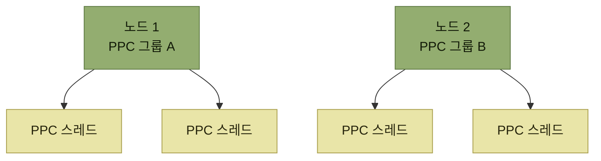

# 피크매니지먼트 — 기술 방향

> [B마트 OMS의 물류주문관리를 통한 출고 최적화](./README.md)

## 빠른 복습
- 과제의 핵심은 **변경되는 출고 요청 로직을 정확하게 반영하면서 시스템의 확장성과 안정성까지 고려한 아키텍처 설계**였다.
- **출고 요청은 단순한 트리거가 아니라, 피패킹센터 단위로 실시간 처리할 수 있는 주문만 선별해 분산 요청하는 핵심 비즈니스 로직**이다.
- **PPC(피패킹센터)는 물리적·시스템적으로 완전히 독립된 단위로 동작**한다. 이 사실을 그대로 아키텍처 분리 기준으로 삼았다.
- 성능은 두 층으로 확보했다 — **단일 노드 내 멀티스레드 기반 PPC 병렬 처리**, **노드 단위 수평 확장**.
- 그러나 **실제 병목은 시스템이 아니라 물리적 제약**이다. 그래서 **불필요하게 높은 TPS를 위한 과도한 최적화는 피하고 비즈니스 로직의 정확성과 일관성에 집중**했다.
- 규칙을 예측 가능하게 만든 방법은 **기획서의 추상화 수준을 그대로 코드에 옮기기**, **결정성 확보**, **비즈니스 정의와 코드의 1:1 매핑 유지**다.
- 효과 — **시간대별 주문이 15~18%씩 균등 분배**, **예약배달 주문 평균 출고 처리 시간 2.2분(19%) 단축.**

## 출고 요청은 트리거가 아니라 비즈니스 로직이다

> **출고 요청은 단순한 트리거를 넘어서 피패킹센터 단위로 실시간 처리할 수 있는 주문만 선별하여 분산 요청하는 핵심 비즈니스 로직**이다. 따라서 **주문 처리의 효율성과 작업 안정성을 좌우하기 때문에, 변화에 강하고 물리적 제약을 유연하게 반영할 수 있는 구조가 중요**했다.

**"선별"이라는 단어가 성격을 바꾼다.** 시각이 되면 내보내는 일이라면 스케줄러로 끝나지만, **누구를 지금 내보낼지 고르는 일**이면 조건이 얽힌 도메인 로직이다.

## PPC 단위로 쪼갠다

**PPC는 물리적으로도 시스템적으로도 독립된 단위로 동작한다.** 아키텍처를 그 경계에 맞췄다.

*두 층의 병렬 — 노드 안에서는 스레드로, 노드 밖에서는 노드 수로 늘린다*

| 층 | 무엇을 해결하는가 |
| --- | --- |
| **단일 노드 내 멀티스레드 기반 PPC 병렬 처리** | **하나의 노드 안에서 각 PPC 단위를 멀티스레드로 병렬 처리**해 **노드 리소스로 인한 병목을 회피** |
| **노드 단위 수평 확장** | **한 노드로 감당하기 어려운 경우 여러 노드에 PPC 그룹을 분산 배치**해 확장성 확보 |

표를 읽는 법. 두 줄은 **같은 분할 기준(PPC)을 스레드와 노드에 각각 적용**한 것이다. 그래서 **PPC 수가 늘어도 병목 없이 확장**할 수 있고, **각 PPC가 독립적으로 작동하므로 여러 작업을 동시에 처리하면서도 확장하기 쉬운 구조**가 된다.

**도메인의 자연스러운 경계가 곧 병렬화 단위**라는 점이 이 설계의 값이다. [2장이 피처 플래그를 센터 단위로 제어한 것](../02-전체-서비스를-관통하는-도메인-모듈-안전하게-분리하기/4-Step-3-안전하게-배포하기.md#피처-플래그)과 같은 감각이다 — **센터는 이미 나뉘어 있으니 시스템도 그 선을 따른다.**

## 성능은 어디에서 막히는가

**주문 수가 많아졌을 때 실제 성능이 좋아졌는가**를 물었고, 답은 **물리적 제약을 봐야 한다**는 것이었다.

- **PPC는 작업 공간, 인력 수, 작업 순서 등 물리적인 제약이 있어 실제로 처리 가능한 주문 수에는 현실적인 한계가 있다.**
- **단건 기준의 성능을 확보한 상태라면 전체 처리 시간은 결국 물리적 처리 능력에 따라 결정된다.**
- 따라서 **불필요하게 높은 TPS를 위한 과도한 최적화는 피하고, 비즈니스 로직의 정확성과 일관성을 유지하는 데 집중**했다.

> 이 두 가지 철학으로 **현실적인 주문량과 물리적 병목 조건을 기반으로 설계**함으로써 **과도한 복잡성을 피하고 안정적인 운영이 가능한 구조**를 만들었다.

**성능 목표를 시스템이 아니라 현장에서 가져왔다.** [『아키텍트 첫걸음』 5.3](../../아키텍트-첫걸음/5-품질-보증과-테스트/3-성능-테스트.md#부하-테스트)이 **부하 테스트의 목표치는 업무량 예측에서 나온다**고 한 것과 같은 이야기이며, 여기서는 그 예측의 상한이 **사람과 공간**이다. 시스템을 10배 빠르게 만들어도 **피킹하는 손이 10배가 되지는 않는다.**

## 비즈니스 규칙을 예측 가능하게 만든 방법

> **출고 요청은 복잡한 조건들이 얽힌다.** 그래서 **예측 가능하고 명확한 규칙 기반 설계**가 필요했다.

| 방법 | 내용 |
| --- | --- |
| **비즈니스 정의의 추상화 수준을 코드에 반영** | 기능 구현에 그치지 않고 **기획서에 정의된 수식이나 조건의 추상화 수준을 그대로 코드에 옮겨** **해석의 여지를 없애고** 유지보수를 쉽게 했다 |
| **같은 입력에 같은 결과를 보장(결정성)** | 비즈니스 로직이 **외부 상태나 순서에 의존하지 않도록** 설계. **테스트 자동화와 변수에 따른 결과 분석**에 도움이 되었다 |
| **결과는 유지하되 더 효율적·안전한 방식으로 리팩터링** | 개선점이 발견되면 코드만 바꾸지 않고 **비즈니스 정의 자체도 함께 업데이트**해 **늘 1:1 매핑되도록 관리** |

표를 읽는 법. 세 줄이 **같은 규율의 세 면**이다. 기획서와 코드의 표현 수준을 맞추고, 그 코드가 결정적이게 하고, 어느 한쪽만 바뀌지 않게 지킨다. **셋 중 하나라도 빠지면 "기획서를 봐도 코드 동작을 알 수 없는" 상태로 되돌아간다.**

> **비즈니스 정의와 코드 간의 표현 수준이 같고 테스트 데이터가 동일하면, 입력에 대한 결과가 항상 일정**하여 **정확한 테스트 · 변경 대응의 용이성 · 운영 시 신뢰도 확보**라는 세 가지 측면에서 장점을 얻는다.

이것은 [『좋은 코드의 기준』 2장의 유비쿼터스 언어](../../내-코드가-불안한-개발자를-위한-좋은-코드의-기준/02-움직이는-코드에서-뜻을-전하는-코드로/4-코드로-도메인-지식-표현하기.md#유비쿼터스-언어를-찾는다)를 **수식 수준까지 밀어붙인 사례**다. 그 책은 이름을 맞추라고 했고, 이 팀은 **기획서의 조건식 구조까지** 맞췄다. 그리고 **결정성**은 [다음 과제의 시뮬레이션](./4-동적-출고-예정-시각-시뮬레이션으로-검증하기.md)이 성립하기 위한 전제이기도 하다.

## 정리 — 무엇이 반영된 구조인가

- **변경 가능한 출고 요청 로직을 유연하게 반영할 수 있는 구조**
- **PPC 단위의 물리적 제약 조건을 고려한 현실적 처리 모델**
- **독립성과 병렬성을 활용한 확장 가능하고 안정적인 아키텍처**
- **비즈니스 정의 추상화 수준을 그대로 코드로 구현한, 명확하고 테스트할 수 있는 규칙 로직**

## 효과

| 지표 | 결과 |
| --- | --- |
| **시간대별 주문 분포** | **1시간을 10분 단위로 나누어 분석**했을 때, 특정 시간대에 몰리던 주문이 **15~18%씩 균등 분배** |
| **예약배달 주문 평균 출고 처리 시간** | **2.2분 감소(19% 단축)** |
| **출고대기장** | **운영 효율 증대, 작업자 피로도 감소** |
| **라이더** | **도착 시점 출고 완료 비중 증가** |

표를 읽는 법. 앞의 두 줄은 숫자로 잡히는 성과이고, 뒤의 두 줄은 **사람이 체감하는 성과**다. 특히 마지막 줄은 **다음 과제(동적 출고 예정 시각)가 정면으로 겨냥하는 지표**이므로, 두 과제가 같은 문제의 앞뒤임을 보여준다.

## 함께 읽기
- [다음 절 — 라이더가 기다리지 않게 만드는 두 번째 과제](./3-동적-출고-예정-시각-기획-방향.md)
- [『아키텍트 첫걸음』 5.3 확장성 테스트](../../아키텍트-첫걸음/5-품질-보증과-테스트/3-성능-테스트.md#확장성-테스트) — 수평 확장이 실제로 선형인지 확인하는 방법
