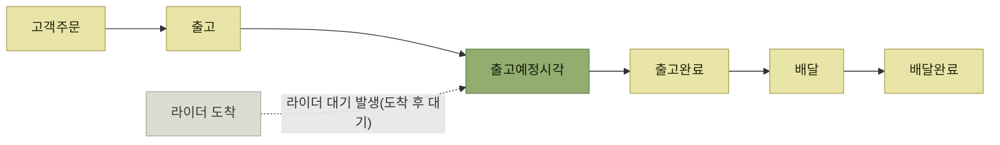
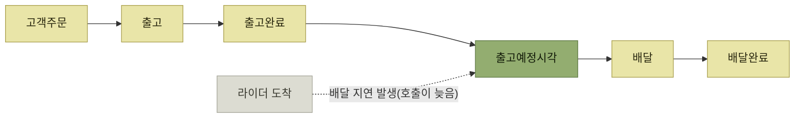
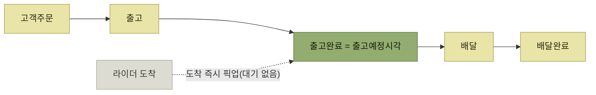
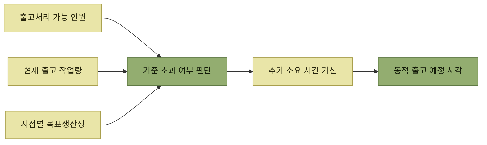

# 동적 출고 예정 시각 — 기획 방향

> [B마트 OMS의 물류주문관리를 통한 출고 최적화](./README.md)

## 빠른 복습
- OMS의 **출고 예정 시각**은 **출고가 완료될 예정 시각**이다. **배달 생성 요청 시 픽업 준비 소요 시간으로 적용**된다 — **"이때까지 출고가 완료될 예정이니 픽업하러 와달라".**
- **AS-IS는 주문 생성 시점으로부터 고정된 시간을 더하는 단순 계산식**이었다. **현장의 실제 출고 여건을 고려하지 않아 피크타임에 주문이 몰리면 현실과 괴리**가 생겼다.
- 어긋나는 방향은 두 가지다 — **예정 시각이 실제보다 빠르면 라이더 대기**, **늦으면 배달 지연.** **최적은 출고 완료 = 출고 예정 시각**이다.
- 그래서 **현장 상황에 맞춰 동적으로 산정하는 로직**이 필요해졌다.
- 산정의 두 축은 **출고처리 가능 인원**과 **지점별 목표생산성 기반 소요 시간 가산**이다.
- 검증은 **실제 지점 데이터로 하루 치 주문을 순차 처리하는 시뮬레이션**으로 했다.

## 출고 예정 시각이 무엇을 결정하는가

이 시각은 **OMS 내부의 참고값이 아니라 라이더 호출의 근거**다. 그래서 틀리면 **사람이 기다린다.**

*[그림] 실제 출고 완료보다 빠른 출고예정시각 — 라이더가 먼저 와서 기다린다*

*[그림] 실제 출고 완료보다 늦은 출고예정시각 — 상품은 준비됐지만 배달이 밀린다*

*[그림] 최적(Optimal) — 출고 완료와 출고 예정 시각이 일치하고, 라이더 도착도 그 시점이다*

세 도식이 말하는 것은 하나다. **예정 시각은 늦게 잡아도 이르게 잡아도 손실**이며, **정확해야만 이득**이다. 늦게 잡으면 라이더 호출과 배달이 지연되고, 이르게 잡으면 라이더가 출고 완료 전에 도착해 대기한다.

## AS-IS의 문제

> AS-IS의 출고 예정 시각은 **주문이 생성된 시점으로부터 고정된 시간을 더하는 단순 계산식**이었다. **현장의 실제 출고 여건을 고려하지 않았기 때문에 피크타임에 여러 주문이 동시에 몰려드는 경우 현실과 괴리가 발생**했다.

**고정 가산값의 약점은 부하에 반응하지 않는다는 것**이다. 주문이 1건일 때와 100건일 때 같은 값을 더하면, 후자에서는 반드시 늦는다.

## 산정 모델의 두 축

### 출고처리 가능 인원 기반 모델

- **총 인원이 아니라 출고 작업이 가능한 인원**을 기준으로 계산한다. **입고·진열·지원 등 업무를 병행하는 인력의 가용성까지 포함**해서 본다.
- **각 피패킹센터 지점별 운영 형태와 작업자 전환 비율을 반영**해 **인력 가용성 로직을 커스터마이징할 수 있도록** 설계했다.

**"현장에 몇 명 있는가"가 아니라 "지금 출고에 몇 명을 쓸 수 있는가"** 를 세는 것이 핵심이다. 지점마다 운영 형태가 다르므로 이 환산 비율 자체를 **설정 가능한 값**으로 뺐다.

### 생산성 기반 소요 시간 가산

- **지점의 구조 및 출고 전략 등을 고려한 피패킹센터 지점별 목표생산성**을 기반으로 **출고 예정 시각에 추가 시간이 더 필요한 기준을 산정**한다.
- 그 기준에 맞추어 **예상 소요 시간을 더한다.**
- **특정 기준을 초과했을 때 어느 정도 시간을 더해야 너무 과하게 산정하지 않으면서 라이더 대기 시간을 최소화할 수 있을지**를 고려했다.

*가용 인원 · 작업량 · 목표생산성 세 값을 비교해 얼마를 더할지 정한다*

**가산은 양날**이다. 많이 더하면 라이더는 안 기다리지만 배달이 늦고, 적게 더하면 반대다. 원서가 **"너무 과하게 산정하지 않으면서"** 를 함께 적어둔 이유다.

## 시뮬레이션 기반 정합성 검증

- **새로운 출고 예정 시각 산정 로직을 실제 지점 데이터에 적용**해 **하루 치 주문 데이터를 순차 처리한 결과**를 확인했다.
- **기존 방식 대비 신규 모델 시뮬레이션에서 출고 지연과 조기 완료 편차가 줄어듦**을 **시각화 자료와 정의한 지표**를 통해 확인했다.

**운영에 넣기 전에 하루를 다시 살려본 것**이다. 이 검증을 성립시키기 위한 기술적 장치들이 [다음 절](./4-동적-출고-예정-시각-시뮬레이션으로-검증하기.md)의 내용이다.

## 함께 읽기
- [다음 절 — 시뮬레이션을 신뢰할 수 있게 만드는 방법](./4-동적-출고-예정-시각-시뮬레이션으로-검증하기.md)
- [『WMS 원리와 이해』 5.5 차량배차](../../wms-원리와-이해/05-출고-프로세스/5-차량배차.md) — 출고 완료 시점과 차량(라이더) 도착 시점을 맞추는 문제는 전통 물류에서도 같다
