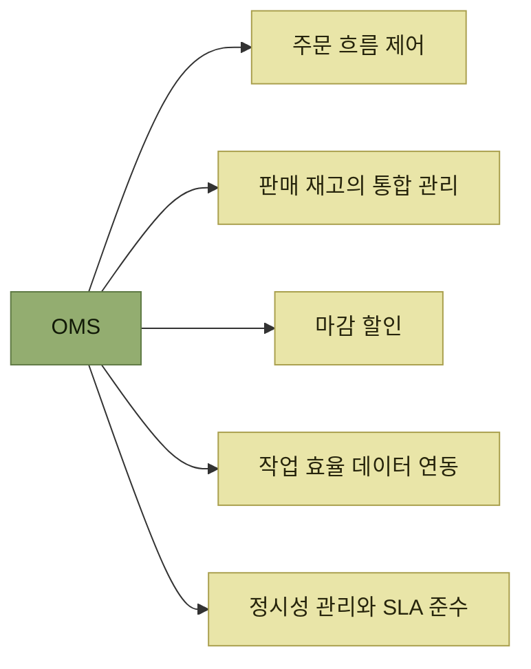
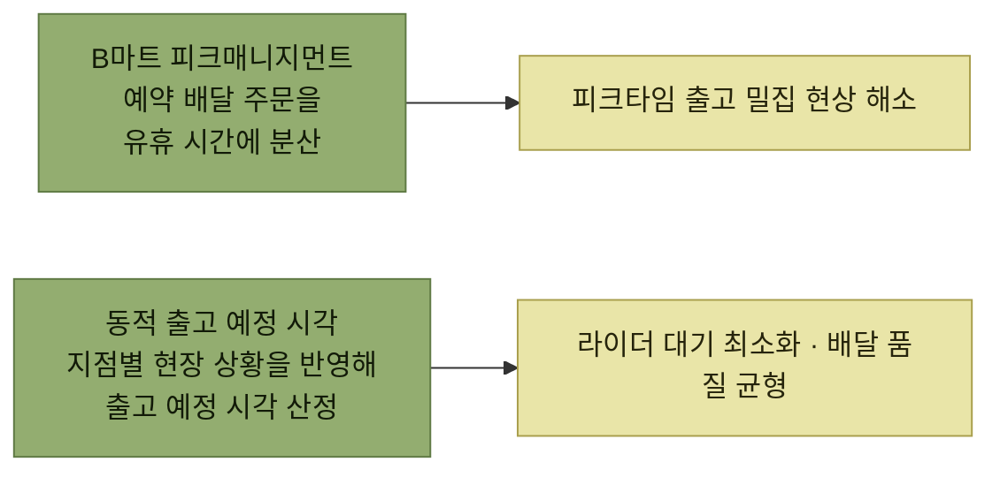

# B마트 OMS의 물류주문관리를 통한 출고 최적화

> [요즘 우아한 백엔드 개발](../README.md)

## 빠른 것만으로는 퀵커머스가 완성되지 않는다

**퀵커머스는 "지금" 주문한 상품이 "금방" 도착하는 경험**을 제공한다. 그런데 **속도 중심의 서비스는 "빠른 것"을 넘어서** 세 주체 모두에게 각자의 품질이 보장되어야 완성된다.

| 누구에게 | 무엇이 보장되어야 하는가 |
| --- | --- |
| **고객** | **정시성**과 **정확성** |
| **라이더** | 도착 시점의 **일관성**, **대기 최소화** |
| **피패킹센터 현장 작업자** | **예측 가능한 작업 부하**, **안정적인 운영** |

표를 읽는 법. 이 셋은 **서로 당긴다.** 고객의 정시성만 좇으면 현장에 주문이 몰리고, 현장 부하만 고르게 하면 상품이 너무 일찍 나와 라이더가 없는 채로 기다린다. **이 장의 두 과제는 각각 이 긴장 중 하나를 푼다.**

우아한형제들의 **B마트는 자체 OMS(Order Management System)를 구축**해 물류 최적화 전략을 실행한다. **B마트에서 발생하는 모든 주문의 흐름을 제어하고, 주문 생성부터 출고·배송까지의 전 과정을 유기적으로 연결**한다. **단순한 주문처리시스템이 아니라 고객 수령 경험, 현장의 작업 여건, 라이더의 업무 흐름까지 고려한 전방위적 최적화 시스템**이다.

*OMS가 맡는 다섯 가지 역할*

| 역할 | 내용 |
| --- | --- |
| **주문 흐름 제어** | 주문이 **출하 단위인 Shipment로 분리**되어 OMS를 통해 처리된다. **주문 접수 시 재고를 확인해 출고 가능 여부를 판단**하고, 이후 **배송 가능성을 고려해 후속 프로세스를 제어** |
| **판매 재고의 통합 관리** | **가용 재고, 입고 예정 재고, 이미 할당된 재고를 실시간으로 반영**해 주문 가능 상태를 조절. **품절 방지와 고객 신뢰도 유지**에 기여 |
| **마감 할인** | **소비 기한과 수요 예측 데이터**를 바탕으로 할인 대상 상품을 정의하고 **수량·할인률을 유동적으로 조정.** 상품 폐기율을 줄이고 소비자에게 합리적 소비 기회 제공 |
| **작업 효율 데이터 연동** | **지점별 작업 인원, 과거 출고 처리량, 피크 타임 분석** 등 운영 데이터를 바탕으로 **출고 요청 타이밍을 제어하고 라이더 호출 시점을 결정.** 실시간 현장 대응력의 기반 |
| **정시성 관리와 SLA 준수** | 각 주문의 **처리 이력을 추적**하고 **실제 출고 완료 시각과 목표 출고 시각 간의 편차를 관리** |

표를 읽는 법. 다섯 줄 모두 **"주문을 저장한다"가 아니라 "언제 무엇을 시킬지 정한다"** 는 일이다. 그래서 이 시스템은 주문 저장소가 아니라 **스케줄러이자 판단기**다.

## 이 장이 다루는 두 과제

*두 과제는 각각 "언제 만들지"와 "언제 끝날지"를 다룬다*

## 목차

- [피크매니지먼트 — 기획 방향](./1-피크매니지먼트-기획-방향.md)
- [피크매니지먼트 — 기술 방향](./2-피크매니지먼트-기술-방향.md)
- [동적 출고 예정 시각 — 기획 방향](./3-동적-출고-예정-시각-기획-방향.md)
- [동적 출고 예정 시각 — 시뮬레이션으로 검증하기](./4-동적-출고-예정-시각-시뮬레이션으로-검증하기.md)

## 함께 읽기

- [『WMS 원리와 이해』 5장 출고 프로세스](../../wms-원리와-이해/05-출고-프로세스/README.md) — 이 장이 최적화하는 **출고**가 창고 안에서 실제로 어떤 단계를 밟는지(출고예정 수신 → 출고가능 체크 → 할당 → 피킹 → 출고).
- [2장 도메인 모듈 분리](../02-전체-서비스를-관통하는-도메인-모듈-안전하게-분리하기/README.md) — 같은 물류 플랫폼의 다른 팀 이야기이며, **"물리적 한계가 먼저 온다"** 는 판단이 이 장과 겹친다.
- [13장 WMS 재고 이관 분산 락](../13-wms-재고-이관을-위한-분산-락-사용기/README.md) — 이 장이 시뮬레이션으로 순차 처리 병목을 받아들여도 되는지 검증했다면, 13장은 락의 범위를 줄여 SKU 병렬성을 유지한다.
- [『아키텍트 첫걸음』 3.2 품질 속성](../../아키텍트-첫걸음/3-아키텍처-설계/2-아키텍처-드라이버의-핵심-사항.md#품질-속성) — 정시성·일관성·예측 가능성을 **드라이버로 놓고 설계를 정하는** 방식.

## 참고

- 원 소스: 우아한형제들 기술블로그, [B마트 OMS의 물류주문관리를 통한 출고 최적화](https://techblog.woowahan.com/22263/)
