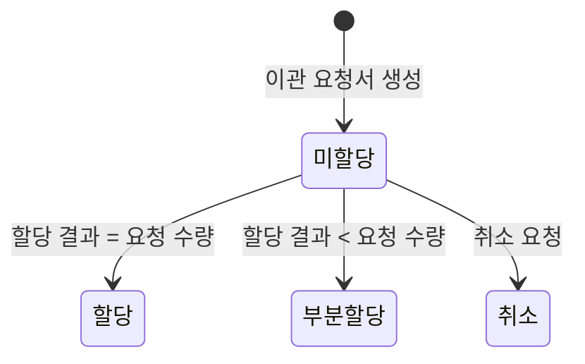

# 이관 요청서와 할당

> [WMS 재고 이관을 위한 분산 락 사용기](./README.md)

## 빠른 복습
- **DC에서 PPC로 재고를 이관할 때 WMS에 이관 요청서를 생성**한다. 요청서에는 **출발지 센터 · 목적지 센터 · SKU · 이관 수량**이 담긴다.
- 생성 직후의 **할당 상태는 미할당**이다.
- **할당은 동일한 상품이 물류 센터 내 여러 위치에 흩어져 있을 때 작업자가 출고할 상품을 선정하는 작업**이다. **이관 요청서로 재고를 옮기려면 할당 상태를 미할당에서 할당으로 바꾸어야 한다.**
- 할당은 **내부 로직에 의한 자동 할당 로케이션 지정**으로도, **DC 관리자의 수동 지정**으로도 가능하다.
- **이관 요청서를 잘못 생성했으면 취소할 수 있다. 단 할당 상태가 미할당이어야만 가능**하다.
- 할당 상태는 **할당 결과에 따라** 할당 · 부분 할당 · 미할당 · 취소 중 하나가 된다.

## 이관 요청서

| 출발지 센터 | 목적지 센터 | SKU | 이관 수량 | 할당 상태 |
| --- | --- | --- | --- | --- |
| 인천 DC | 송파잠실PPC | 배달이 피규어 (S01234) | 10 | 미할당 |

표를 읽는 법. **"무엇을 어디서 어디로 몇 개"까지는 요청서가 정하지만, "창고 어느 자리의 물건으로"는 아직 정해지지 않았다.** 그 미정 상태가 곧 `미할당`이며, 이 장의 사고는 **바로 이 미할당 구간에서** 일어난다.

**할당**은 [『WMS 원리와 이해』 5.4](../../wms-원리와-이해/05-출고-프로세스/4-할당-출고지시.md)가 자세히 다룬 그 작업이다. 그 책은 **"같은 상품이 여러 로케이션에 있을 때 어느 것을 뺄지 정하는 일"** 이라고 설명하며, **할당 수량이 잡히는 순간 그 재고는 다른 주문이 쓸 수 없게 된다**고 못박는다. 이 장의 버그가 아픈 이유가 거기에 있다 — **취소된 요청서가 재고를 붙잡고 있으면 그 재고는 아무도 못 쓴다.**

## 할당 상태의 네 값

| 할당 상태 | 조건 |
| --- | --- |
| **할당** | **이관요청 수량 = 할당 수량** |
| **부분 할당** | **이관요청 수량 > 할당 수량** |
| **미할당** | **할당 수량 = 0** |
| **취소** | 취소된 요청서 |

*[그림] 할당 상태 전이 — 미할당에서만 취소로 갈 수 있다*

## 두 작업의 전제 조건

| | 할당 상태 | 비고 |
| --- | --- | --- |
| **할당** | **미할당 → 할당** 또는 **부분할당** | **할당 결과에 따라 할당 상태가 결정된다** |
| **취소** | **미할당 → 취소** | **미할당 상태인 경우에만 취소가 가능하다** |

표를 읽는 법. **두 작업이 같은 출발점(미할당)을 놓고 경쟁한다.** 규칙 자체는 모순이 없다 — 미할당이면 취소할 수 있고, 할당이 끝나면 취소할 수 없다. 문제는 **"할당이 끝났다"고 기록되기까지의 시간**이며, 그 틈이 [다음 절의 사고](./2-할당과-취소가-동시에-요청된다면.md)를 만든다.

## 함께 읽기
- [다음 절 — 두 요청이 같은 시점에 들어왔다](./2-할당과-취소가-동시에-요청된다면.md)
- [『WMS 원리와 이해』 6.2 재고이동](../../wms-원리와-이해/06-재고관리/2-재고이동.md) — 센터 간 이동을 창고 관점에서 본 절
