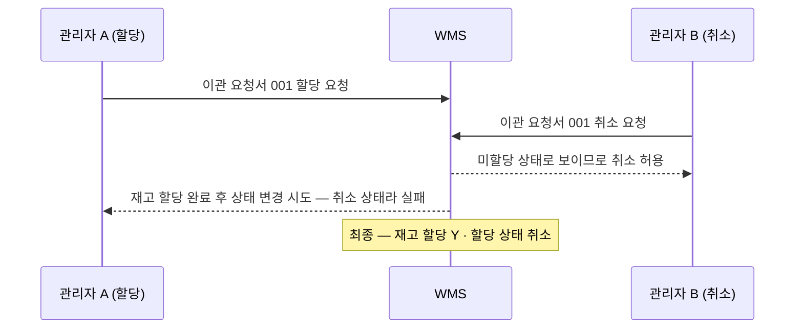
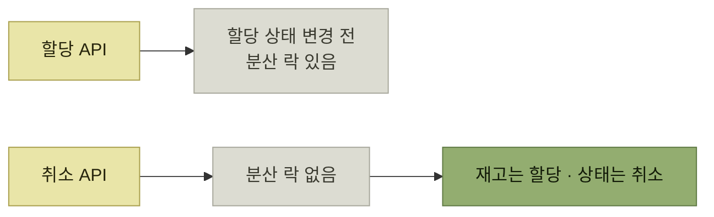

# 할당과 취소가 동시에 요청된다면

> [WMS 재고 이관을 위한 분산 락 사용기](./README.md)

## 빠른 복습
- **DC 관리자로부터 취소된 이관 요청서에 재고가 할당되어 있다는 문의**가 들어왔다. 확인해보니 **같은 시점에 할당과 취소가 요청**되어 있었다.
- **한 관리자는 재고 이관을 위해 이관 요청서를 할당**하고, **같은 시점에 다른 관리자는 그 요청서를 취소**했다.
- 구조를 보면 **재고 할당과 할당 상태 변경의 트랜잭션이 분리**되어 있었다. **재고 할당은 DB 트랜잭션을 짧게 하기 위해 이관 요청서 단위가 아니라 하위 SKU 단위로** 이루어졌다.
- **할당 API는 할당 상태 변경 전에 분산 락이 설정되어 있어서**, SKU들을 병렬로 할당해도 **할당 상태는 의도한 값으로 변경**되었다.
- 문제는 반대쪽이었다 — **취소 API가 분산 락 설정 없이 할당 상태를 취소로 변경**하고 있었다.
- **재고 할당 중에는 아직 할당 상태가 미할당이므로 취소 요청이 통과**했고, **할당이 처리된 뒤 마지막에 취소가 반영되면서** 재고는 할당된 채 상태만 취소가 되었다.
- **취소 로직은 할당 상태만 변경하고 할당과 관련된 작업은 하지 않기 때문에** 재고 할당은 해제되지 않았다.

## 어떤 모양의 요청이었나

*같은 요청서를 두 사람이 동시에 건드렸다*

## 원인 — 한쪽에만 락이 있었다

원서의 타임라인을 옮기면 이렇다.

| 시점 | 할당 요청 | 취소 요청 | 요청서 상태 |
| --- | --- | --- | --- |
| ① | **재고 할당** 시작 | | 재고 할당 N / **미할당** |
| ② | 트랜잭션 1 커밋 (재고 할당 완료) | | 재고 할당 Y / **미할당** |
| ③ | | **할당 상태 변경(미할당 → 취소)**, 트랜잭션 3 커밋 | 재고 할당 Y / **취소** |
| ④ | 할당 상태 변경(미할당 → 할당) 시도 실패, 트랜잭션 2 커밋 | | 재고 할당 Y / **취소** (최종) |

*원서 [그림] 동시성 이슈가 발생할 때의 트랜잭션 순서*

표를 읽는 법. **②에서 재고는 이미 할당되었는데 요청서 상태는 아직 미할당**이다. 이 칸이 버그의 전부다. 취소 API는 **상태만 보고 판단**하므로 여기서 통과해버린다.

> **동시성 이슈의 원인은 취소 작업에 분산 락이 걸려 있지 않았기 때문**이다.

*락은 있었지만 한쪽에만 있었다 — 보호는 참여자 전원이 지켜야 성립한다*

**락이 자원이 아니라 코드 경로에 걸려 있었다**는 것이 이 사고의 교훈이다. 같은 데이터를 만지는 경로가 둘인데 한쪽만 락을 잡으면, **그 락은 아무도 막지 못한다.**

## 왜 SKU 단위였나

- **재고 할당은 DB 트랜잭션을 짧게 하기 위해** 이관 요청서 단위가 아니라 **이관 요청서 하위 SKU 단위**로 수행되었다.
- 그래서 **할당 API는 SKU 단위로 동작하고, 하나의 요청서 아래 SKU들을 병렬로 할당**할 수 있었다.
- **할당 상태 변경 앞에는 분산 락이 있었기 때문에**, 병렬로 할당하더라도 **할당 결과에 따라 상태는 의도한 값으로** 바뀌었다.

**이 SKU 단위 병렬성은 버그의 원인이 아니라 성능상의 이점**이다. 그런데 [다음 절](./3-분산-락을-걸고-기다리게-해보다.md)에서 보듯, **버그를 고치려고 락을 넓히면 가장 먼저 희생되는 것이 바로 이 병렬성**이다.

## 왜 취소 시 재고가 풀리지 않았나

> **취소 로직이 이관 요청서 할당 상태만 변경하고, 할당과 관련된 작업은 하지 않기 때문**이다.

취소는 **"미할당인 요청서를 지우는 일"** 로 설계되었으니 **풀 재고가 없다고 전제**한다. 전제가 깨진 상태에서 그 로직이 실행되면 **잔여물이 남는다.** 상태 기계에서 **금지된 전이가 실제로 일어났을 때 뒷정리를 아무도 하지 않는** 전형적인 모습이다.

## 함께 읽기
- [다음 절 — 1단계와 2단계 해결 시도](./3-분산-락을-걸고-기다리게-해보다.md)
- [앞 절 — 두 작업이 같은 출발점을 놓고 경쟁한다](./1-이관-요청서와-할당.md#두-작업의-전제-조건)
- [24장 — 범용 예외 타입만 보고 HTTP 응답을 판단할 때 놓치는 것](../24-illegalargumentexception은-400-bad-request인가/2-400으로-매핑하면-무엇이-위험한가.md)
