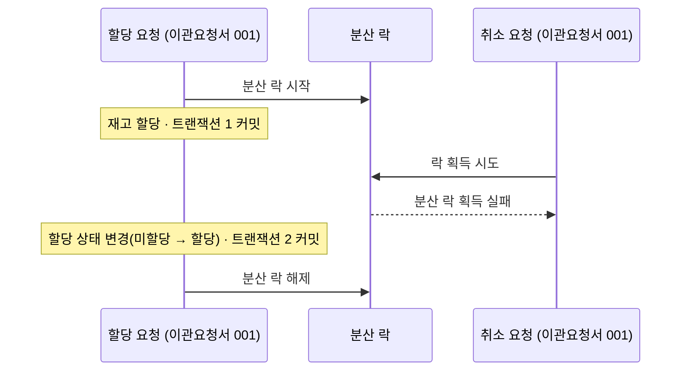
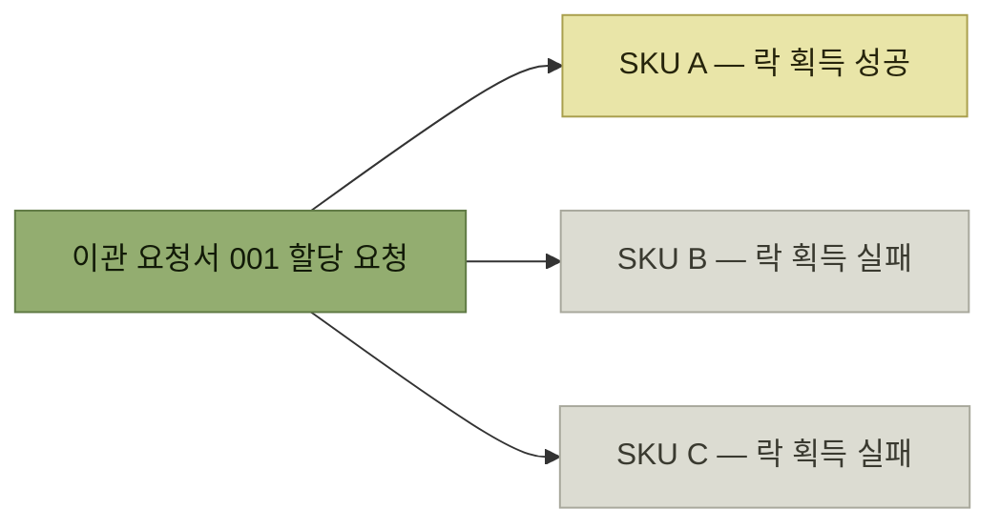
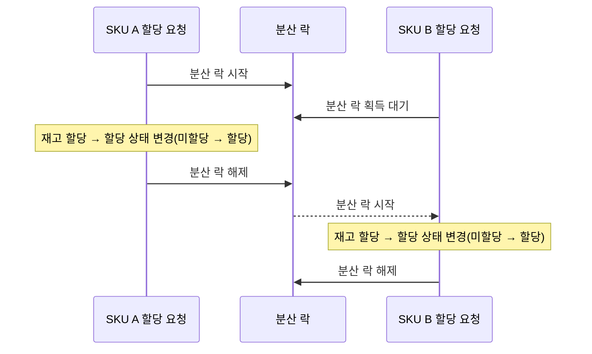

# 분산 락을 걸고, 기다리게 해보다

> [WMS 재고 이관을 위한 분산 락 사용기](./README.md)

## 빠른 복습
- **1단계 — 재고 할당과 취소 로직에 이관 요청서 단위로 분산 락을 추가**했다. **이관 요청서가 할당 중일 때는 취소 요청이 되지 않아야 하기 때문**이다.
- 그런데 **하위에 N개 SKU가 있으면 첫 번째 할당 요청만 성공하고 나머지는 모두 실패**했다. **할당은 SKU 단위인데 락은 요청서 단위**여서, 나머지 SKU들이 **락 획득에 실패**한 것이다.
- **2단계 — 분산 락에 대기 시간(waitTime)을 설정해 순차 처리**되도록 했다. 동작은 정상이 되었다.
- 대신 **락을 획득할 때까지 할당 요청 처리를 대기**하므로, **하위 SKU가 많아질수록 할당 처리 시간이 늘어난다.**
- **이 방법은 이관 요청서의 할당 속도를 포기하는 방법**이다.

## 1단계 — 분산 락 추가하기

> 앞서 동시성 이슈 원인을 살펴본 결과, **이관 요청서가 할당 중일 때는 취소 요청이 되지 않아야 한다.** **재고 할당과 취소 로직에 이관 요청서 단위로 분산 락을 추가하면, 동시에 이관 요청서의 할당 상태를 변경하려는 것을 막을 수 있다.**

*[그림] 1단계 — 할당이 락을 쥐고 있는 동안 취소는 락 획득에 실패한다*

**의도한 대로 취소는 막힌다.** 요청서에 **SKU가 하나뿐일 때는 정상 동작하는 것으로 보인다.**

### 그런데 SKU가 여러 개면

> 하나의 이관 요청서 하위에는 **SKU 단위의 데이터**가 있고 **그 단위로 재고가 할당**되나, **이관 요청서 단위로 분산 락을 설정하면** 클라이언트가 **하위 N개의 SKU를 동시에 할당해달라고 요청할 때 첫 번째 SKU만 할당되고 나머지 SKU들은 분산 락 획득에 실패하여 재고가 할당되지 않는다.**

*락의 단위(요청서)와 작업의 단위(SKU)가 어긋나면 같은 요청서의 형제들끼리 서로를 막는다*

**막아야 할 것(취소)과 막지 말아야 할 것(같은 요청서의 다른 SKU 할당)을 락이 구분하지 못한다.** 락 키는 **"이 요청서를 건드리는 중"** 이라는 사실만 표현할 뿐, **누가 무슨 작업으로 건드리는지**는 담고 있지 않다. 3단계의 상태 키는 정확히 이 빠진 정보를 채우는 장치다.

## 2단계 — 분산 락 대기

- **할당은 이관 요청서 단위가 아니라 하위 SKU 단위로 진행된다.**
- **이관 요청서 하나를 할당 요청했을 때 10개 SKU가 있다면 할당 요청도 10번 호출된다.**
- 따라서 **이관 요청서 단위로 분산 락 키를 사용하면 첫 번째 할당 요청만 성공하고 나머지는 전부 실패**한다.
- 이를 방지하기 위해 **분산 락에 대기 시간을 설정해서 순차 처리가 되도록** 했다. **정상적으로 진행되었다.**

*[그림] 2단계 — 실패하는 대신 기다린다. 최종 상태는 재고 할당 Y / 할당 상태 할당*

### 대가

> 다만 이와 같은 해결 방법에도 문제점이 있다. **분산 락 waitTime 설정에 의해서 분산 락을 획득하기까지 할당 요청을 처리하는 것을 대기**한다. 즉 **이관 요청서의 하위 SKU가 많아질수록 할당 처리 시간이 늘어나게 된다.**

> **할당과 취소가 동시에 되는 것은 막았지만, 이 방법은 이관 요청서의 할당 속도를 포기하는 방법**이다.

| | 1단계 | 2단계 |
| --- | --- | --- |
| **할당·취소 동시 실행** | 막힌다 | 막힌다 |
| **같은 요청서의 SKU 병렬 할당** | **불가 — 첫 건만 성공** | **불가 — 순차 대기** |
| **처리 시간** | 짧지만 대부분 실패 | **SKU 수에 비례해 증가** |

표를 읽는 법. **두 단계 모두 "동시성 차단"이라는 목적은 달성했지만, 둘 다 병렬성을 잃었다.** 1단계는 실패로, 2단계는 지연으로 잃는다. 남은 질문은 하나다 — **막아야 할 조합(할당 ↔ 취소)만 막고, 막을 필요 없는 조합(할당 ↔ 할당)은 통과시킬 수 없는가.**

[11장은 순차화를 받아들여도 괜찮다](../11-b마트-oms의-물류주문관리를-통한-출고-최적화/4-동적-출고-예정-시각-시뮬레이션으로-검증하기.md#성능-병목은-어디였나)고 판단했지만, 여기서는 **락 대기가 API 응답 시간에 그대로 쌓이므로** 같은 선택을 하기 어렵다. **어디에서 기다리는가가 판단을 가른다.**

## 함께 읽기
- [다음 절 — 3단계, 상태 키를 함께 쓴다](./4-분산-락과-상태-키-함께-사용하기.md)
- [앞 절 — SKU 단위 병렬 처리가 원래 왜 있었는지](./2-할당과-취소가-동시에-요청된다면.md#왜-sku-단위였나)
