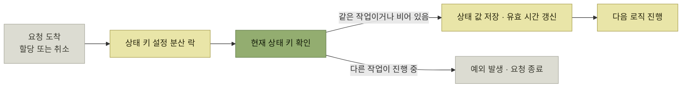
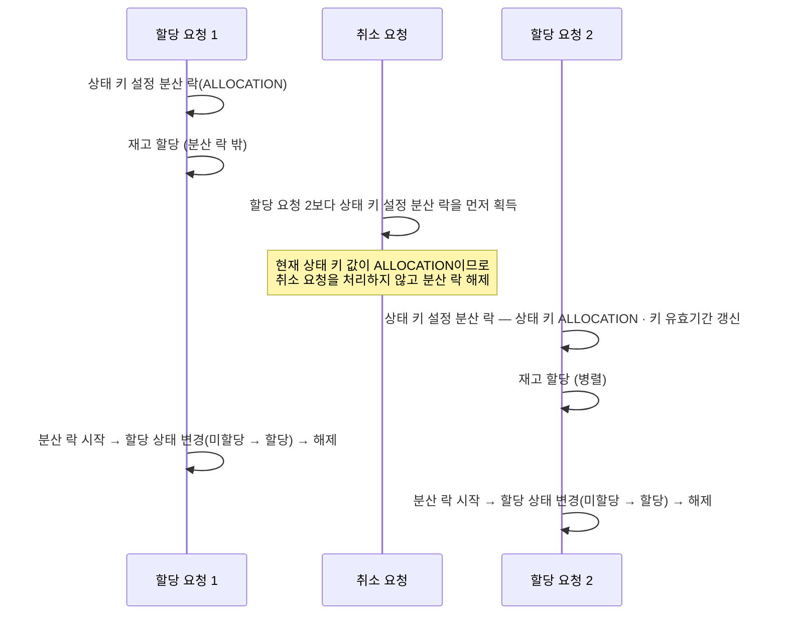

# 분산 락과 상태 키 함께 사용하기

> [WMS 재고 이관을 위한 분산 락 사용기](./README.md)

## 빠른 복습
- 3단계는 **이관 요청서가 "할당 중"인지 "취소 중"인지를 나타내는 상태 키를 추가**한다. 분산 락 안에서 **재고 할당과 상태 변경을 통째로 하는 대신**, **상태 키를 먼저 확인**한다.
- **상태 키 설정 분산 락 안에서** 현재 요청이 할당이면 **할당 값**을, 취소면 **취소 값**을 Redis에 저장하고 **그 키의 유효 시간을 갱신**한다.
- **할당 → 할당**이면 다음 로직(재고 할당, 할당 상태 변경)으로 넘어가고, **취소 → 할당**이면 **할당 작업을 진행하지 않고 예외를 발생시키며 요청을 종료**한다. 취소 요청도 같은 방식이다.
- **상태 키 값을 설정하는 것은 단순히 값만 변경하는 작업이라 빠르게 처리**되어 **전체 처리 속도에 영향이 적다.**
- **할당 API에서 가장 오래 걸리는 부분은 재고 할당**이며, 이것은 **분산 락 밖에서 처리되어 같은 상태의 요청이 들어오더라도 병렬로 처리**된다.
- **할당 결과에 따라 할당 상태가 결정되어야 하므로, 할당 상태를 변경하기 전에는 여전히 분산 락이 필요**하다.

## 무엇을 바꿨나

> **이관 요청서 단위로 분산 락을 설정하고 그 락 안에서 재고 할당과 할당 상태 변경을 하는 것이 아니라**, **이관 요청서가 할당 중 상태인지 취소 중 상태인지를 체크하는 상태 키를 추가로 사용**하도록 수정했다.



*짧은 락 안에서는 상태만 확인하고, 오래 걸리는 일은 락 밖에서 한다*

| 이전 상태 → 현재 요청 | 처리 |
| --- | --- |
| **할당 → 할당** | 다음 로직(**재고 할당, 할당 상태 변경**)으로 진행 |
| **취소 → 할당** | **할당 작업을 진행하지 않고 예외를 발생시키고 요청 종료** |
| **취소 → 취소** | 다음 로직으로 진행 |
| **할당 → 취소** | **취소 작업을 진행하지 않고 예외를 발생시키고 요청 종료** |

표를 읽는 법. **같은 작업끼리는 통과, 다른 작업끼리는 차단**이라는 한 줄 규칙이다. [앞 절의 락](./3-분산-락을-걸고-기다리게-해보다.md)이 구분하지 못했던 **"누가 무슨 작업으로 건드리는가"** 를 상태 키가 담고 있으므로, 이제 **막을 것만 막을 수 있다.**

## 시간축으로 보면



*[그림] 3단계 — 두 할당은 나란히 진행되고, 취소만 상태 키에 막혀 되돌아간다*

**취소 요청이 분산 락을 먼저 획득했는데도 아무 일이 일어나지 않는다**는 점이 이 도식의 핵심이다. **락을 잡았다는 것이 곧 작업 권한은 아니며**, 권한은 **상태 키가 준다.**

## 왜 이 구조가 빠른가

> **상태 키 값을 설정하는 것은 단순히 값만 변경하는 작업이라 빠르게 처리된다. 전체 처리 속도에 영향이 적다.** **할당 API에서 처리 시간이 가장 오래 걸리는 부분은 재고 할당**이며, **할당 결과에 따라 할당 상태가 결정되어야 하므로 할당 상태를 변경하기 전에 분산 락 설정이 필요**하다. **재고 할당은 분산 락 밖에서 처리되어 같은 상태의 요청이 들어오더라도 병렬로 처리**된다.

| 구간 | 락 안인가 | 왜 |
| --- | --- | --- |
| **상태 키 확인 · 설정** | **락 안** | 값만 바꾸는 작업이라 **짧다** |
| **재고 할당** | **락 밖** | **가장 오래 걸리는 작업**이며, 같은 상태끼리는 **병렬로 해도 안전**하다 |
| **할당 상태 변경** | **락 안** | **할당 결과에 따라 상태가 결정**되어야 하므로 직렬화가 필요하다 |

표를 읽는 법. **락 구간이 두 번 나뉘고, 그 사이의 긴 작업은 락 밖에 있다.** 2단계가 **긴 작업까지 락 안에 넣어 대기 시간을 만들었다면**, 3단계는 **락을 짧게 두 번 잡는 대신 상태 키로 정합성을 지킨다.**

원서가 보여준 코드 조각은 **(2) 할당 상태 변경이 분산 락을 포함한 별도 호출**임을 드러낸다.

```kotlin
if (result) {
    // (2) 할당 상태 변경 (분산 락 포함)
    orderAllocationService.updateStatus(orderId)
}
return result
```

*원서 코드 일부 발췌 — 재고 할당 결과(`result`)가 참일 때만 상태 변경으로 넘어간다*

> **이전 상태와 다른 요청이 들어왔을 때는 예외를 발생시켜 처리를 하지 않는 프로세스를 구현할 수 있다.**

## 마무리

> **분산 락은 여러 프로세스가 같은 자원에 접근할 때 발생할 수 있는 충돌을 방지하고 시스템의 안정성을 높이는 데 큰 역할을 한다.** WMS에서는 **여러 작업이 동시에 수행되더라도 재고 데이터의 일관성을 유지할 수 있도록 분산 락을 사용하여 시스템의 신뢰성을 높이고 오류를 최소화**한다.

> **분산 락을 적용해야 하면서도 병렬 처리가 필요한 경우, 상태 키를 설정하여 다음 로직을 수행할지를 결정**했다. 이를 통해 **할당과 취소가 동시에 발생하는 것을 방지**할 수 있었고, **같은 작업의 경우 병렬 처리까지 가능**하게 되었다.

남겨둔 개선안도 함께 적혀 있다.

> 본 글에서는 **이관 요청서 하위 SKU 단위로 할당 요청을 처리**했다. 개선안으로는 **할당 요청을 이관 요청 단위로 받아 하위 SKU들의 할당을 멀티 스레딩 방식으로** 해볼 수 있을 것 같다. 다만 **멀티 스레딩 방식을 사용하면 API의 총 처리 시간과 API 서버 부하에 대해 고려할 필요가 있다.**

## 핵심 정리

- 동시성 버그의 원인은 **취소 API에만 분산 락이 없었던 것**이었다. **보호는 그 자원을 만지는 모든 경로가 함께 지켜야 성립한다.**
- 락을 **요청서 단위**로 넓히자 **같은 요청서의 SKU들이 서로를 막았다.** **락 단위와 작업 단위가 어긋난 것**이다.
- 대기 시간을 주면 동작하지만 **SKU 수에 비례해 느려진다.** 정확성을 위해 속도를 내준 셈이다.
- 최종 해법은 **짧은 락 안에서 상태 키를 확인**하고, **오래 걸리는 재고 할당은 락 밖에서 병렬로** 수행하는 것이다.
- 즉 **"동시에 하면 안 되는 것"은 작업의 종류로 판별하고, 락은 그 판별과 상태 확정에만 쓴다.**

## 함께 읽기
- [이 장의 목차](./README.md)
- [앞 절 — 1·2단계가 잃은 것](./3-분산-락을-걸고-기다리게-해보다.md)
- [『WMS 원리와 이해』 5.4 할당 수량이라는 장치](../../wms-원리와-이해/05-출고-프로세스/4-할당-출고지시.md#할당-수량이라는-장치) — 할당이 왜 되돌리기 어려운 상태인지
- [『AI 시대의 엔지니어링 전략』 2.7 위험을 이름에 드러내기](../../ai-시대의-엔지니어링-전략/02-제품-내-사용자-안내/7-사용-시나리오-위험을-이름에-드러내기.md) — 위험한 조합을 이름·기표와 상태 제약으로 막는 두 접근의 비교
