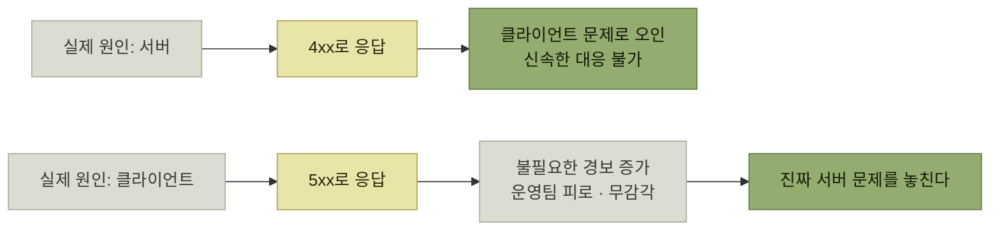

# 4xx와 5xx는 무엇을 가르는가

> [IllegalArgumentException은 400 Bad Request인가](./README.md)

## 빠른 복습
- **4xx는 대체로 클라이언트가 잘못된 요청을 보냈음**을 뜻한다. 대부분은 **요청을 수정하지 않으면 계속 실패하므로 자동 재시도 전략이 무의미**하지만, **408 Request Timeout·429 Too Many Requests처럼 지연 후 재시도할 수 있는 코드도 있다.**
- **5xx는 서버 내부 문제로 요청을 처리하지 못했음**을 뜻한다. **내부 로직 오류, DB 연결 실패, 예기치 않은 서버 오류, 일시적 장애**에서 발생한다.
- 즉 이 구분은 **오류 발생의 책임 주체가 클라이언트인지 서버인지를 판단하는 기준**이다.
- 운영에서 이 구분은 **경보의 기준선**이다. **5xx는 즉시 대응해야 한다.**
- 양방향으로 위험하다 — **서버 오류를 4xx로 처리하면 클라이언트 문제로 오인**하고, **클라이언트 오류를 5xx로 처리하면 불필요한 경보가 늘어 진짜 서버 문제를 놓친다.**

## 두 무리의 뜻

| | 무엇을 의미하는가 | 대표 코드 | 재시도 |
| --- | --- | --- | --- |
| **4xx** | **대체로 클라이언트가 잘못된 요청을 보냈다** | **400 Bad Request · 401 Unauthorized · 404 Not Found** | 대부분 요청 수정이 먼저다. 단 **408·429**는 `Retry-After` 등 서버 신호에 따라 지연 후 재시도할 수 있다 |
| **5xx** | **서버 내부 문제로 요청을 처리하지 못했다** | **500 Internal Server Error · 502 Bad Gateway · 503 Service Unavailable** | 서버가 회복되면 성공할 수 있지만 **501 같은 영구 오류와 비멱등 요청의 중복 처리 위험**을 확인해야 한다 |

표를 읽는 법. **재시도 열이 이 구분의 실용적 의미**다. 상태 코드는 사람에게 설명하는 문구이기 전에 **클라이언트와 게이트웨이가 다음 행동을 결정하는 신호**다. 다만 **4xx·5xx라는 범위만으로 재시도 여부를 결정해서는 안 된다.** 개별 상태 코드와 `Retry-After` 같은 응답 헤더, 요청의 멱등성을 함께 확인해야 한다. 특히 멱등성이 보장되지 않은 POST를 그대로 재시도하면 작업이 중복될 수 있다.

> 이 구분은 **오류 발생의 책임 주체가 클라이언트인지 서버인지를 판단하는 기준**이다.

## 운영과 모니터링에서 왜 중요한가

**5xx는 즉시 대응해야 한다.** **서버 내부 문제의 신호로 간주되어 모니터링·알림 시스템에서 즉시 감지하고, 빠르게 원인을 파악해 조치할 수 있어야** 한다.

*두 방향의 오분류는 서로 다른 방식으로 대응을 늦춘다*

| 오분류 | 무슨 일이 생기나 |
| --- | --- |
| **서버 오류를 4xx로** | **운영팀은 클라이언트 문제로 오인해 신속히 대응하기 어렵다.** 경보가 울리지 않으니 **문제가 조용히 쌓인다** |
| **클라이언트 오류를 5xx로** | **불필요한 경보가 증가해 운영팀의 피로도가 높아지고 무감각해져 진짜 서버 문제를 놓칠 위험**이 있다 |

표를 읽는 법. 첫 줄은 **탐지 누락**, 둘째 줄은 **경보 피로**다. 둘 다 결국 같은 결과 — **진짜 장애를 늦게 안다.** 그래서 상태 코드 매핑은 취향이 아니라 **장애 대응 설계의 일부**다.

> **4xx와 5xx를 명확히 구분하여 응답 코드 전략을 설계해야 효율적인 장애 대응 및 운영 안정성 확보가 가능**하다.

이 관점은 [『아키텍트 첫걸음』 4.4 오류 처리](../../아키텍트-첫걸음/4-아키텍처-구현/4-애플리케이션-기반-구현.md#오류-처리)가 **오류 처리를 애플리케이션 기반(공통 기능)으로 다룬 이유**와 같다. 개별 컨트롤러가 각자 상태 코드를 고르면 **같은 성격의 실패가 서비스마다 다른 코드로 나가고**, 그때부터 경보 기준은 무너진다.

## 함께 읽기
- [다음 절 — 그래서 이 예외를 400에 묶으면 안 되는 이유](./2-400으로-매핑하면-무엇이-위험한가.md)
- [『AI 시대의 엔지니어링 전략』 3.2 에러 시나리오 분류](../../ai-시대의-엔지니어링-전략/03-에러와-경고/2-에러-시나리오-분류.md) — 4xx·5xx보다 세밀하게 고치는 사람과 시점으로 실패를 분류하는 방법
