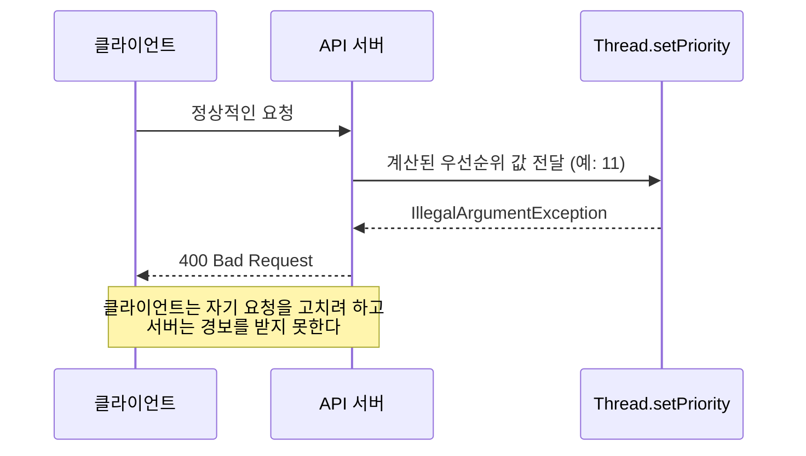

# 400으로 매핑하면 무엇이 위험한가

> [IllegalArgumentException은 400 Bad Request인가](./README.md)

## 빠른 복습
- **`IllegalArgumentException`은 자바 표준 라이브러리뿐 아니라 스프링·하이버네이트 같은 프레임워크와 여러 라이브러리에서 흔히 발생**한다.
- 유효하지 않은 인자에서 발생하니 400이 적합해 보이지만, **스프링은 이 예외를 기본 정책으로 400에 지정하지 않았다.**
- 이유는 하나다 — **이 예외가 클라이언트의 입력 때문인지 서버 내부 로직 때문인지 알 수 없기 때문**이다.
- `Thread.setPriority`처럼 **클라이언트와 무관한 코드에서도 같은 예외가 나온다.** 이때 400으로 판정하면 **문제 파악이 늦어진다.**
- 반대로 **커스텀 예외만 400으로 매핑**해두었다면 이런 상황은 **500으로 나가 서버 내부 문제로 인식되고 더 빠르게 조치**할 수 있다.

## 발생처가 너무 넓다

**이 예외는 내가 던지지 않아도 발생한다.** 표준 라이브러리, 프레임워크, 서드파티 라이브러리가 모두 이 클래스를 쓴다. 즉 **`@ExceptionHandler(IllegalArgumentException.class)`는 내 코드가 아닌 곳에서 나온 예외까지 함께 받는다.**

> **스프링에서는 이것을 기본 정책으로 400 에러로 지정하지 않았다.** 그 이유는 **이 예외가 클라이언트의 입력으로 인한 것인지 서버 내부 로직에 의한 것인지 알 수 없기 때문**이다.

**프레임워크가 정하지 않은 것을 애플리케이션이 일괄로 정해버리는 것**이 이 매핑의 성격이다. 판단 근거가 없어서 비워둔 자리를, **근거 없이 채우는 셈**이다.

## 클라이언트와 무관하게 나는 예외

```java
// 서버 내부 로직 오류 예시: 클라이언트와 무관하게 IllegalArgumentException 발생
public void execute(Runnable task, PriorityResolver priorityResolver) {
    Thread thread = new Thread(task);
    int calculatedPriority = priorityResolver.get();
    thread.setPriority(calculatedPriority);
    thread.start();
}
```

*원서 예시 — 우선순위 값이 범위를 벗어나면 여기서 예외가 난다*

**`Thread.setPriority(...)` 메서드는 1~10의 값을 허용하고, 이 범위를 벗어나면 `IllegalArgumentException`이 발생**한다.

> 서버 개발자가 이를 인지하지 못하고 `PriorityResolver`를 개발하거나 수정했다면, **클라이언트의 잘못이 아닌 문제로 `IllegalArgumentException`이 발생**할 수 있다. 이 케이스에서 **400으로 판정해버리면 문제 파악이 늦어질 수 있다.**



*요청에는 아무 잘못이 없는데 클라이언트가 책임을 뒤집어쓴다*

**요청은 완벽했다.** 잘못된 값은 **서버가 스스로 계산해 만든 값**이다. 그런데 응답은 "네 요청이 틀렸다"고 말한다. 클라이언트 개발자는 고칠 것이 없는 요청을 들여다보고, 서버 팀은 경보를 못 받는다. **양쪽 모두 잘못된 곳을 보게 된다.**

> 반대로 **커스텀 예외 클래스만을 400으로 매핑하고 클라이언트의 잘못이 명확한 때에만 사용했다면**, 이 경우 **500 에러가 발생하여 서버 내부 문제로 인식되고 보다 빠르게 조치**할 수 있다.

## 정리하면

| | `IllegalArgumentException` → 400 | 커스텀 예외만 → 400 |
| --- | --- | --- |
| **클라이언트 입력 오류** | 400 (의도대로) | 400 (의도대로) |
| **서버 내부 버그** | **400 (오분류)** | **500 (정상 탐지)** |
| **라이브러리 내부 오류** | **400 (오분류)** | **500 (정상 탐지)** |

표를 읽는 법. **두 방식은 정상 케이스에서 똑같이 동작하고, 사고가 났을 때만 갈린다.** 그래서 평소에는 문제가 드러나지 않으며, **정작 필요한 순간에 신호가 사라진다.** [앞 절의 "탐지 누락"](./1-4xx와-5xx는-무엇을-가르는가.md#운영과-모니터링에서-왜-중요한가)이 바로 이 칸들이다.

## 함께 읽기
- [다음 절 — 세 가지 기준과 커스텀 예외](./3-그러면-어떻게-매핑할-것인가.md)
- [13장 — 상태만 보고 판단했다가 놓친 사례](../13-wms-재고-이관을-위한-분산-락-사용기/2-할당과-취소가-동시에-요청된다면.md)
