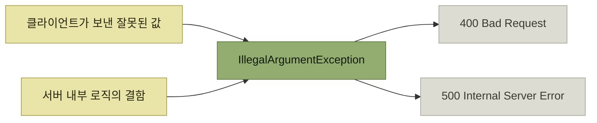

# IllegalArgumentException은 400 Bad Request인가

## 익숙한 매핑을 다시 본다

스프링에서 API를 만들 때는 **`@ExceptionHandler`와 `@ResponseStatus`로 예외 클래스와 응답을 매핑**할 수 있다. 그리고 아주 흔하게 이렇게 쓴다.

```java
@RestControllerAdvice
public class GlobalDefaultExceptionHandler {

    @ResponseStatus(HttpStatus.BAD_REQUEST)
    @ExceptionHandler(IllegalArgumentException.class)
    public ErrorResponse onException(IllegalArgumentException exception) {
        // ...
    }
}
```

*원서 예시 — `IllegalArgumentException`을 400으로 매핑하는 익숙한 코드*

**`IllegalArgumentException`은 주로 잘못된 인수로 발생하기 때문에 많은 사람들이 400 응답으로 자연스럽게 연결짓는다.** 이 장은 그 연결을 의심한다.

> 이 예외가 **꼭 클라이언트의 잘못으로 발생하는 건 아니다.** 때로는 **개발자의 실수나 내부 로직의 결함으로 발생**하기도 한다.



*하나의 예외 클래스에 두 개의 원인이 모인다 — 그래서 클래스만 보고 응답을 정할 수 없다*

## 목차

- [4xx와 5xx는 무엇을 가르는가](./1-4xx와-5xx는-무엇을-가르는가.md)
- [400으로 매핑하면 무엇이 위험한가](./2-400으로-매핑하면-무엇이-위험한가.md)
- [그러면 어떻게 매핑할 것인가](./3-그러면-어떻게-매핑할-것인가.md)

## 함께 읽기

- [『아키텍트 첫걸음』 4.4 오류 처리](../../아키텍트-첫걸음/4-아키텍처-구현/4-애플리케이션-기반-구현.md#오류-처리) — 오류 처리를 **공통 기능으로 설계**하는 이야기. 이 장은 그 공통 기능의 **매핑 테이블을 무엇으로 채울지**를 다룬다.
- [『좋은 코드의 기준』 2.2 이름 짓기](../../내-코드가-불안한-개발자를-위한-좋은-코드의-기준/02-움직이는-코드에서-뜻을-전하는-코드로/2-이름-짓기.md) — 커스텀 예외를 정의하라는 이 장의 결론은 **타입에 의미를 담는 일**이다.
- [『AI 시대의 엔지니어링 전략』 3장 에러와 경고](../../ai-시대의-엔지니어링-전략/03-에러와-경고/README.md) — 같은 분류 문제를 사용자 시나리오·실행 가능한 메시지·구조화된 메타데이터까지 확장한다.

## 참고

- 원 소스: 우아한형제들 기술블로그, [IllegalArgumentException은 400 Bad Request인가?](https://techblog.woowahan.com/21686/)
