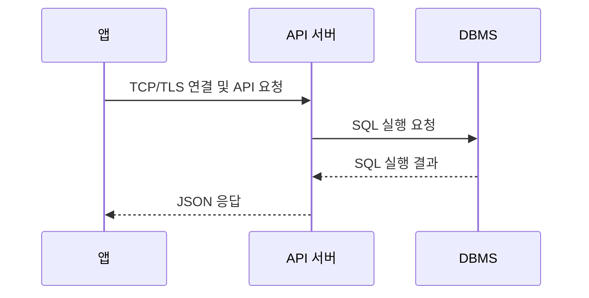
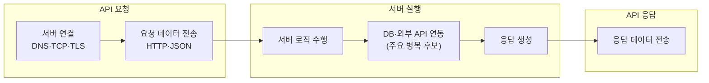
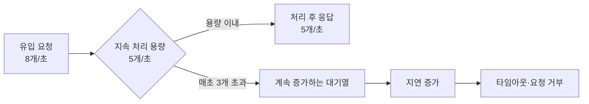
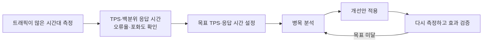

# 처리량과 응답 시간

> [느려진 서비스, 어디부터 봐야 할까](./README.md)

## 빠른 복습

- 응답 시간은 사용자가 기다린 전체 시간이고, 처리량은 단위 시간에 완료한 작업 수다.
- `처리량 ≈ 동시 처리 가능 수 ÷ 평균 처리시간`은 병목을 찾는 출발점이지 실제 용량 보장은 아니다.
- TTFB와 TTLB, 평균과 p95·p99를 데이터 특성에 맞게 구분한다.
- 개선 전에는 트래픽이 많은 시간대의 TPS·응답 시간·오류율을 먼저 측정한다.
- TPS 5에 요청 8개 보내기로 대기시간을 확인할 수 있다.
- 평균과 tail latency 비교 실험으로 같은 평균 주변에서도 p95·p99가 달라지는 모습을 확인할 수 있다.

사용자는 요청한 동작이 완료될 때까지 걸린 시간으로 서비스 성능을 체감한다. 실제 성능에는 네트워크와 디스크 속도, 메모리 크기, 클라이언트의 CPU 성능 등 여러 요소가 영향을 미친다. 그중 **서버 성능을 판단하는 핵심 지표는 응답 시간과 처리량**이다.

> [!IMPORTANT]
> **평균만으로 서비스 상태를 판단하지 마세요**
>
> 평균 응답 시간과 함께 p95·p99 같은 꼬리 지연, 처리량과 오류율을 확인해야 일부 사용자가 겪는 긴 대기를 놓치지 않습니다.

## 함께 읽기

- 측정한 TPS와 응답 시간을 바탕으로 실제 병목을 찾고 확장하려면 [먼저 병목을 찾는다](./2-서버-성능-개선-기초.md#먼저-병목을-찾는다)를 읽는다.
- DB 구간이 느리다면 조회 패턴과 인덱스 설계로 이어간다.
- 외부 API 구간이 느리거나 실패한다면 외부 연동의 timeout·retry를 확인한다.
- 사용자 시나리오의 지연을 시스템 지표와 연결하는 방법은 [프로덕트 아키텍처의 지연 시간](../../ai-시대의-엔지니어링-전략/09-프로덕트-아키텍처/3-지연-시간.md)에서 이어서 볼 수 있다.

## API 요청은 어떻게 처리되는가

전형적인 API 호출은 다음 순서로 진행된다.

하나의 API 요청에 걸리는 전체 시간은 크게 세 구간으로 나눌 수 있다.

1. **API 요청**: 클라이언트가 필요에 따라 DNS 조회를 거쳐 TCP와 TLS로 서버에 연결하고, HTTP 같은 프로토콜에 따라 요청 데이터를 전송한다.
2. **서버 실행**: 서버가 로직을 수행하고 DB 또는 외부 API와 통신한 뒤 응답을 생성한다.
3. **API 응답**: 서버가 생성한 응답을 클라이언트로 전송한다.

서버 처리 시간에는 로직 수행, DB 연동, 외부 API 연동, 응답 데이터 전송 시간이 포함된다. 일반적으로 DB와 외부 API 연동이 큰 비중을 차지하므로 성능 저하를 조사할 때 우선 살펴볼 만하다. 다만 실제 병목은 측정 결과로 판단해야 하며 CPU, 디스크, 네트워크, 스레드 풀 등이 병목일 수도 있다.

DB에서 시간이 오래 걸리는 원인은 DB 쿼리 개선 점검 순서, 외부 호출의 구간별 시간은 외부 호출 timeout의 종류에서 더 자세히 다룬다.

## 응답 시간

응답 시간은 요청을 보낸 뒤 응답을 받기까지 걸리는 시간이다. 짧은 차이도 비교할 수 있도록 밀리초(ms) 단위로 표현하는 경우가 많다.

- **TTFB(Time to First Byte)**: 요청 후 응답의 첫 번째 바이트가 도착할 때까지 걸린 시간
- **TTLB(Time to Last Byte)**: 요청 후 응답의 마지막 바이트가 도착할 때까지 걸린 시간

응답 데이터가 작으면 두 값의 차이가 거의 없을 수 있다. 반면 파일 다운로드처럼 응답이 크거나 네트워크가 느린 환경에서는 TTFB와 TTLB의 차이가 커진다. 따라서 서버 성능을 올바르게 평가하려면 데이터 크기와 네트워크 환경을 고려해 적절한 지표를 선택해야 한다.

평균 응답 시간만 보면 일부 사용자가 겪는 긴 지연이 가려질 수 있다. 따라서 실무에서는 중앙값인 **p50**과 함께 **p95, p99** 같은 백분위 응답 시간을 확인한다. 예를 들어 p95가 500ms라면 전체 요청의 95%가 500ms 이내에 완료됐다는 뜻이다.

```mermaid
gantt
    title 응답 시간의 구간
    dateFormat X
    axisFormat %L ms
    section 요청과 처리
    연결·요청·서버 처리 :a, 0, 400
    section 응답
    첫 바이트 도착(TTFB) :milestone, m1, 400, 0
    응답 데이터 전송 :b, 400, 300
    마지막 바이트 도착(TTLB) :milestone, m2, 700, 0
```

## 처리량

처리량은 시스템이 단위 시간에 처리하는 작업의 수다.

- **TPS(Transaction Per Second)**: 초당 처리한 트랜잭션 수
- **RPS(Request Per Second)**: 초당 처리한 요청 수
- **최대 TPS**: 주어진 응답 시간과 오류율 목표를 지키면서 시스템이 지속적으로 처리할 수 있는 초당 최대 요청 수

예를 들어 서버가 요청을 동시에 5개 처리할 수 있고 요청 하나의 처리 시간이 1초라면 단순화한 최대 TPS는 5다. 초당 유입 요청 수가 이 처리량을 지속적으로 초과하면 처리하지 못한 요청이 대기열에 쌓인다. 대기열이 길어질수록 사용자가 체감하는 응답 시간이 증가하며, 결국 타임아웃이나 요청 거부로 이어질 수 있다.

> 포화 상태에서의 단순화된 관계: **처리량 ≈ 동시 처리 가능한 요청 수 ÷ 평균 처리 시간**

이 관계가 여러 dependency를 거칠 때 어떻게 제한되는지는 [최대 TPS는 가장 느린 구간이 결정한다](./2-서버-성능-개선-기초.md#최대-tps는-가장-느린-구간이-결정한다)에서 이어서 설명한다.

### 실제 서비스의 처리량 비교

처리량의 규모는 서비스의 성격에 따라 크게 달라진다.

| 서비스 | 알려진 처리량 | 초당 환산 | 의미 |
| --- | ---: | ---: | --- |
| Extensiv Warehouse Manager API | 분당 최대 100건 | 약 1.67 RPS | 공식 문서에 명시된 API 요청 제한 |
| Google Search | 초당 약 158,500~189,800건 | 약 158,500~189,800 RPS | 제공된 자료를 바탕으로 산정한 평균 검색 요청량 추정치 |

Extensiv의 분당 최대 처리량을 초당 단위로 바꾸면 다음과 같다.

> **100건 ÷ 60초 ≈ 1.67 RPS**

반면 Google Search는 초당 약 158,500~189,800건의 요청을 처리하는 것으로 추정된다. 단순 비교하면 Extensiv의 명목상 처리율보다 약 **9만 5천~11만 4천 배** 큰 규모다.

여기서 Extensiv의 수치는 실제 트래픽을 관찰해 구한 평균 RPS가 아니라 **분당 최대 100건이라는 API 제한을 초당으로 환산한 값**이다. Google Search의 정확한 RPS도 공식 공개 수치가 아니라 추정치다. Google은 공식 자료에서 매일 수십억 건의 검색을 처리한다고만 설명한다. 두 수치 모두 HTTP 요청을 기준으로 하므로 TPS보다는 RPS라고 부르는 편이 자연스럽다. TPS와 RPS는 작업의 정의가 다를 수 있기 때문에 숫자를 비교할 때는 측정 대상, 시간 범위, 평균 또는 최대 여부를 함께 확인해야 한다.

> 출처: [Extensiv Warehouse Manager API의 요청 제한](https://developer.extensiv.com/pages/warehouse-manager.html), [Google Search 공식 설명](https://www.google.com/intl/en_us/search/howsearchworks/how-search-works/). Google Search의 정확한 초당 요청 범위는 공식 수치가 아닌 추정치이므로 규모를 이해하기 위한 참고값으로만 사용한다. (확인일: 2026-08-01)

## 응답 시간을 줄이는 두 가지 방향

응답 시간이 늘면 사용자 이탈로 이어질 수 있다. 대기 시간을 줄이는 방법은 크게 두 가지다.

1. **동시 처리량 늘리기**: DB나 외부 시스템 등 하위 자원의 여유가 허용하는 범위에서 서버가 한 번에 처리할 수 있는 요청 수를 늘려 대기열을 줄인다.
2. **요청당 처리 시간 줄이기**: 로직, DB 쿼리, 외부 API 호출 등을 최적화해 각 요청이 처리 자원을 점유하는 시간을 줄인다.

두 방법 모두 최대 TPS를 높이고, 트래픽이 몰릴 때의 응답 시간 증가를 완화한다. 다만 동시 처리 수만 무작정 늘리면 DB 커넥션이나 CPU 같은 하위 자원이 먼저 포화되어 오히려 응답 시간이 악화될 수 있다.

## 측정 없이 개선하지 않는다

성능 개선은 현재 상태를 수치로 파악하는 데서 시작한다. 단순히 “느리다”는 인상만으로 여러 최적화를 시도하면 실제 병목과 무관한 작업에 시간을 쓸 수 있다.

스카우터나 핀포인트 같은 모니터링 도구를 활용하면 실시간 TPS와 응답 시간뿐 아니라 과거 특정 시점의 값도 확인할 수 있다. 특히 트래픽이 가장 많은 시간대의 수치를 기준선으로 삼고, 이를 바탕으로 목표와 개선안을 정한 뒤 전후 결과를 비교해야 한다.

측정값에서 병목 후보를 좁히는 구체적인 지표와 trace 흐름은 [서버 병목 분석](./2-서버-성능-개선-기초.md#먼저-병목을-찾는다)과 외부 연동 관측을 참고한다.

함께 확인할 핵심 지표는 다음과 같다.

- **응답 시간**: 평균, p50, p95, p99
- **처리량**: TPS 또는 RPS
- **안정성**: 오류율, 타임아웃 비율
- **포화도**: CPU·메모리 사용률, DB 커넥션 풀과 스레드 풀의 사용량, 대기열 길이

## 핵심 정리

- 서버 성능의 핵심 지표는 **응답 시간**과 **처리량**이다.
- 응답 시간은 필요에 따라 TTFB와 TTLB로 구분하며, 평균뿐 아니라 p95와 p99도 확인한다.
- 유입량이 최대 처리량을 지속적으로 넘으면 대기열이 증가하고, 결국 타임아웃이나 요청 거부가 발생할 수 있다.
- 성능은 동시 처리량을 늘리거나 요청당 처리 시간을 줄여 개선할 수 있다.
- 개선 전후의 TPS·백분위 응답 시간·오류율·포화도를 측정해 실제 효과를 검증해야 한다.
