# 서버 성능 개선 기초

> [느려진 서비스, 어디부터 봐야 할까](./README.md)

## 빠른 복습

- 최대 TPS를 넘는 유입은 대기열·timeout·retry를 통해 장애를 증폭시킨다.
- Scale-up/out 전에 API, DB, 외부 dependency 중 실제 병목을 trace와 metric으로 찾는다.
- DB pool과 cache는 처리량을 높일 수 있지만 하위 자원의 포화와 데이터 일관성을 함께 봐야 한다.
- 응답 크기, GC, 정적 자원과 대기 처리도 사용자 응답 시간과 서버 용량에 영향을 준다.
- TPS Lab 모드 연결표에서 각 병목을 직접 비교할 수 있다.
- 설정에 따라 달라지는 병목 해석은 TPS Lab 결과 지표 읽기를 참고한다.

서비스 초기에는 사용자와 트래픽이 적어 성능 문제가 잘 드러나지 않는다. 사용자가 늘고 요청량이 시스템의 처리 용량에 가까워지면 작은 지연이 대기열을 키우고, 다시 지연을 증가시키는 문제가 나타나기 시작한다.

> [!WARNING]
> **서버 수나 풀 크기부터 늘리지 마세요**
>
> 병목이 하위 DB나 외부 API에 있다면 상위 동시성만 늘리는 조치는 대기와 부하를 더 빠르게 증폭시킬 수 있습니다.

## 함께 읽기

- TPS, RPS와 백분위 응답 시간의 의미부터 확인하려면 [처리량](./1-처리량과-응답-시간.md#처리량)과 [응답 시간](./1-처리량과-응답-시간.md#응답-시간)을 읽는다.
- DB가 병목이라면 [DB 쿼리 개선 점검 순서](../03-성능을-좌우하는-db-설계와-쿼리/5-db-쿼리-개선-점검-순서.md)로 이어간다.
- 외부 API가 병목이라면 [외부 연동 점검 순서](../04-외부-연동이-문제일-때-살펴봐야-할-것들/9-외부-연동-관측과-점검.md#외부-연동-점검-순서)를 확인한다.
- 긴 동기 호출이 ALB와 요청 thread를 함께 점유하는 실제 사례는 [동기 외부 API와 계층별 Timeout](../04-외부-연동이-문제일-때-살펴봐야-할-것들/10-실무-사례-동기-외부-api와-계층별-timeout.md)을 참고한다.
- 프로덕션과 닮은 입력으로 용량 한계를 검증하는 방법은 [확장성 시뮬레이션](../../ai-시대의-엔지니어링-전략/09-프로덕트-아키텍처/7-확장성과-확장성-시뮬레이션.md)과 함께 볼 수 있다.

## 과부하의 전형적인 증상

- 순간적으로 대부분의 요청이 느려지고 10초 이상 걸리는 요청이 증가한다.
- 연결 시간 초과, 요청 시간 초과, `5xx` 같은 오류가 함께 늘어난다.
- 서버를 재시작하면 잠시 회복하지만 얼마 지나지 않아 다시 느려진다.
- 트래픽이 줄거나 일부 요청을 차단할 때까지 심각한 상태가 계속된다.

이런 현상은 **유입량이 시스템의 지속 가능한 최대 처리량을 넘을 때** 흔히 발생한다. 요청 처리 속도보다 유입 속도가 빠르면 대기열이 길어지고, 응답 시간이 증가하면서 동시에 처리 중인 요청과 자원 사용량도 늘어난다. 결국 타임아웃과 재시도가 추가 트래픽을 만들며 장애를 증폭할 수 있다.

다만 이 증상만으로 과부하를 단정해서는 안 된다. 재시작 후 잠시 회복되는 현상은 메모리·커넥션 누수, 긴 GC, 고갈된 스레드 풀, 누적된 대기열 같은 문제에서도 나타날 수 있다. 최근 배포나 설정 변경도 함께 확인해야 한다.

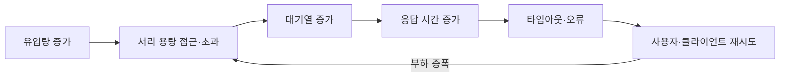

## 최대 TPS는 가장 느린 구간이 결정한다

서비스의 최대 TPS는 API 서버만의 성능으로 결정되지 않는다. 요청이 거치는 모든 구간의 처리 용량을 함께 봐야 한다.

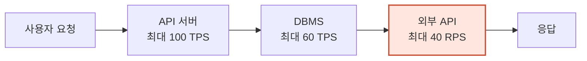

> 단순화한 관계: **전체 시스템의 지속 가능한 처리량 ≤ 각 필수 구간 처리량의 최솟값**

위 예시에서는 API 서버가 100 TPS를 처리할 수 있어도 필수 외부 API가 초당 40개만 허용한다면 전체 요청 흐름은 최대 40 RPS 부근에서 제한된다. 외부 API 한도를 넘으면 즉시 `429 Too Many Requests`가 발생할 수도 있고, 클라이언트 내부 대기나 재시도가 있다면 응답 시간이 늘어난 뒤 오류가 나타날 수도 있다.

따라서 “우리 서버의 최대 TPS는 충분하다”는 사실만으로 전체 서비스의 처리 용량이 충분하다고 판단할 수 없다. DBMS, 메시지 브로커, 외부 API 등 **필수 의존성의 처리량·응답 시간·오류율·동시 요청 제한**을 모두 확인해야 한다.

처리량과 대기 시간의 기본 관계는 [처리량](./1-처리량과-응답-시간.md#처리량), 외부 API의 quota·동시성 보호 방법은 Rate limit과 동시 요청 제한에서 더 자세히 다룬다.

## 먼저 병목을 찾는다

TPS를 높이려면 가장 오래 걸리거나 가장 먼저 포화되는 구간을 찾아야 한다. 막연히 서버 사양을 높이거나 인스턴스를 추가하기 전에 다음 지표를 같은 시간축에서 비교한다.

- **유입과 처리량**: RPS/TPS, 완료 TPS, 대기열 길이
- **응답 시간**: 평균보다 p50·p95·p99, API 전체와 구간별 소요 시간
- **오류**: `5xx`, 타임아웃, 외부 API의 `429`, DB 커넥션 획득 실패
- **포화도**: CPU, 메모리, GC, 디스크 I/O, 네트워크, 스레드 풀, DB 커넥션 풀
- **의존성**: DB 쿼리 시간, 외부 API 응답 시간과 호출량, 재시도 횟수

Datadog APM 같은 분산 추적 도구를 사용하면 한 요청 안에서 API 로직, DB 쿼리, 외부 API 호출이 각각 얼마나 걸렸는지 span 단위로 확인할 수 있다. 느린 요청의 공통 패턴과 배포 전후의 지연 변화를 함께 살피면 병목 후보를 좁히기 쉽다.

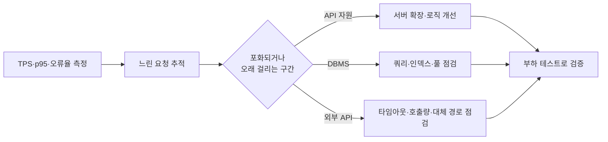

## 급한 불 끄기: 수직 확장

**수직 확장(scale-up)**은 한 서버의 CPU, 메모리, 디스크 또는 네트워크 자원을 늘리는 방식이다. 클라우드에서는 더 큰 인스턴스 유형으로 변경해 비교적 빠르게 시도할 수 있어 긴급 완화책으로 유용하다.

단, 병목과 관계있는 자원을 늘릴 때만 효과가 있다.

- CPU가 포화됐다면 더 많은 CPU가 처리 시간을 줄일 수 있다.
- 메모리 부족으로 스와핑이나 잦은 GC가 발생한다면 메모리 증설이 도움이 될 수 있다.
- 디스크 I/O가 병목이라면 메모리만 늘려서는 효과가 없을 수 있다.
- DB나 외부 API가 병목이라면 API 서버 사양을 높여도 전체 TPS는 거의 늘지 않는다.

예를 들어 512MB 메모리에서 동시 요청 200개 부근부터 메모리 압박이 시작되는 시스템이라면, 동시 요청이 250개로 늘 때 응답 시간이 급격히 증가할 수 있다. 이때 메모리가 실제 병목이라는 측정 결과가 있다면 1GB로 증설해 처리 용량을 높일 수 있다. 그러나 `메모리 2배 = TPS 2배`가 보장되는 것은 아니며 이 숫자는 어디까지나 가상의 예시다.

수직 확장은 적용 가능한 최대 사양과 비용 한계가 있고, 변경 과정에서 재시작이 필요할 수도 있다. 트래픽이 계속 증가한다면 반복적인 scale-up만으로 대응하기 어렵다.

## 지속 가능한 확장: 수평 확장

**수평 확장(scale-out)**은 서버 인스턴스를 추가해 요청을 나누어 처리하는 방식이다. 인스턴스를 제거하는 것은 scale-in이다. 이상적으로는 서버 수를 두 배로 늘리면 처리량도 두 배에 가까워지지만, 공유 DB나 락 같은 병목이 있으면 증가 폭이 작아진다.

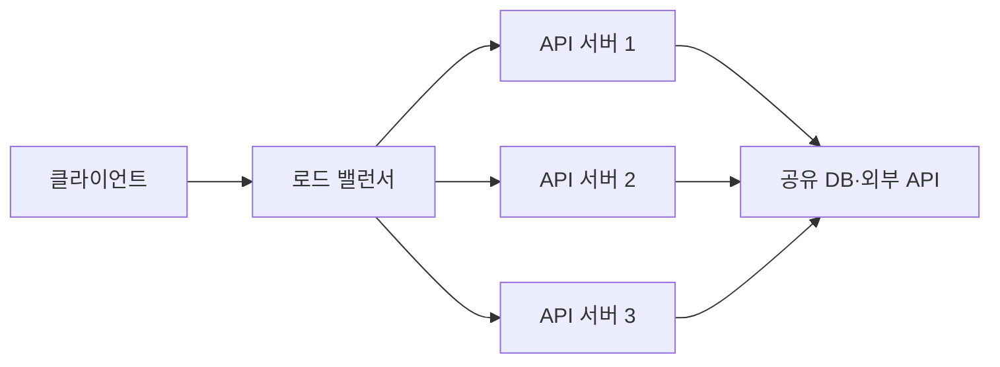

scale-out을 하려면 보통 로드 밸런서가 필요하다. 또한 서버를 가능한 한 무상태(stateless)로 만들고, 로그인 세션이나 파일처럼 여러 서버가 공유해야 하는 상태는 외부 저장소에 두는 편이 확장에 유리하다. 로드 밸런서는 상태가 나쁜 서버로 요청을 보내지 않도록 헬스 체크도 수행해야 한다.

## 로드 밸런싱 방식

로드 밸런싱 알고리즘은 설명 편의상 정적 방식과 동적 방식으로 구분할 수 있다. 실제 제품이 제공하는 이름과 세부 동작은 다를 수 있다.

| 구분 | 방식 | 동작 | 적합한 상황과 주의점 |
| --- | --- | --- | --- |
| 정적 | 라운드 로빈 | 정상 서버에 요청을 순서대로 분배한다. | 서버 성능과 요청 비용이 비슷할 때 단순하고 효과적이다. 긴 요청과 짧은 요청이 섞이면 순간 부하가 불균형할 수 있다. |
| 정적 | 가중 라운드 로빈 | 성능이 좋은 서버에 더 많은 비율을 배정한다. | 서버 사양이 서로 다를 때 유용하지만 실시간 부하 변화는 직접 반영하지 않는다. |
| 정적 | IP 해시 | 클라이언트 IP의 해시값으로 서버를 선택한다. | 같은 클라이언트를 같은 서버에 보내는 세션 고정에 쓸 수 있다. NAT 환경이나 특정 사용자 트래픽 때문에 쏠림이 생길 수 있다. |
| 동적 | 최소 연결/최소 미처리 요청 | 현재 연결 또는 처리 중인 요청이 가장 적은 서버를 선택한다. | 요청 처리 시간이나 서버 성능이 서로 다를 때 라운드 로빈보다 유리할 수 있다. |
| 동적 | 최소 응답 시간 | 관측된 응답 시간과 활성 연결 등을 이용해 서버를 선택한다. | 느린 서버를 피할 수 있지만 측정 지연과 순간 변동을 고려해야 한다. |

IP 해시나 sticky session은 편리하지만 특정 사용자의 요청이 한 서버에 고정되어 scale-out 효율을 떨어뜨릴 수 있다. 가능하면 애플리케이션 상태를 외부화하고 어느 서버든 요청을 처리할 수 있게 만드는 편이 좋다.

## 서버를 추가하기 전에 확인할 것

API 서버를 추가하면 DB와 외부 API로 향하는 총 동시 요청 수도 늘어난다. DB가 이미 포화된 상태에서 API 서버를 추가하면 DB 대기열과 쿼리 시간이 증가하여 전체 성능이 오히려 나빠질 수 있다. 외부 API도 동일하다.

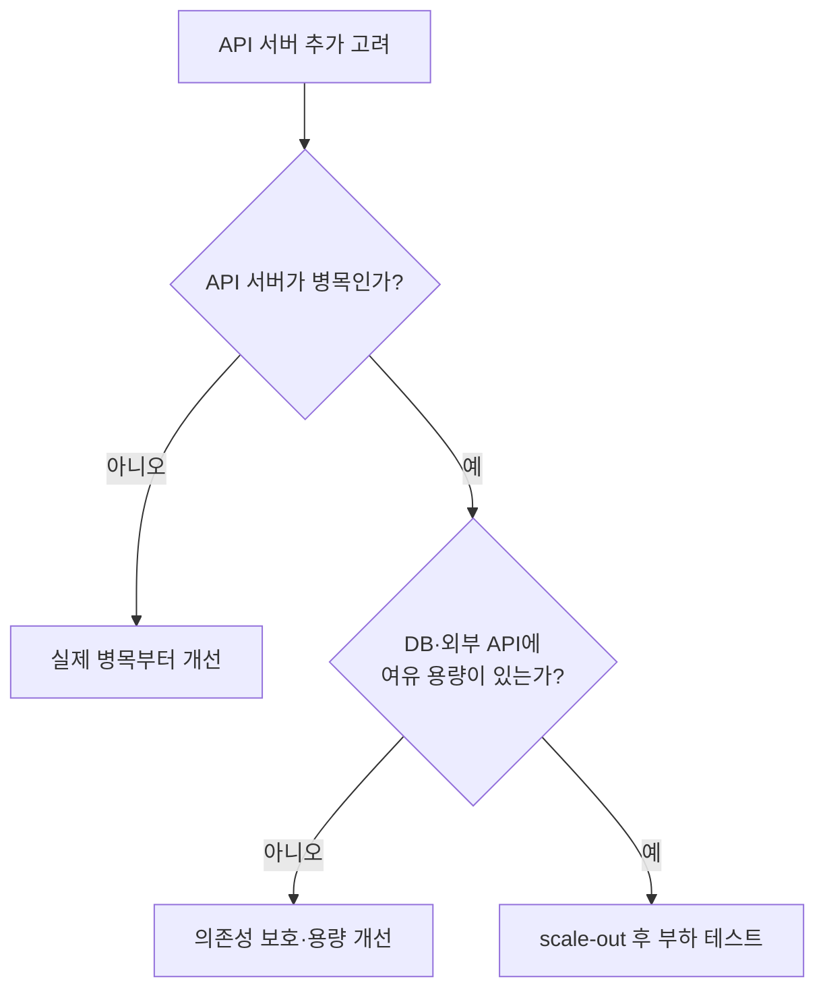

확장 전후에는 같은 조건으로 부하 테스트를 수행하고 TPS뿐 아니라 p95·p99, 오류율, DB CPU, 커넥션 대기, 외부 API 호출량을 함께 비교해야 한다.

DB 쿼리와 인덱스까지 내려가 병목을 확인할 때는 [DB 쿼리 개선 점검 순서](../03-성능을-좌우하는-db-설계와-쿼리/5-db-쿼리-개선-점검-순서.md), 외부 호출을 보호할 때는 [Circuit breaker](../04-외부-연동이-문제일-때-살펴봐야-할-것들/4-circuit-breaker.md)를 참고한다.

## DB 커넥션 풀

애플리케이션이 DB를 사용하려면 물리적인 연결을 만들고 인증한 뒤 쿼리를 실행해야 한다. 매 요청마다 새 연결을 만들고 종료하면 네트워크 연결, TLS, 인증, DB 세션 준비 비용이 반복되어 처리량이 감소한다.

새 연결을 만드는 데 걸리는 시간은 네트워크 거리, DB 종류, TLS와 인증 방식에 따라 크게 달라지므로 항상 `0.5~1초`가 걸린다고 일반화할 수 없다. 중요한 점은 **새 연결 생성 비용이 이미 만들어진 연결을 빌려 쓰는 비용보다 크며, 부하가 높을수록 반복 생성의 영향도 커진다**는 것이다.

커넥션 풀은 DB에 연결된 커넥션을 미리 만들거나 필요할 때 생성해 보관하고, 요청이 끝나면 물리적 연결을 닫는 대신 풀에 반환하여 재사용한다.

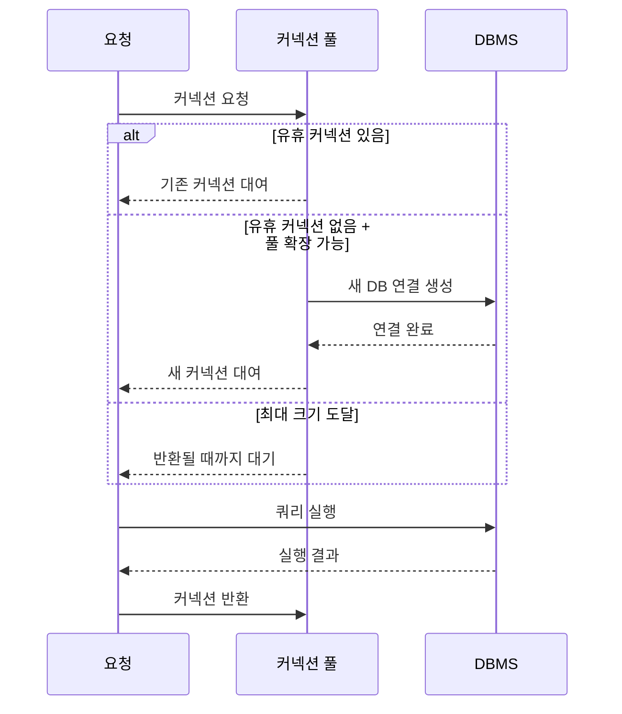

### 주요 설정

| 설정 | 의미 | 주의점 |
| --- | --- | --- |
| 최소 유휴 크기 | 풀에서 유지하려는 최소 유휴 커넥션 수 | 구현체에 따라 동작이 다르다. 너무 크면 사용하지 않는 DB 연결을 오래 점유한다. |
| 최대 풀 크기 | 유휴·사용 중 커넥션을 포함한 최대 물리 연결 수 | 애플리케이션 인스턴스 수와 DB 전체 연결 예산을 함께 고려한다. |
| 커넥션 획득 대기 시간 | 풀이 가득 찼을 때 커넥션을 기다릴 수 있는 최대 시간 | 초과하면 커넥션 획득 실패 예외가 발생한다. 서비스 응답 시간 목표보다 과도하게 길면 안 된다. |
| 최대 유휴 시간 | 사용되지 않은 커넥션을 풀에서 제거하기까지의 시간 | 동적 크기 풀에서 유휴 연결을 정리하는 데 사용한다. |
| 최대 유지 시간 | 생성된 커넥션을 풀에서 유지할 수 있는 최대 수명 | DB나 네트워크 장비가 연결을 끊는 시간보다 짧게 설정하는 편이 안전하다. |
| 연결 검증·keepalive | 커넥션이 여전히 사용 가능한지 확인한다. | 검사 자체의 비용과 주기를 고려한다. JDBC4 드라이버는 보통 `isValid()`를 사용한다. |

### 커넥션 풀 크기와 처리량

DB 커넥션 하나가 한 번에 쿼리 하나를 실행한다고 단순화하면 다음 관계를 사용할 수 있다.

> **DB 구간의 이론상 처리량 상한 ≈ 커넥션 수 ÷ 커넥션 점유 시간(초)**

이 계산은 모든 쿼리의 시간이 같고 DB가 추가 동시 쿼리를 처리해도 느려지지 않으며 데이터 전송 시간을 무시한다는 가정에 기반한 상한선이다.

#### 풀 크기 5, 쿼리 시간 1초, 동시 요청 6개

처음 5개 요청은 즉시 커넥션을 얻고, 여섯 번째 요청은 커넥션이 반환될 때까지 기다린다.

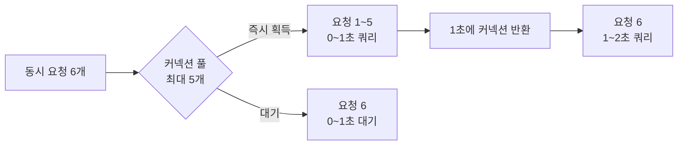

- 요청 1~5의 응답 시간: 약 1초
- 요청 6의 응답 시간: 대기 1초 + 쿼리 1초 = 약 2초
- DB 구간의 단순화한 최대 처리량: `5 ÷ 1초 = 5 TPS`

같은 풀 크기에서도 쿼리 시간이 달라지면 처리량이 크게 달라진다.

| 풀 크기 | 쿼리당 점유 시간 | 단순화한 처리량 상한 |
| ---: | ---: | ---: |
| 5 | 0.1초 | 약 50 TPS |
| 5 | 0.5초 | 약 10 TPS |
| 5 | 1초 | 약 5 TPS |

풀 크기가 5이고 쿼리 시간이 0.5초일 때 50개 요청이 한꺼번에 도착하면 10번의 처리 묶음이 필요하다. 가정이 유지된다면 첫 5개는 0.5초, 마지막 5개는 5초에 쿼리를 마친다.

### 풀 크기는 클수록 좋은가

커넥션 획득 대기만 보면 풀을 늘리고 싶지만, 커넥션 수를 과도하게 늘리면 DB가 동시에 실행해야 할 쿼리가 많아진다. DB CPU가 포화되고 락 경합과 디스크 I/O 대기가 증가하면 개별 쿼리 시간이 길어져 전체 TPS가 오히려 감소할 수 있다.

HikariCP 공식 문서도 작은 풀을 충분히 활용하는 방식을 권장하며, 최적 크기는 애플리케이션과 DB를 함께 부하 테스트해 찾아야 한다고 설명한다. `CPU 코어 × 2 + 유효 디스크 수` 같은 공식은 출발점일 뿐, SSD·캐시·쿼리 유형·원격 DB 환경에 그대로 적용할 정답이 아니다.

다음 항목을 함께 관찰하면서 크기를 조정한다.

- DB CPU, 메모리, 디스크 I/O와 락 대기
- 평균·p95 쿼리 실행 시간
- 활성·유휴 커넥션 수
- 커넥션 획득 대기 요청 수와 대기 시간
- 커넥션 획득 시간 초과 횟수
- 애플리케이션 인스턴스 전체의 최대 커넥션 합계

> **잠재적 전체 DB 연결 수 = 애플리케이션 인스턴스 수 × 인스턴스당 최대 풀 크기**

인스턴스 10개가 각각 최대 20개의 커넥션을 가지면 애플리케이션은 최대 200개의 DB 연결을 만들 수 있다. scale-out할 때 이 값이 함께 증가한다는 사실을 빠뜨리면 API 서버를 추가한 직후 DB가 포화될 수 있다. DB의 최대 연결 수 중에는 운영·관리 작업과 다른 애플리케이션을 위한 여유도 남겨야 한다.

### 최소 크기와 최대 크기

최소 10, 최대 20으로 설정하는 동적 풀은 유휴 커넥션을 최소 10개가량 유지하고, 요청이 늘면 최대 20개까지 확장한 뒤 트래픽이 줄면 다시 유휴 커넥션을 정리할 수 있다. 정확한 생성·축소 시점은 풀 구현체에 따라 다르다.

트래픽이 순간적으로 급증하고 새 DB 연결 생성 비용이 크다면, 필요한 커넥션을 미리 확보한 고정 크기 풀이 급증 시 지연을 줄일 수 있다. HikariCP는 `minimumIdle`을 별도로 지정하지 않으면 기본적으로 `maximumPoolSize`와 같게 두어 고정 크기 풀처럼 동작하며, 급증 대응을 위해 이 방식을 권장한다.

그러나 최소 크기를 최대 크기와 같게 두면 모든 애플리케이션 인스턴스가 그만큼의 DB 연결을 계속 점유한다. 다음 조건을 확인한 뒤 선택해야 한다.

- DB가 전체 고정 연결 수를 감당할 수 있는가?
- 연결 생성 시간이 실제로 급증 시 지연의 주요 비중을 차지하는가?
- 트래픽이 낮은 시간에도 연결을 유지하는 비용이 허용되는가?

### 커넥션 획득 대기 시간

풀에 사용할 수 있는 커넥션이 없고 최대 크기에도 도달하면 요청은 다른 요청이 커넥션을 반환할 때까지 기다린다. 지정한 시간 안에 커넥션을 얻지 못하면 예외가 발생한다.

HikariCP의 `connectionTimeout` 기본값은 30초이고 허용되는 최솟값은 250ms다. 그러나 **기본값 30초가 모든 서비스에 적절하다는 뜻은 아니다**. `0.5~3초` 역시 보편적인 권장값이 아니라 응답 시간 목표, 상위 요청의 deadline, 정상 쿼리 시간과 트래픽 특성을 바탕으로 정해야 하는 예시 범위다.

응답 시간이 중요한 서비스에서 대기 시간을 지나치게 길게 두면 이미 성공 가능성이 낮은 요청이 서버 자원을 계속 점유한다. 짧은 시간 안에 실패를 반환하고 상위 계층에서 부하를 제어하는 편이 전체 장애를 막는 데 유리할 수 있다.

#### 긴 대기와 재시도가 만드는 악순환

다음 상황을 가정한다.

1. 커넥션 풀 크기는 10이고 커넥션 대기 시간은 30초다.
2. 30개 요청이 동시에 도착한다.
3. DB 부하로 쿼리 시간이 10초까지 증가한다.
4. 10개는 쿼리를 실행하고 20개는 커넥션을 기다린다.
5. 클라이언트 일부가 5초 후 요청을 취소하고 즉시 재시도한다.

클라이언트 연결이 끊겨도 서버와 DB 작업이 자동으로 즉시 취소된다고 보장할 수 없다. 취소 신호가 DB까지 전파되지 않으면 기존 작업과 대기 요청이 남은 상태에서 재시도 요청이 추가된다. 이 때문에 대기열과 부하가 더 커질 수 있다.

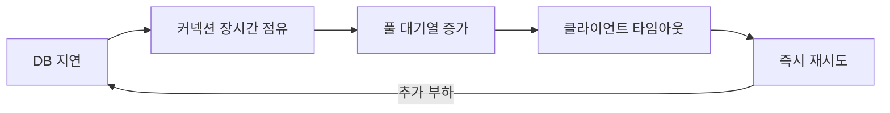

대기 시간을 1초로 설정하면 처음 커넥션을 얻지 못한 20개 요청은 빠르게 실패한다. 하지만 클라이언트가 즉시 무제한으로 재시도하면 여전히 부하가 커질 수 있다. 따라서 짧은 timeout과 함께 지수 백오프, jitter, 재시도 횟수 제한, 전체 retry budget을 사용해야 한다.

### 최대 유휴 시간과 최대 유지 시간

DB나 방화벽, 프록시 같은 네트워크 장비는 오래 사용되지 않은 연결을 종료할 수 있다. 풀에 끊어진 연결이 남아 있으면 다음 요청에서 오류가 발생할 수 있으므로 풀은 유휴 연결 정리, 최대 수명, keepalive와 유효성 검사 기능을 제공한다.

- **최대 유휴 시간(idle timeout)**: 일정 시간 사용되지 않은 여분의 커넥션을 제거한다. 최소 유휴 크기 아래로는 줄이지 않는 구현이 일반적이다.
- **최대 유지 시간(max lifetime)**: 생성된 뒤 일정 시간이 지난 커넥션을 교체한다. 사용 중인 커넥션은 보통 반환된 뒤 제거한다.
- **keepalive**: 유휴 커넥션을 주기적으로 확인해 DB나 네트워크 장비의 idle timeout으로 끊기는 것을 예방한다.
- **유효성 검사**: 커넥션이 실제로 사용 가능한지 확인한다. JDBC4 드라이버에서는 `Connection.isValid()`가 권장되며, 레거시 드라이버에서만 `SELECT 1` 같은 테스트 쿼리가 필요할 수 있다.

HikariCP 기준 기본값은 `idleTimeout=10분`, `maxLifetime=30분`, `keepaliveTime=2분`이며, `idleTimeout`은 `minimumIdle < maximumPoolSize`일 때만 적용된다. 기본값을 그대로 복사하기보다 DB와 네트워크 인프라의 연결 종료 정책을 확인해야 한다. `maxLifetime`은 DB나 인프라가 강제로 연결을 끊는 시간보다 몇 초 짧게 설정하는 것이 권장된다.

최대 유휴 시간이나 최대 유지 시간을 무조건 무한대로 두는 것은 피한다. 반대로 너무 짧게 설정하면 커넥션을 계속 만들고 닫는 churn이 발생한다. 풀의 기본값, DB 설정, 네트워크 장비 정책을 함께 보고 결정해야 한다.

### 커넥션 풀 점검 순서

1. 느린 요청 trace에서 **커넥션 획득 대기 시간**과 **쿼리 실행 시간**을 분리한다.
2. 풀의 활성·유휴·대기 커넥션과 획득 timeout을 확인한다.
3. 같은 시간대의 DB CPU, I/O, 락, slow query를 확인한다.
4. 쿼리와 트랜잭션 시간을 먼저 줄일 수 있는지 검토한다.
5. DB에 여유가 있을 때만 풀 크기를 조금씩 바꾸고 부하 테스트한다.
6. scale-out 시 모든 인스턴스의 최대 커넥션 합계를 다시 계산한다.
7. connection timeout, query timeout과 상위 요청 deadline의 순서를 맞춘다.

## 서버 캐시

DB를 바로 확장하기 어렵거나 반복 조회의 응답 시간을 줄이고 싶다면 캐시를 고려할 수 있다. 캐시는 원본 데이터나 계산 결과를 키와 값 형태로 임시 보관하고, 느린 원본 대신 빠르게 재사용하는 저장소다.

캐시는 DB 조회 결과뿐 아니라 복잡한 계산 결과와 외부 API 응답에도 적용할 수 있다. 단, 외부 API 응답을 저장할 때는 제공자의 이용 약관, 개인정보 포함 여부, 허용 가능한 데이터 갱신 주기를 먼저 확인해야 한다.

### Cache-Aside 패턴

가장 흔한 읽기 방식은 cache-aside다. 애플리케이션이 캐시를 먼저 확인하고, 값이 없을 때만 원본을 조회한 뒤 캐시에 저장한다.

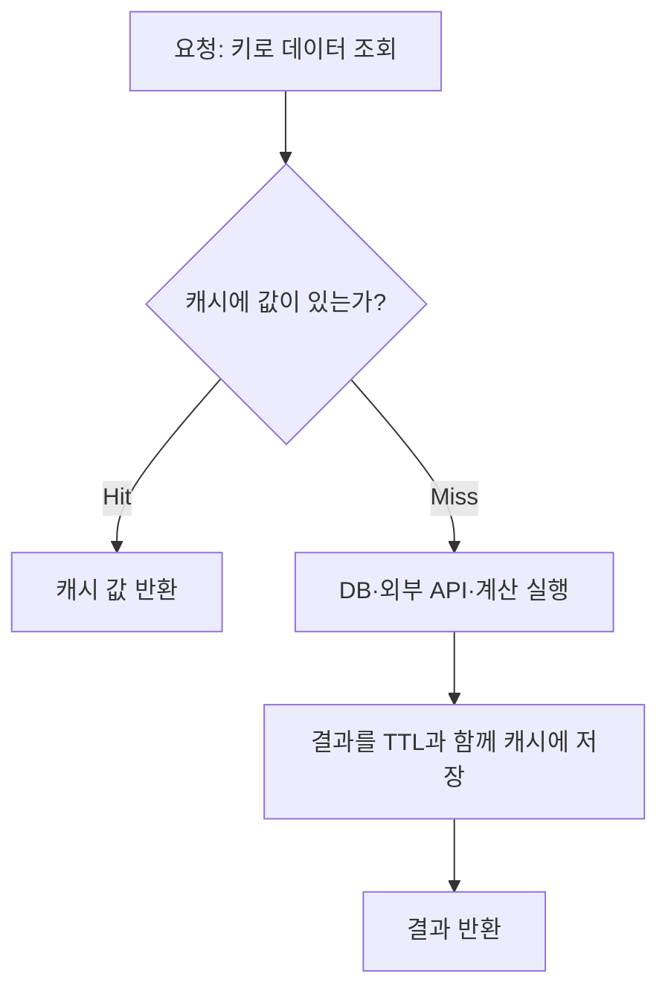

캐시 miss가 항상 저장으로 이어져야 하는 것은 아니다. 매우 큰 값, 한 번만 조회되는 값, 민감한 값, 곧 변경될 값은 캐시에 넣지 않는 편이 나을 수 있다. 존재하지 않는 데이터에 대한 반복 조회가 원본을 압박한다면 `not found` 결과를 짧은 TTL로 저장하는 **negative caching**도 사용할 수 있다.

### 캐시 키 설계

키는 같은 결과를 만드는 요청은 동일한 키가 되고, 다른 결과를 만드는 요청은 서로 다른 키가 되도록 설계해야 한다.

> 예시: `catalog:product:v3:{productId}:{locale}`

키를 설계할 때 다음 요소를 확인한다.

- 서비스·도메인·엔티티를 나타내는 namespace
- 원본 데이터의 ID와 스키마 버전
- 결과에 영향을 주는 locale, 권한, 사용자·tenant, 필터와 페이지 번호
- 서로 다른 서비스가 같은 Redis를 사용할 때의 충돌 방지
- 키에 개인정보나 인증 토큰을 그대로 노출하지 않기

사용자별 결과를 공용 키로 저장하면 다른 사용자의 정보가 노출될 수 있다. 반대로 결과와 무관한 모든 헤더와 파라미터를 키에 포함하면 키가 지나치게 세분화되어 적중률이 낮아진다.

### 적중률과 제거 정책

캐시의 기본 효율 지표는 적중률(hit rate)이다.

> **적중률 = cache hit 횟수 ÷ 전체 캐시 조회 횟수 × 100**

100번 조회 중 87번 캐시에 값이 있었다면 적중률은 87%다. 적중률이 높아지면 일반적으로 원본 조회가 줄어 응답 시간이 짧아지고 DB 부하가 감소한다.

하지만 적중률만으로 캐시 효과를 단정해서는 안 된다. 값의 크기와 miss 비용이 서로 다를 수 있으므로 cache hit·miss의 p95 응답 시간, DB 감소량, eviction 수, 메모리 사용량과 오래된 데이터 제공 비율도 함께 확인한다.

메모리 한도에 도달했을 때 어떤 항목을 제거할지는 eviction 정책이 결정한다.

| 정책 | 제거 대상 | 특징 |
| --- | --- | --- |
| LRU | 가장 오래 사용되지 않은 데이터 | 최근에 사용한 데이터가 다시 사용될 가능성이 높은 패턴에 적합하다. |
| LFU | 사용 빈도가 가장 낮은 데이터 | 장기적으로 자주 쓰이는 데이터를 보존하는 데 유리하다. |
| FIFO | 가장 먼저 추가된 데이터 | 단순하지만 실제 접근 패턴을 반영하지 않는다. |

eviction은 메모리 부족 시 공간을 확보하는 정책이고, TTL expiration은 데이터의 신선도와 보관 기간을 제한하는 정책이다. 둘은 목적이 다르므로 함께 설계한다. 실제 구현체는 정확한 LRU/LFU 대신 근사 알고리즘이나 Caffeine의 Window TinyLFU처럼 빈도와 최신성을 결합한 정책을 사용할 수 있다.

### 로컬 캐시와 리모트 캐시

| 구분 | 로컬 캐시 | 리모트 캐시 |
| --- | --- | --- |
| 위치 | 애플리케이션 프로세스 내부 | Redis 같은 별도 프로세스·클러스터 |
| 속도 | 네트워크 호출이 없어 매우 빠르다. | 네트워크 왕복과 직렬화 비용이 추가된다. |
| 용량 | 애플리케이션 힙과 서버 메모리에 제한된다. | 독립적으로 메모리를 늘리거나 shard를 추가할 수 있다. |
| 다중 서버 | 인스턴스마다 서로 다른 복사본을 가진다. | 여러 애플리케이션 인스턴스가 같은 캐시를 공유한다. |
| 재시작 | 애플리케이션 재시작·배포 시 사라진다. | 애플리케이션이 재시작되어도 캐시 프로세스가 유지되면 남아 있다. |
| 복잡도 | 구조가 단순하다. | 운영, 장애 대응, 네트워크 timeout이 필요하다. |

Java의 Caffeine, Go의 인프로세스 캐시, Node.js의 메모리 캐시 등은 로컬 캐시에 해당한다. 최신 공지 목록처럼 데이터가 작고 변경이 드물며 인스턴스별 차이가 잠시 허용되는 경우에 적합하다.

Redis 같은 리모트 캐시는 데이터 규모가 크거나 인스턴스 사이에 같은 값을 공유해야 할 때 유리하다. Redis Cluster는 키 공간을 여러 노드로 나누어 수평 확장할 수 있다. 다만 애플리케이션 재시작과 무관하게 데이터가 유지된다는 것이 영구 보존을 뜻하지는 않는다. 캐시는 장애나 eviction으로 사라져도 원본에서 다시 만들 수 있어야 한다.

리모트 캐시는 새로운 의존성이므로 짧은 timeout, 연결 풀, 장애 시 원본 조회 또는 제한된 기능으로 전환하는 fallback을 설계해야 한다. 로컬 L1 캐시와 리모트 L2 캐시를 함께 사용하는 방식도 가능하지만 무효화와 관측 복잡도가 증가한다.

### 캐시 사전 적재와 스탬피드 방지

트래픽이 발생할 시점과 조회 대상을 미리 알 수 있다면 필요한 데이터를 사전 적재(cache warming)할 수 있다.

예를 들어 사용자 300만 명에게 같은 시점에 월별 요금 안내를 보내고 그중 50%가 짧은 시간에 조회하면 최대 150만 건의 조회가 몰릴 수 있다. 사용자별 요금 정보가 아직 캐시에 없다면 적중률이 순간적으로 낮아지면서 DB 부하가 급증한다.

사전 적재 시에도 다음을 주의한다.

- 300만 건을 한꺼번에 읽어 DB를 먼저 과부하시키지 않도록 batch와 rate limit을 적용한다.
- 실제로 조회할 가능성이 높은 데이터부터 적재한다.
- 필요한 메모리 크기와 Redis network bandwidth를 계산한다.
- TTL이 같은 시각에 끝나지 않도록 작은 무작위 값인 jitter를 추가한다.
- 푸시 발송 자체도 여러 구간으로 나누어 트래픽을 평탄화할 수 있다.

인기 키 하나가 만료됐을 때 여러 요청이 동시에 DB를 조회하는 현상을 **cache stampede** 또는 **thundering herd**라고 한다. 사전 적재 외에도 같은 키의 동시 로딩을 하나로 합치는 single-flight/request coalescing, 짧은 분산 락, 만료 전 비동기 갱신, stale-while-revalidate로 원본 부하를 줄일 수 있다.

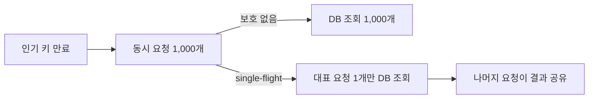

### 캐시 무효화와 일관성

원본이 변경됐는데 캐시를 갱신하거나 제거하지 않으면 사용자는 오래된 값을 보게 된다. 허용 가능한 stale 시간과 데이터의 중요도에 따라 전략을 선택한다.

- **TTL 기반**: 일정 시간이 지나면 자동 갱신한다. 변경에 덜 민감한 데이터에 단순하고 유용하다.
- **변경 시 삭제**: DB 변경이 성공한 뒤 관련 캐시 키를 삭제하고 다음 읽기에서 다시 채운다.
- **이벤트 기반 무효화**: 변경 이벤트를 발행해 여러 캐시 인스턴스가 해당 키를 제거한다.
- **버전 키**: 데이터나 스키마 버전을 키에 넣어 이전 값을 자연스럽게 사용하지 않게 한다.

다중 ECS task처럼 애플리케이션 인스턴스가 여러 개면 각 로컬 캐시는 서로 독립적이다. 한 서버에서 로컬 값을 삭제해도 다른 서버의 값은 남는다. 그렇다고 반드시 모든 데이터를 리모트 캐시에만 저장해야 하는 것은 아니다. 메시지 브로커나 Redis Pub/Sub 같은 채널로 무효화 이벤트를 전파하거나, 짧은 TTL로 불일치 시간을 제한할 수 있다. 강한 일관성이 필요하고 이벤트 유실을 허용할 수 없다면 공유 리모트 캐시나 신뢰할 수 있는 이벤트 전달 구조가 더 단순하다.

DB 변경과 캐시 삭제 사이에 실패가 발생할 수 있으므로 중요한 데이터는 outbox/CDC 같은 신뢰 가능한 변경 이벤트, 재시도, 멱등한 무효화를 고려한다. 결제 상태나 권한처럼 오래된 값이 심각한 문제를 만드는 데이터는 캐시 적용 범위를 특히 보수적으로 정한다.

## 가비지 컬렉터와 메모리

Java와 Go처럼 추적형 GC를 사용하는 런타임은 사용 중인 객체를 찾아 남기고 도달할 수 없는 객체의 메모리를 회수한다. Python은 주로 참조 카운팅과 순환 GC를 함께 사용하므로 언어마다 동작 방식은 다르다.

GC 비용은 단순히 “전체 메모리가 크다”는 사실만으로 결정되지 않는다. 주요 요인은 다음과 같다.

- GC가 추적해야 하는 **live set과 root의 크기**
- 새 객체를 만드는 **할당률(allocation rate)**
- 사용하는 collector와 heap 크기·목표 pause 설정
- 한 번에 생성되는 큰 객체와 일시적인 메모리 spike

일부 GC 단계에서는 애플리케이션 실행이 잠시 멈추는 stop-the-world가 발생할 수 있다. 현대 collector는 많은 작업을 병렬·동시 수행하므로 heap이 크다고 pause가 반드시 같은 비율로 증가하는 것은 아니다. GC pause, GC CPU 비율, allocation rate와 live heap을 실제로 측정해야 한다.

로컬 캐시는 live heap을 늘려 GC 비용과 OOM 위험을 키울 수 있다. 캐시 엔트리의 객체·키·자료구조 overhead 때문에 직렬화된 데이터 크기보다 실제 heap 점유가 더 클 수 있으므로 엔트리 수 또는 weight 기반 한도를 반드시 둔다.

### 대량 응답의 메모리 계산

게시글 하나의 순수 데이터가 0.5KB이고 10만 개를 한꺼번에 메모리에 올리면 단순 계산으로 약 50MB다.

> `0.5KB × 100,000 = 약 50MB`

100개 요청이 동시에 같은 양을 각자 적재하면 약 5GB, 이진 단위로는 약 4.66GiB가 필요하다. 실제로는 객체와 컬렉션 overhead, 직렬화 buffer까지 더해져 더 커질 수 있다. 최대 heap이 4GB라면 GC로도 살아 있는 데이터를 제거할 수 없어 OOM이 발생할 수 있다.

해결 방법은 heap만 늘리는 것이 아니라 다음과 같다.

- 페이지네이션과 조회 기간·최대 건수 제한
- 필요한 필드만 조회하고 반환
- 한 번에 materialize하지 않고 chunk 단위 처리
- 파일 다운로드와 대용량 응답은 streaming 사용
- 동시 실행 수와 응답 크기에 상한 설정

## 응답 데이터 압축

응답 시간에는 데이터 전송 시간이 포함된다. 서버가 사용자의 네트워크 품질을 바꿀 수는 없지만 전송할 byte 수는 줄일 수 있다.

HTTP 압축 협상은 다음과 같이 동작한다.

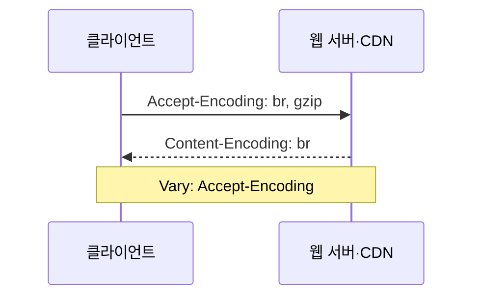

- 클라이언트는 요청의 `Accept-Encoding`에 해제 가능한 압축 방식을 보낸다.
- 서버는 지원 방식 중 하나를 선택해 압축하고 `Content-Encoding`으로 알린다.
- 캐시가 압축 방식별 응답을 구분하도록 일반적으로 `Vary: Accept-Encoding`을 사용한다.

HTML, CSS, JavaScript, JSON, XML과 같은 텍스트 데이터는 gzip이나 Brotli 압축 효과가 크다. JPEG, WebP, MP4, ZIP처럼 이미 압축된 형식은 다시 압축해도 이득이 작고 CPU만 사용할 수 있다. 아주 작은 응답도 header와 CPU 비용 때문에 압축하지 않는 편이 나을 수 있다.

압축은 CPU를 사용하므로 압축률, 응답 크기, CPU 사용량과 p95를 전후 비교한다. 정적 파일은 미리 압축하거나 CDN에서 압축하면 origin CPU 사용을 줄일 수 있다. 웹 서버에서 설정했는데 최종 응답이 압축되지 않았다면 중간 프록시, WAF, CDN이 `Accept-Encoding` 또는 응답을 변경하는지 실제 클라이언트 응답 헤더로 확인한다.

## 정적 자원과 브라우저 캐시

웹 페이지는 API 결과 같은 동적 자원과 이미지·CSS·JavaScript·폰트 같은 정적 자원으로 구성된다. 이미지가 많은 페이지에서는 정적 자원의 byte 비중이 대부분을 차지할 수 있다. 변경되지 않은 파일을 매번 다운로드하는 대신 HTTP 캐시를 사용하면 전송량과 로딩 시간을 줄일 수 있다.

`Cache-Control: max-age=60`은 응답을 60초 동안 fresh한 것으로 취급할 수 있다는 의미다. 그 안에 같은 캐시 키로 요청하면 브라우저는 네트워크 요청 없이 저장된 응답을 재사용할 수 있다.

주요 지시어는 다음과 같다.

- `public`: 공유 캐시도 저장할 수 있다.
- `private`: 브라우저 같은 private cache만 저장할 수 있다.
- `max-age=N`: N초 동안 fresh하게 사용할 수 있다.
- `s-maxage=N`: CDN 같은 shared cache의 freshness를 별도로 지정한다.
- `no-cache`: 저장은 가능하지만 재사용 전에 origin 검증이 필요하다.
- `no-store`: 저장하지 않도록 지시한다.
- `immutable`: freshness 기간 동안 내용이 바뀌지 않는 versioned 자원임을 알린다.

파일 내용이 바뀔 때 이름도 바뀌는 `app.a1b2c3.js` 같은 fingerprinted URL에는 긴 `max-age`와 `immutable`을 사용할 수 있다. HTML처럼 같은 URL의 내용이 변경되는 자원은 짧은 TTL 또는 `ETag`·`Last-Modified`를 사용한 조건부 요청으로 변경 여부를 검증한다. 변경이 없으면 서버는 본문 없이 `304 Not Modified`를 반환할 수 있다.

인증·개인화 응답은 공유 캐시에 저장되지 않도록 `private` 또는 `no-store`를 데이터 특성에 맞게 사용한다. `Expires`도 사용할 수 있지만 `Cache-Control: max-age`가 함께 있으면 `max-age`가 우선한다.

## 정적 자원과 CDN

브라우저 캐시는 사용자별로 따로 존재한다. 신규 사용자나 캐시가 비어 있는 사용자가 한꺼번에 접속하면 origin 서버가 같은 정적 파일을 반복해서 전송해야 한다.

CDN(Content Delivery Network)은 여러 지역의 edge 서버에 콘텐츠를 저장하고 사용자와 가까운 위치에서 응답한다.

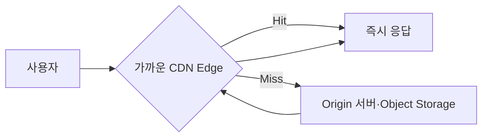

CDN의 장점은 다음과 같다.

- 사용자와 가까운 edge에서 응답해 network latency를 줄인다.
- 같은 파일에 대한 origin 요청과 outbound traffic을 줄인다.
- 트래픽 spike를 여러 edge로 분산한다.
- 큰 정적 파일을 애플리케이션 서버가 직접 전송하지 않게 할 수 있다.

CDN도 cache key와 invalidation 설계가 필요하다. 결과에 영향을 주지 않는 cookie·header·query parameter를 cache key에 모두 포함하면 적중률이 낮아진다. 정적 파일 갱신은 전체 purge보다 versioned URL을 사용하는 편이 안전하고 효율적인 경우가 많다.

대용량 다운로드는 단순히 웹 서버에 크기 제한을 두는 것보다 object storage와 CDN을 사용하고, streaming과 HTTP Range 요청을 지원하는 편이 적절하다. 업로드 크기 제한은 별도의 자원 보호 정책으로 설정한다.

## 대기 처리

콘서트 예매나 한정 판매처럼 짧은 시간에 트래픽이 폭증하면 최대 순간 부하에 맞춰 모든 시스템을 증설하는 비용이 매우 클 수 있다. DB처럼 빠르게 확장하기 어려운 병목이 있다면, 시스템이 감당할 수 있는 사용자만 입장시키고 나머지는 **가상 대기실(virtual waiting room)**에 두는 admission control이 합리적일 수 있다.

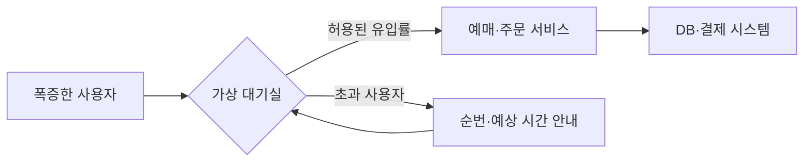

대기실은 총 활성 사용자 수와 분당 신규 입장 수를 제한해 origin, DB, 외부 결제 시스템을 보호한다. 서버 증설을 완전히 대신하는 기능은 아니며, 안전한 처리 용량을 부하 테스트로 먼저 알아야 한다.

새로고침할 때마다 순번을 뒤로 보내는 방식은 불필요한 새로고침을 줄일 수 있지만 사용자 경험과 공정성을 해칠 수 있다. 일반적으로는 서명된 cookie나 대기 토큰으로 사용자의 위치를 보존하고, 페이지가 주기적으로 상태를 갱신하도록 한다. 새로고침은 같은 토큰을 사용하므로 순번에 영향을 주지 않게 만들 수 있다.

대기 처리를 설계할 때는 다음을 고려한다.

- FIFO 또는 우선순위 정책과 공정성
- 위조·공유하기 어려운 서명된 대기 토큰과 만료 시간
- 탭 종료나 일시적 연결 끊김에 대한 grace period
- 예상 대기 시간과 현재 상태 안내
- 봇·다중 접속·우회 URL 방지
- 실제 서비스의 활성 사용자 수와 신규 입장률 측정
- 대기 시스템 장애 시 fail-open 또는 fail-closed 정책
- 운영자·장애 대응을 위한 bypass와 수동 제어

가상 대기실은 사용자의 서비스 진입을 제어한다. 이미 들어온 긴 작업을 비동기로 처리하는 메시지 큐와는 목적이 다르므로 두 개념을 구분한다.

## 핵심 정리

- 과부하는 유입 속도가 지속 가능한 처리 속도를 넘을 때 대기열과 응답 시간을 증가시킨다.
- 전체 처리량은 API 서버뿐 아니라 DB와 외부 API를 포함한 필수 구간의 병목에 제한된다.
- APM과 시스템 지표를 이용해 가장 느리거나 먼저 포화되는 구간을 찾은 뒤 개선한다.
- scale-up은 빠른 완화책이지만 실제 병목 자원을 늘릴 때만 효과가 있다.
- scale-out에는 로드 밸런싱, 헬스 체크, 상태 외부화가 필요하다.
- DB나 외부 API가 병목이면 API 서버 증설이 오히려 문제를 악화할 수 있다.
- 커넥션 풀은 연결 생성 비용을 줄이지만, 풀을 과도하게 키우면 DB를 포화시킬 수 있다.
- 풀 크기와 timeout은 공식 하나가 아니라 실제 쿼리 시간, DB 용량, 응답 시간 목표를 기준으로 결정한다.
- scale-out할 때는 모든 애플리케이션 인스턴스의 최대 DB 연결 수를 합산해야 한다.
- 캐시는 반복 조회와 계산을 줄이지만 key, TTL, eviction, stampede와 무효화를 함께 설계해야 한다.
- 로컬 캐시는 빠르고 단순하며, 리모트 캐시는 공유와 확장에 유리하지만 새로운 네트워크 의존성이 된다.
- 로컬 캐시도 이벤트 기반 무효화가 가능하며, 다중 서버라고 해서 반드시 모든 캐시를 리모트에 둘 필요는 없다.
- GC 비용은 live set과 allocation rate의 영향을 받으므로 대량 객체 생성, 무제한 로컬 캐시와 대용량 응답을 피한다.
- 텍스트 응답 압축, 브라우저 캐시와 CDN은 전송량과 origin 부하를 줄인다.
- 가상 대기실은 시스템이 수용할 수 있는 범위로 유입을 제한하며, 토큰으로 사용자의 순번을 보존해야 한다.

## 참고 자료

- [Google SRE: Addressing Cascading Failures](https://sre.google/sre-book/addressing-cascading-failures/)
- [Datadog APM과 Trace Explorer](https://docs.datadoghq.com/tracing/trace_explorer/)
- [NGINX HTTP Load Balancing](https://nginx.org/en/docs/http/load_balancing.html)
- [AWS Application Load Balancer의 라우팅 알고리즘](https://docs.aws.amazon.com/elasticloadbalancing/latest/application/edit-target-group-attributes.html)
- [AWS Application Load Balancer 헬스 체크](https://docs.aws.amazon.com/elasticloadbalancing/latest/application/target-group-health-checks.html)
- [Azure Architecture Center: Design to scale out](https://learn.microsoft.com/en-us/azure/architecture/guide/design-principles/scale-out)
- [HikariCP 공식 설정 문서](https://github.com/brettwooldridge/HikariCP)
- [HikariCP: About Pool Sizing](https://github.com/brettwooldridge/HikariCP/wiki/About-Pool-Sizing)
- [Oracle JDBC Connection Pool 개요](https://docs.oracle.com/database/121/JJUCP/E49541-01.pdf)
- [Redis Cache-Aside 공식 문서](https://redis.io/docs/latest/develop/use-cases/cache-aside/)
- [Redis Key Eviction 공식 문서](https://redis.io/docs/latest/develop/reference/eviction/)
- [Caffeine 공식 문서](https://github.com/ben-manes/caffeine)
- [Go Garbage Collector Guide](https://go.dev/doc/gc-guide)
- [Oracle HotSpot VM Garbage Collection Tuning Guide](https://docs.oracle.com/en/java/javase/26/gctuning/hotspot-virtual-machine-garbage-collection-tuning-guide.pdf)
- [RFC 9110: HTTP Semantics](https://www.rfc-editor.org/rfc/rfc9110.html)
- [RFC 9111: HTTP Caching](https://www.rfc-editor.org/rfc/rfc9111.html)
- [NGINX gzip module](https://nginx.org/en/docs/http/ngx_http_gzip_module.html)
- [Amazon CloudFront 동작 방식](https://docs.aws.amazon.com/AmazonCloudFront/latest/DeveloperGuide/HowCloudFrontWorks.html)
- [Cloudflare Waiting Room](https://developers.cloudflare.com/waiting-room/about/)
