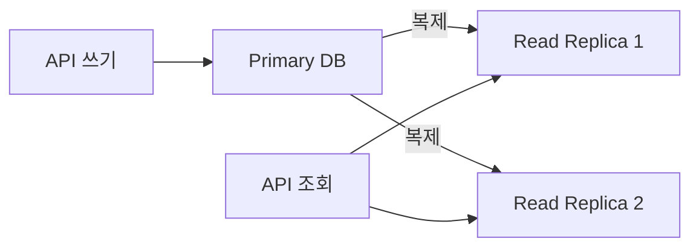

# 몇 가지 조회 성능 개선 방법

> [성능을 좌우하는 DB 설계와 쿼리](./README.md)

> [!TIP]
> **읽고 계산하는 데이터의 범위를 먼저 줄이세요**
>
> 집계, 페이지네이션, 보관 정책과 읽기 분산은 각자 다른 병목을 해결하므로 측정 결과에 맞춰 선택합니다.

## 빠른 복습

- 반복 집계는 미리 계산하고, 큰 OFFSET은 안정적인 정렬 key를 이용한 keyset pagination으로 바꾼다.
- 시간·최신 범위로 조회량을 제한하고 정확한 전체 건수가 정말 필요한지 제품 요구사항을 확인한다.
- 오래된 데이터 분리, 읽기 replica와 cache는 비용·일관성·운영 복잡도를 함께 평가한다.
- 개선 전후에는 반환 행뿐 아니라 읽은 행, 실행시간과 쓰기 비용을 비교한다.

## 1. 미리 집계하기

설문 목록에 답변자 수와 좋아요 수를 함께 표시한다고 가정하자.

```text
survey(surveyId, subject, fromDate, toDate, question1 ... question4)
answer(surveyId, memberId, answer1 ... answer4)
liked(surveyId, memberId)
```

조회 시점에 상관 서브쿼리로 매번 집계할 수 있다.

```sql
SELECT
    s.surveyId,
    s.subject,
    (SELECT COUNT(*) FROM answer a WHERE a.surveyId = s.surveyId) AS answerCnt,
    (SELECT COUNT(*) FROM liked l WHERE l.surveyId = s.surveyId) AS likedCnt
FROM survey s
ORDER BY s.surveyId DESC
LIMIT 30;
```

설문 30건을 가져오고 설문마다 답변 10만 건, 좋아요 1만 건을 센다면 반복 집계 비용이 매우 커질 수 있다. 단순한 최악의 비용 모델을 적용해보자.

- 설문 목록: `0.01초`
- 답변 집계: 설문당 `0.1초 × 30`
- 좋아요 집계: 설문당 `0.05초 × 30`

> `0.01 + (0.1 × 30) + (0.05 × 30) = 4.51초`

이를 “물리적으로 SQL 61개가 항상 실행된다”고 표현하면 정확하지 않다. 하나의 SQL 문이며 DB 옵티마이저가 상관 서브쿼리를 join이나 materialization으로 바꿀 수도 있다. 핵심은 실행 계획에 따라 외부 행마다 대량 집계 작업이 반복될 가능성이 있다는 것이다.

자주 조회되는 집계라면 `survey` 테이블이나 별도 집계 테이블에 값을 미리 저장할 수 있다.

```sql
UPDATE survey
SET answerCnt = answerCnt + 1
WHERE surveyId = ?;
```

이 방식은 목록 조회를 빠르게 하는 대신 데이터 중복과 일관성 관리 비용을 만든다. 다음 두 전략 중 데이터 특성에 맞는 것을 고른다.

- **동기 집계**: 답변 저장과 count 증가를 같은 트랜잭션에서 처리한다. 즉시 일관성이 높지만 인기 설문의 한 행에 쓰기가 몰리면 hot row가 될 수 있다.
- **비동기 집계**: 원본 이벤트를 저장한 뒤 queue나 CDC로 집계값을 갱신한다. 쓰기 경합을 줄일 수 있지만 일정 시간 값이 어긋날 수 있다.

어느 방식을 사용하든 중복 요청에 대한 멱등성, 증가·감소의 원자성, 실패 시 재처리, 실제 원본과의 주기적인 reconciliation을 설계해야 한다. 정확한 값이 중요한 화면에서는 원본 집계를 사용하고, 목록처럼 약간의 지연이 허용되는 화면에서는 사전 집계값을 사용하는 식으로 분리할 수 있다.

## 2. OFFSET 대신 ID 기준으로 목록 조회하기

게시글 10만 건을 10개씩 보여주면 1만 페이지가 된다. 첫 페이지는 적은 행만 읽으면 된다.

```sql
SELECT id, subject, writer, regdt
FROM article
ORDER BY id DESC
LIMIT 10 OFFSET 0;
```

마지막 페이지는 결과 10건을 반환하기 전에 99,990건을 건너뛰어야 한다.

```sql
SELECT id, subject, writer, regdt
FROM article
ORDER BY id DESC
LIMIT 10 OFFSET 99990;
```

큰 `OFFSET`은 건너뛸 행도 DB 내부에서 계산해야 하므로 뒤쪽 페이지로 갈수록 느려질 수 있다. 필터 컬럼이 인덱스에 적절히 포함되지 않으면 비용이 더 커진다.

```sql
SELECT id, subject, writer, regdt
FROM article
WHERE deleted = false
ORDER BY id DESC
LIMIT 10 OFFSET 10000;
```

무한 스크롤이나 “다음 페이지” 방식이라면 마지막으로 받은 ID를 cursor로 사용하는 keyset pagination이 적합하다.

```sql
-- 첫 조회
SELECT id, subject, writer, regdt
FROM article
WHERE deleted = false
ORDER BY id DESC
LIMIT 10;

-- 첫 조회의 마지막 ID가 9985였을 때 다음 조회
SELECT id, subject, writer, regdt
FROM article
WHERE deleted = false
  AND id < 9985
ORDER BY id DESC
LIMIT 10;
```

다음 데이터가 있는지도 함께 알려줘야 한다면 10개 대신 11개를 조회한다.

```sql
SELECT id, subject, writer, regdt
FROM article
WHERE deleted = false
  AND id < 1001
ORDER BY id DESC
LIMIT 11;
```

11개가 조회되면 처음 10개만 응답하고 `hasNext = true`로 표시한다.

keyset pagination에는 다음 조건이 필요하다.

- 정렬 순서가 안정적이고 유일해야 한다. `regdt` 값이 중복될 수 있다면 `(regdt, id)`를 함께 cursor로 사용한다.
- 정렬 조건과 cursor 조건에 맞는 복합 인덱스가 필요하다. `deleted = false ORDER BY id DESC`라면 DBMS에 따라 `(deleted, id)` 또는 부분 인덱스를 검토한다.
- 임의의 5,000번째 페이지로 바로 이동하기는 어렵다. 페이지 번호 이동이 꼭 필요하면 OFFSET 방식이나 별도 탐색 구조와 병행해야 한다.
- 중간에 데이터가 추가·삭제되어도 OFFSET보다 중복과 누락이 적지만, 완전한 snapshot이 필요하면 별도의 일관성 정책이 필요하다.

## 3. 조회 범위를 시간으로 제한하기

뉴스 기사처럼 사용자가 특정 기간의 결과를 조회한다면 시간 범위를 명시한다.

```sql
SELECT title, regdt
FROM news
WHERE regdt >= TIMESTAMP '2024-08-09 00:00:00'
  AND regdt <  TIMESTAMP '2024-08-10 00:00:00'
ORDER BY regdt DESC
LIMIT 100;
```

종료 시각을 `23:59:59`로 만들기보다 다음 구간의 시작 시각 미만으로 비교하면 초 이하 정밀도와 경계값 오류를 피하기 쉽다.

카테고리별 기사 조회가 많다면 `(category, regdt)` 복합 인덱스를 검토할 수 있다.

```sql
SELECT title, regdt
FROM news
WHERE category = '01'
  AND regdt >= TIMESTAMP '2024-08-09 00:00:00'
  AND regdt <  TIMESTAMP '2024-08-10 00:00:00'
ORDER BY regdt DESC
LIMIT 100;
```

주문 내역을 고객별·월별로 조회한다면 `(customerId, orderDt)`가 자연스러운 인덱스 후보가 된다. 최근 6개월처럼 제품 요구사항 자체를 제한할 수 있다면 쿼리 범위, 캐시 가능성, 응답 데이터 크기를 함께 줄일 수 있다. 다만 법적 보존 기간과 고객의 과거 데이터 접근 권한은 제품·법무 담당자와 확인해야 한다.

## 4. 전체 개수를 매번 세지 않기

목록과 전체 건수를 함께 표시하면 보통 목록 쿼리와 `COUNT(*)` 쿼리를 각각 실행한다.

```sql
SELECT id, name
FROM member
WHERE name LIKE '지은%'
ORDER BY id DESC
LIMIT 20;

SELECT COUNT(*)
FROM member
WHERE name LIKE '지은%';
```

조건에 맞는 행이 많으면 목록 20개를 찾는 것보다 전체를 끝까지 세는 쿼리가 더 비쌀 수 있다. 그렇다고 개발 편의를 위해 꼭 필요한 제품 요구사항을 일방적으로 없애서는 안 된다.

정확한 전체 건수가 정말 필요한 경우에는 다음 대안을 검토한다.

- 조건에 맞는 복합 인덱스로 count 비용을 줄인다.
- 집계 테이블이나 캐시에 비동기로 계산한 값을 저장한다.
- 읽기 복제본이나 분석용 DB에서 집계한다.
- 첫 요청에서는 목록을 먼저 보여주고 전체 건수는 나중에 비동기로 표시한다.
- 정확한 값 대신 `10,000+`, 추정치 또는 상한이 제품 의미를 충족하는지 협의한다.
- 검색 조건이 자주 바뀌지 않으면 조건별 결과를 일정 시간 캐시한다.

결제 정산처럼 정확성이 필수라면 근삿값으로 바꾸면 안 된다. 이때는 정확한 집계가 서비스 트래픽과 경합하지 않도록 실행 시점, 저장 구조와 격리된 분석 경로를 설계해야 한다.

## 5. 오래된 데이터 삭제 및 분리 보관하기

로그인 시도 내역처럼 운영 서비스에서 최근 데이터만 필요하다면 retention 정책을 두고 오래된 데이터를 삭제하거나 저렴한 저장소로 옮길 수 있다.

```text
서비스 DB: 최근 180일
아카이브·분석 저장소: 181일 이전
```

대량 `DELETE`는 트랜잭션 로그, 잠금, 복제 지연과 정리 작업에 부담을 줄 수 있다. DBMS에 따라 삭제 후 파일 크기가 즉시 줄지 않으며 PostgreSQL의 dead tuple/VACUUM, MySQL 테이블 공간 회수처럼 동작과 정리 방법도 다르다. “삭제하면 항상 단편화되어 느려진다”는 식으로 일반화하지 말고 해당 DBMS의 지표를 확인한다.

데이터가 날짜 기준으로 매우 많이 쌓이고 같은 기준으로 삭제한다면 날짜 파티셔닝을 고려할 수 있다. 오래된 파티션을 detach/drop하면 행을 하나씩 삭제하는 것보다 빠를 수 있다. 파티션 수, 인덱스, 잠금과 운영 복잡도가 늘어나므로 큰 테이블에서 이점이 분명할 때 적용한다.

## 6. DB 장비 확장과 읽기 분산

즉시 쿼리를 개선하기 어렵고 DB 자원이 포화됐다면 CPU, 메모리와 IOPS를 늘리는 scale-up으로 개선 시간을 벌 수 있다. 단, 병목 자원이 무엇인지 확인하지 않고 사양만 높이면 효과가 작을 수 있다.

조회 트래픽 비중이 높다면 primary-replica 구조로 읽기를 분산할 수 있다.



읽기 복제본은 쓰기 처리량을 직접 늘리지 않으며 복제 지연이 발생할 수 있다. 사용자가 값을 변경한 직후 조회하는 read-after-write, 권한 변경, 재고와 결제 상태처럼 최신성이 중요한 조회는 primary를 사용하거나 일관성 보장 방식을 별도로 마련해야 한다.

DB는 API 서버보다 고사양이고 비용도 큰 경우가 많다. 일시적인 피크만을 위해 상시 복제본을 늘리기 전에 캐시, 예약형 집계, 트래픽 평탄화와 autoscaling 지원 범위를 비용과 함께 비교한다.

## 7. 별도 캐시 서버 구성하기

인덱스와 쿼리를 개선해도 반복 조회 트래픽이 DB 용량을 넘거나 DB 확장 비용이 과도하다면 Redis 같은 별도 캐시 서버를 고려한다. 캐시는 DB 확장보다 적은 비용으로 읽기 처리량을 크게 높일 수 있지만 코드 변경과 일관성 관리가 필요하다.

캐시 키, TTL, eviction, stampede와 무효화 전략은 [서버 캐시](../02-느려진-서비스-어디부터-봐야-할까/2-서버-성능-개선-기초.md#서버-캐시)에서 정리한 내용을 따른다. 캐시를 잘못 사용하면 오래된 데이터, cache miss 폭증과 새로운 네트워크 장애 지점이 생길 수 있으므로 DB 쿼리를 먼저 측정하고 반복 가능하며 재생성할 수 있는 데이터부터 적용한다.

## 참고 자료

- [MySQL 8.4: Correlated Subqueries](https://dev.mysql.com/doc/refman/8.4/en/correlated-subqueries.html)
- [PostgreSQL: LIMIT과 OFFSET](https://www.postgresql.org/docs/current/queries-limit.html)
- [PostgreSQL: Table Partitioning](https://www.postgresql.org/docs/current/ddl-partitioning.html)
