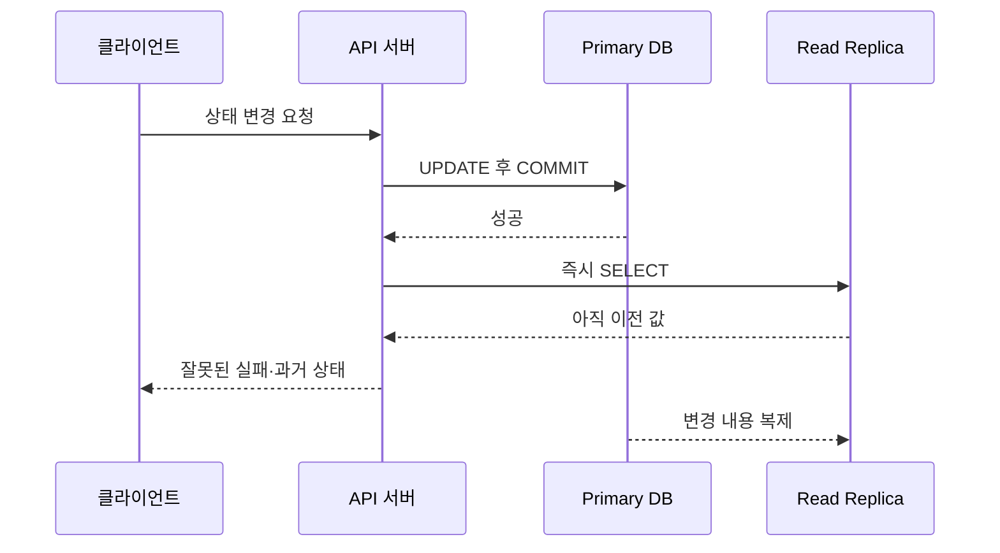

# 알아두면 좋을 몇 가지 주의 사항

> [성능을 좌우하는 DB 설계와 쿼리](./README.md)

> [!WARNING]
> **운영 DB 변경은 연결 수와 실행 시간을 함께 보세요**
>
> timeout, 복제 지연, 장시간 배치와 큰 테이블 변경은 서로 영향을 주며 장애 범위를 키울 수 있습니다.

## 빠른 복습

- Query timeout은 HTTP deadline과 실제 DB cancellation이 함께 작동하는지 확인한다.
- 변경 직후 조회와 상태 변경 transaction은 replica lag를 고려해 primary를 사용한다.
- Batch는 구간을 나누고 checkpoint와 멱등성을 둬서 재실행할 수 있게 만든다.
- Join key의 타입·collation을 맞추고 큰 DDL은 lock·복제·임시 공간을 사전에 검증한다.
- DB 연결 수는 모든 인스턴스 pool의 합과 DB 포화점을 기준으로 제한한다.

## 쿼리 timeout

HTTP dependency의 timeout 계층과 retry까지 함께 설계하려면 [외부 연동 Timeout](../04-외부-연동이-문제일-때-살펴봐야-할-것들/1-timeout.md)도 참고한다.

요청 하나가 자원을 점유하는 시간이 길어지면 같은 동시 처리 용량에서 처리량은 감소한다. 과부하 상태에서 사용자가 응답을 기다리다 재시도하면 기존 작업과 새 작업이 겹쳐 동시 요청 수가 더 늘어날 수 있다.


쿼리 실행 시간을 제한하면 끝없이 실행되는 쿼리가 커넥션을 계속 점유하는 상황을 줄일 수 있다. 다만 **클라이언트나 API 서버에서 요청 시간이 끝났다고 DB 쿼리가 반드시 즉시 중단되는 것은 아니다.** 드라이버가 cancellation을 전달하는지, DBMS의 server-side statement timeout이 적용되는지, 취소된 트랜잭션이 rollback되는지를 확인해야 한다.

timeout은 한 개가 아니라 여러 계층에 존재한다.

```text
커넥션 획득 + DB statement 실행 + 오류 정리 여유
    < API 서버 request deadline
    < 클라이언트 timeout

lock timeout <= DB statement timeout
```

안쪽 작업의 timeout이 바깥 deadline보다 먼저 끝나게 설정하면 서버가 오류를 정리하고 명확한 응답을 반환할 시간을 확보할 수 있다. 실제 값은 서비스 목표와 네트워크 환경에 맞춰 검증한다.

기능별 timeout도 달라야 한다.

- 게시글 목록처럼 빠른 조회가 기대되는 기능은 비교적 짧은 query timeout을 적용한다.
- 관리자용 통계나 배치 쿼리는 더 긴 timeout과 별도의 자원 격리를 사용할 수 있다.
- 결제는 단순히 timeout을 길게 만드는 것으로 해결하지 않는다. 유한한 deadline, idempotency key, 처리 상태 저장과 결제사 조회·대사 절차가 필요하다.

timeout은 재시도 폭증을 완전히 막지 못한다. 재시도에는 최대 횟수, exponential backoff와 jitter를 적용하고, 상태 변경 요청에는 idempotency key나 고유 제약을 사용해 중복 처리를 방지해야 한다.

## 상태 변경 기능은 무조건 복제 DB에서 조회하지 않는다

primary-replica 구조에서 쓰기는 primary에 보내고 조회를 replica에 분산하더라도 모든 `SELECT`를 무조건 replica로 보내면 안 된다. 일반적인 비동기 복제에서는 primary의 commit과 replica 반영 사이에 지연이 존재한다.



특히 다음 조회는 primary를 사용해야 한다.

- `INSERT`, `UPDATE`, `DELETE`의 변경 대상을 확인하거나 잠그는 조회
- 같은 로컬 트랜잭션 안에서 변경한 값을 다시 읽는 조회
- 변경 직후 사용자에게 최신 값을 보여줘야 하는 read-after-write 조회
- 재고, 권한, 결제 상태처럼 오래된 값이 잘못된 의사결정을 만드는 조회

일반적인 구성에서 primary와 replica를 오가는 작업은 하나의 로컬 DB 트랜잭션이 아니다. 트랜잭션 중간에 replica를 읽으면 primary에서 아직 commit되지 않은 변경은 replica에 존재할 수 없고, commit 직후에도 replication lag 때문에 이전 값을 볼 수 있다.

변경 직후 일정 시간 같은 사용자의 조회를 primary로 보내는 session stickiness, replica가 특정 replication position까지 따라올 때까지 기다리는 방식, 일관성 token 등도 사용할 수 있다. 어떤 방법이 가능한지는 DBMS와 관리형 서비스에 따라 다르다.

## 배치 쿼리 실행 시간 증가

집계 쿼리는 많은 행을 읽고 정렬하거나 그룹화한다. 그룹 수와 중간 결과가 메모리 한도를 넘으면 임시 데이터가 디스크로 spill되어 실행 시간이 비선형적으로 증가할 수 있다. 데이터가 조금 증가했는데 실행 시간이 갑자기 크게 늘어나는 이유가 될 수 있다.

배치 쿼리는 다음 지표를 지속해서 추적한다.

- 실행 시간과 처리 행 수
- 읽은 page·block과 cache hit 비율
- 정렬·hash aggregate의 메모리 사용과 disk spill
- 임시 파일 크기와 I/O
- CPU, lock wait와 운영 쿼리에 준 영향
- 성공 시각, 실패 횟수와 재시도 시간

장비 scale-up은 빠른 완화책이지만 커버링 인덱스, 사전 집계, 파티셔닝, 분석 DB 분리와 데이터 구간 분할도 함께 검토한다. 집계에 필요한 컬럼이 인덱스에 모두 들어 있으면 table read를 줄일 수 있지만, index-only scan 여부와 집계용 메모리 감소 폭은 실행 계획에 따라 달라진다.

한 달치 접속 로그를 한 번에 집계하면 데이터가 늘수록 실행 시간이 길어진다.

```sql
SELECT /* 각종 집계 */
FROM accessLog al
WHERE al.accessDatetime >= TIMESTAMP '2024-08-01 00:00:00'
  AND al.accessDatetime <  TIMESTAMP '2024-09-01 00:00:00'
GROUP BY /* 집계 기준 */;
```

이를 하루 단위의 반개구간으로 나눠 실행한 뒤 결과를 합칠 수 있다.

```sql
SELECT /* 각종 집계 */
FROM accessLog al
WHERE al.accessDatetime >= TIMESTAMP '2024-08-01 00:00:00'
  AND al.accessDatetime <  TIMESTAMP '2024-08-02 00:00:00'
GROUP BY /* 집계 기준 */;
```

구간을 나누면 각 쿼리의 최대 작업량, 실패 시 재처리 범위와 lock 유지 시간을 제한할 수 있다. 전체 읽기량 자체가 자동으로 줄어드는 것은 아니며, 지나치게 잘게 나누면 쿼리 실행·commit 비용이 증가할 수 있다.

분할 결과를 단순히 더해도 되는지도 확인해야 한다. `COUNT`와 `SUM`은 구간별 결과를 합칠 수 있지만 `AVG`는 `SUM`과 `COUNT`를 함께 저장해야 한다. 정확한 `COUNT(DISTINCT ...)`와 percentile은 구간별 결과를 단순 합산할 수 없으므로 전체 중복 제거, merge 가능한 중간 상태나 근사 sketch 같은 별도 설계가 필요하다.

10분마다 증분 집계를 수행하는 흐름은 다음과 같다.

1. 성공적으로 반영한 마지막 checkpoint를 읽는다.
2. `[checkpoint, checkpoint + 10분)` 구간의 로그를 집계한다.
3. 통계 테이블을 멱등하게 `UPSERT`한다.
4. 집계 결과와 새 checkpoint를 같은 트랜잭션에서 commit한다.

`accessDatetime`이 같은 행이 여러 개라면 시간만으로 checkpoint를 만들 때 중복이나 누락이 생길 수 있다. `(accessDatetime, id)`처럼 유일하고 안정적인 cursor를 사용한다. 늦게 도착한 로그가 있다면 일정 지연 구간을 다시 계산하거나 event time과 ingestion time을 구분하는 정책도 필요하다.

## 타입이 다른 컬럼의 조인

다음 두 테이블처럼 논리적으로 같은 ID를 서로 다른 타입으로 저장하면 문제가 생길 수 있다.

```text
user(userId INTEGER, name VARCHAR(...))
push(id INTEGER, receiverType VARCHAR(2), receiverId VARCHAR(200))
```

```sql
SELECT u.userId, p.id
FROM user u
JOIN push p ON u.userId = p.receiverId;
```

DBMS는 `INTEGER`와 `VARCHAR`를 비교하기 위해 한쪽 값을 암묵적으로 변환한다. 어떤 쪽을 변환하는지는 DBMS와 식에 따라 다르며, 인덱스 컬럼에 함수나 cast가 적용되면 인덱스를 효율적으로 사용하지 못할 수 있다. 숫자로 변환할 수 없는 문자열의 오류·경고와 예상하지 못한 비교 결과도 발생할 수 있다.

가장 좋은 해결책은 스키마에서 같은 의미의 컬럼 타입, 길이, signed 여부와 collation을 일치시키는 것이다. `receiverType + receiverId`처럼 여러 엔티티의 ID를 한 문자열 컬럼에 저장하는 polymorphic association은 무결성과 인덱스 설계도 어렵게 만든다. 트래픽과 데이터 규모가 크다면 수신자 종류별 컬럼이나 연결 테이블 분리를 검토한다.

스키마를 즉시 바꿀 수 없어 명시적 `CAST`가 필요하다면 작은 쪽이나 인덱스 사용에 영향이 적은 쪽을 변환하고 반드시 실행 계획을 확인한다. 이는 임시 대응이며 장기적으로 타입을 통일해야 한다.

## 큰 테이블의 변경은 신중히 한다

데이터가 많은 테이블에 컬럼·인덱스를 추가하거나 타입을 변경하는 DDL은 lock, table rebuild, 임시 디스크, redo·replication 부하를 유발할 수 있다. 그러나 최신 MySQL의 모든 `ALTER TABLE`이 항상 새 테이블 전체를 복사하고 DML을 중단하는 것은 아니다.

MySQL InnoDB의 주요 DDL 방식은 다음과 같다.

| 방식 | 주요 동작 | 동시 DML |
| --- | --- | --- |
| `INSTANT` | 주로 metadata만 변경 | 일반적으로 허용 |
| `INPLACE` | 전체 복사를 피하지만 rebuild가 필요할 수 있음 | 작업 종류에 따라 허용 |
| `COPY` | 새 테이블에 행을 복사한 뒤 교체 | 일반적으로 제한 |

컬럼 추가는 조건에 따라 `INSTANT`가 가능하지만 컬럼 타입 변경처럼 table rebuild가 필요한 작업도 있다. Online DDL도 시작과 종료 시 짧은 exclusive metadata lock이 필요하고, 장기 트랜잭션이 metadata lock을 잡고 있으면 DDL뿐 아니라 뒤에 온 쿼리까지 대기시키는 장애가 발생할 수 있다.

운영 DDL 전에 다음을 확인한다.

1. 운영 DBMS·버전·스토리지 엔진에서 사용할 알고리즘과 lock 수준
2. 테이블·인덱스 크기, 임시 공간과 replication lag 예상치
3. 오래 열린 트랜잭션과 metadata lock 대기
4. staging 또는 운영과 비슷한 복제 데이터에서의 소요 시간
5. timeout, 중단·rollback 방법과 장애 대응 계획
6. 점진적 배포가 필요한 경우 expand-and-contract 절차

MySQL에서는 지원되지 않는 online 방식이 조용히 더 무거운 방식으로 바뀌지 않도록 가능한 경우 `ALGORITHM`과 `LOCK` 요구사항을 명시해 실패시키는 방법도 고려한다. 무중단 스키마 변경 도구를 사용하더라도 트리거·복제·디스크 사용량과 최종 전환 lock을 이해해야 한다.

## DB 최대 연결 개수

이 절은 [DB 커넥션 풀의 크기·대기 시간](../02-느려진-서비스-어디부터-봐야-할까/2-서버-성능-개선-기초.md#db-커넥션-풀)을 DB 전체 연결 한도 관점에서 보완한다.

API 서버가 세 대이고 트래픽 증가로 scale-out이 필요한데 새 서버가 DB 커넥션 생성에 실패한다면 DB의 최대 연결 수와 이미 사용 중인 연결 수를 확인해야 한다.

```text
예상 최대 연결 수
= API 인스턴스 수 × 인스턴스당 최대 풀 크기
+ 배치·관리 도구·모니터링 연결
+ 장애 대응용 여유 연결
```

예를 들어 API 서버가 세 대이고 각 풀의 최대 크기가 30이면 API만으로 최대 90개 연결을 만들 수 있다. 서버를 두 대 더 추가하면 150개가 된다. DB의 연결 제한뿐 아니라 애플리케이션 전체 풀 크기를 함께 계산해야 한다.

DB CPU가 20%라고 해서 연결 수를 무조건 늘려도 되는 것은 아니다. I/O, memory, lock wait, active query 수와 쿼리 지연도 확인해야 한다. 반대로 CPU가 70%라는 숫자 하나만으로 증설 불가를 결정해서도 안 된다. 부하 테스트로 동시 실행 수를 늘렸을 때 처리량이 증가하는 구간과 응답 시간이 급증하는 포화점을 찾아야 한다.

연결 제한을 늘리기 전에 다음 순서로 확인한다.

1. idle·active·waiting 연결 수와 connection leak 여부
2. 모든 API·배치 인스턴스의 pool 최대치 합계
3. connection acquisition timeout과 대기 요청 수
4. DB CPU, I/O, memory, lock과 쿼리 실행 시간
5. slow query 개선과 캐시로 연결 점유 시간을 줄일 수 있는지
6. 장애 시 관리자가 접속할 수 있는 reserved connection

너무 많은 연결은 DB 메모리와 scheduling 비용을 늘리고 connection storm을 만들 수 있다. DB가 감당할 수 있는 active query 수보다 애플리케이션 풀이 훨씬 크다면 풀이나 DB 앞에 별도 pooler를 두어 동시 실행량을 제한하는 편이 안정적일 수 있다.

## 참고 자료

- [PostgreSQL: Statement Timeout](https://www.postgresql.org/docs/current/runtime-config-client.html)
- [PostgreSQL: Canceling Requests](https://www.postgresql.org/docs/current/protocol-flow.html#PROTOCOL-FLOW-CANCELING-REQUESTS)
- [MySQL 8.4: Replication FAQ](https://dev.mysql.com/doc/refman/8.4/en/faqs-replication.html)
- [MySQL 8.4: Type Conversion](https://dev.mysql.com/doc/refman/8.4/en/cast-functions.html)
- [MySQL 8.4: ALTER TABLE](https://dev.mysql.com/doc/refman/8.4/en/alter-table.html)
- [MySQL 8.4: Too Many Connections](https://dev.mysql.com/doc/refman/8.4/en/too-many-connections.html)
