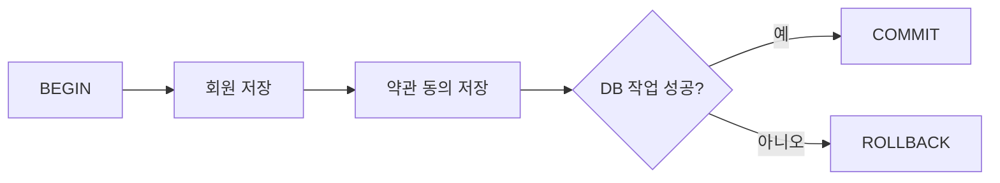
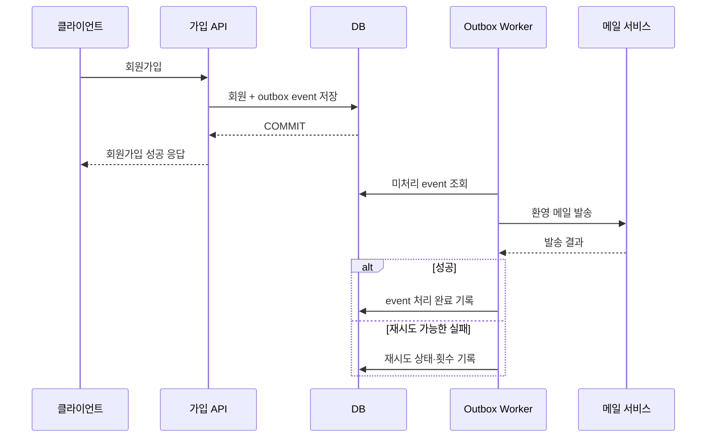

# 실패와 트랜잭션 고려하기

> [성능을 좌우하는 DB 설계와 쿼리](./README.md)

> [!IMPORTANT]
> **트랜잭션 경계는 비즈니스 원자성을 기준으로 정하세요**
>
> 핵심 상태 변경과 부가 작업을 분리하고, 외부 API 실패를 로컬 DB 트랜잭션만으로 해결하려 하지 않아야 합니다.

## 빠른 복습

- Transaction 경계는 기술 호출 수가 아니라 같이 성공·실패해야 하는 비즈니스 원자성으로 정한다.
- 환영 메일처럼 부가 작업의 실패가 핵심 작업을 rollback시키지 않도록 분리한다.
- DB와 외부 API는 하나의 로컬 transaction으로 원자성을 보장할 수 없다.
- Outbox, 멱등성, 보상 transaction과 주기적 대사로 중간 상태를 복구한다.

모든 코드가 항상 정상 작동하는 것은 아니다. 일부 작업이 성공한 뒤 다른 작업이 실패하면 데이터 일관성이 깨질 수 있으므로 DB 코드를 작성할 때 트랜잭션의 시작과 commit·rollback 경계를 명확히 정해야 한다.

## 트랜잭션 경계는 비즈니스 원자성을 기준으로 정한다

같이 성공하거나 같이 실패해야 하는 DB 변경은 하나의 트랜잭션으로 묶는다.



트랜잭션은 가능한 짧게 유지한다. 사용자 입력을 기다리거나 긴 계산, 파일 전송과 외부 API 호출을 수행하는 동안 DB 트랜잭션을 열어두면 커넥션과 lock을 오래 점유해 다른 요청을 지연시킨다.

오류가 발생했는데 예외를 삼키면 framework가 정상 처리로 판단해 commit할 수도 있다. 사용하는 framework의 rollback 규칙, 중첩 트랜잭션과 propagation, checked exception 처리 방식을 테스트해야 한다.

## 핵심 작업과 부가 작업을 분리한다

회원가입은 성공했는데 환영 메일 전송이 실패했다고 회원 데이터까지 rollback하는 것은 일반적으로 원하는 결과가 아니다. 회원 저장은 핵심 작업이고 메일 전송은 재시도 가능한 부가 작업이다.

단순히 commit 후 메일 API를 호출하면 다음 문제가 남는다.

```text
회원 DB commit 성공 → 프로세스 종료 → 메일 호출 누락
```

신뢰성이 필요하다면 회원 데이터와 “환영 메일 발송 필요” outbox event를 같은 DB 트랜잭션에 저장한다. 별도 worker가 commit된 outbox를 읽어 메일을 발송하고 실패하면 재시도한다.



메일 발송 성공과 처리 완료 기록 사이에 worker가 종료되면 같은 event가 다시 조회될 수 있다. 따라서 outbox 발행자와 소비자는 event ID를 기준으로 멱등하게 처리해야 한다.

## 외부 API와 DB는 하나의 로컬 트랜잭션이 아니다

Timeout, retry와 HTTP pool까지 포함한 호출 측 설계는 [외부 연동과 DB Transaction](../04-외부-연동이-문제일-때-살펴봐야-할-것들/6-외부-연동과-db-transaction.md)을 함께 읽는다.

외부 API 호출과 DB 변경을 섞으면 다음 실패 조합이 생긴다.

| 외부 API | DB 작업 | 결과 |
| --- | --- | --- |
| 실패 | 미실행·rollback | 재시도 가능 |
| 성공 | commit 성공 | 정상 |
| 성공 | commit 실패 | 외부에는 반영됐지만 내부 기록 없음 |
| timeout·응답 유실 | 상태 불명 | 외부 성공 여부 조회 필요 |

DB rollback으로 이미 성공한 외부 결제나 메시지 전송을 되돌릴 수는 없다. 외부 API 호출을 트랜잭션 안에 오래 붙잡아 두는 것만으로 원자성이 생기지 않는다.

결제처럼 중요한 작업은 다음 구조를 고려한다.

1. 내부 주문·결제 상태를 `PENDING`으로 저장한다.
2. 외부 결제 요청에 고유한 idempotency key를 사용한다.
3. 외부 성공 응답을 받으면 내부 상태를 `PAID`로 변경한다.
4. timeout처럼 결과가 불명확하면 같은 키로 재시도하거나 결제사 조회 API로 상태를 확인한다.
5. 장시간 `PENDING`인 건은 reconciliation batch로 대사한다.
6. 취소가 필요하면 외부 환불 같은 보상 작업을 별도 상태로 추적한다.

요청 흐름에 따라 outbox, saga와 보상 트랜잭션을 사용할 수 있다. 핵심은 “한 번에 모두 성공할 것”이라고 가정하지 않고 각 단계의 상태, 재시도, 중복 실행과 수동 복구 경로를 설계하는 것이다.

## 실패 시나리오 점검표

- 어느 DB 변경들이 반드시 함께 commit되어야 하는가?
- 외부 호출 전후에 프로세스가 종료되면 무엇이 남는가?
- timeout이 실제 실패인지 결과 불명 상태인지 구분할 수 있는가?
- 같은 요청을 다시 보내도 결과가 한 번만 반영되는가?
- 재시도할 수 없는 오류와 일시적 오류를 구분하는가?
- retry 횟수와 backoff에 상한이 있는가?
- 중간 상태를 조회하고 운영자가 재처리할 수 있는가?
- outbox·queue의 중복 메시지를 안전하게 처리하는가?
- 장기 미완료 건을 찾는 대사·알림이 있는가?

## 참고 자료

- [AWS Prescriptive Guidance: Transactional Outbox](https://docs.aws.amazon.com/prescriptive-guidance/latest/cloud-design-patterns/transactional-outbox.html)
- [RFC 9110: Idempotent Methods](https://www.rfc-editor.org/rfc/rfc9110.html)
