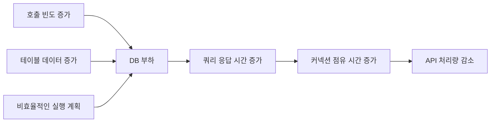

# 성능을 좌우하는 DB 설계와 쿼리

> [주니어 백엔드 개발자가 반드시 알아야 할 실무 지식](../README.md)

> [!IMPORTANT]
> **조회 패턴과 실행 계획을 함께 검증하세요**
>
> 인덱스 유무만 확인하지 말고 실제 트래픽, 데이터 분포, 실행 계획을 기준으로 병목을 판단해야 합니다.

서비스 성능 문제는 DB 자체의 한계보다 DB를 사용하는 방식에서 시작되는 경우가 많다. 호출 빈도가 높은 기능에 풀 스캔을 유발하는 쿼리가 있고 데이터가 계속 쌓이면, 쿼리 실행 시간이 길어지고 DB CPU와 I/O가 포화되면서 API 전체의 응답 시간과 처리량이 함께 나빠진다.

서버 개발자는 다음 세 가지를 조금만 신경 써도 많은 DB 성능 문제를 예방할 수 있다.

- 실제 조회 패턴과 트래픽을 기준으로 인덱스를 설계한다.
- 한 번에 읽고 계산하는 데이터의 범위를 제한한다.
- `EXPLAIN`과 실제 실행 지표로 쿼리 계획을 검증한다.

## 함께 읽기

- DB 시간이 전체 응답 시간과 TPS에 미치는 영향은 [API 요청 처리 구간](../02-느려진-서비스-어디부터-봐야-할까/1-처리량과-응답-시간.md#api-요청은-어떻게-처리되는가)에서 확인한다.
- 쿼리 시간과 커넥션 풀 크기의 관계는 [DB 커넥션 풀](../02-느려진-서비스-어디부터-봐야-할까/2-서버-성능-개선-기초.md#db-커넥션-풀)에서 이어서 읽는다.
- DB transaction과 외부 API가 섞이는 문제는 이후 장의 외부 연동과 DB Transaction에서 장애 대응 관점으로 확장한다.

## 목차

1. [조회 트래픽을 고려한 인덱스 설계](./1-조회-트래픽을-고려한-인덱스-설계.md)

2. [조회 성능 개선 방법](./2-조회-성능-개선-방법.md)

3. [알아두면 좋을 몇 가지 주의 사항](./3-알아두면-좋을-몇-가지-주의-사항.md)

4. [실패와 트랜잭션 고려하기](./4-실패와-트랜잭션-고려하기.md)

5. [DB 쿼리 개선 점검 순서](./5-db-쿼리-개선-점검-순서.md)
