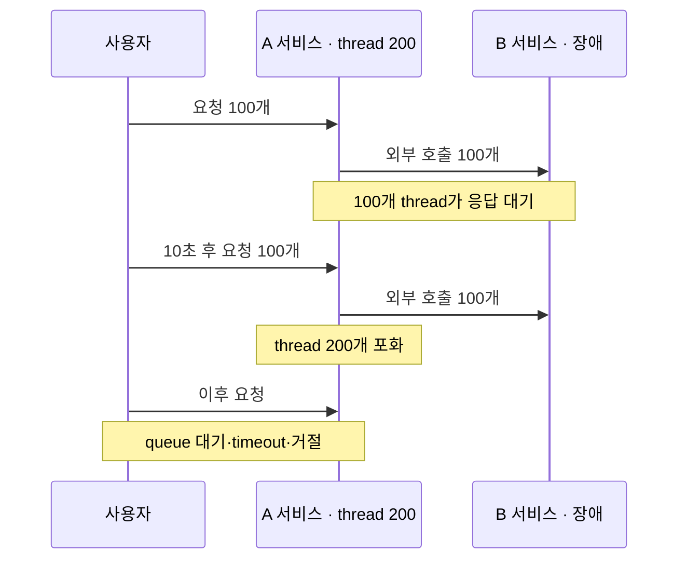
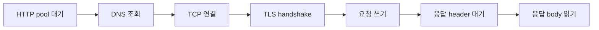
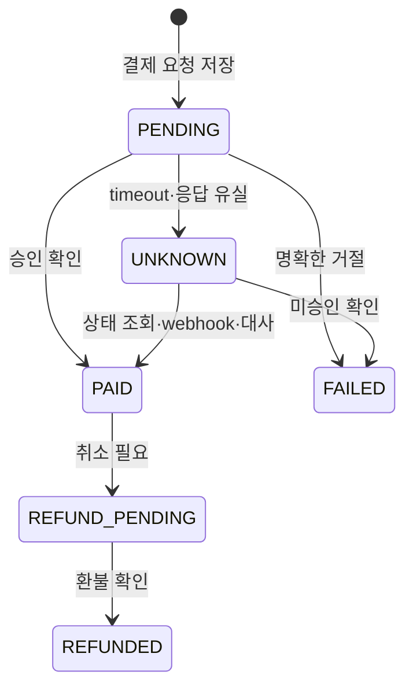

# Timeout

> [외부 연동이 문제일 때 살펴봐야 할 것들](./README.md)

> [!WARNING]
> **각 Timeout과 전체 Deadline을 구분하세요**
>
> 연결·풀 획득·응답 대기 제한을 따로 두더라도 사용자 요청의 전체 허용 시간을 넘지 않도록 설계해야 합니다.

## 빠른 복습

- Timeout이 없거나 너무 길면 느린 dependency가 request thread와 connection을 오래 점유한다.
- Pool acquisition, DNS, connect, TLS, read·socket과 전체 call deadline은 서로 다른 구간이다.
- Timeout 값은 고정 권장값보다 전체 SLO, 정상 p99와 retry budget으로 정한다.
- 상태 변경 호출의 timeout은 실패가 아니라 결과 불명일 수 있어 상태 확인과 멱등성이 필요하다.
- Blocking thread 포화 실험으로 점유 차이를 확인한다.
- Tail latency 실험에서 느린 호출 비율과 timeout을 함께 바꿔 false timeout을 관찰한다.

## Timeout이 없을 때 발생하는 일

블로킹 요청 처리 모델을 사용하는 A 서비스가 있고 요청 처리 thread pool 크기가 200이라고 가정하자. 모든 요청은 B 서비스를 동기 호출한다.

- `0초`: 사용자 100명이 동시에 요청한다.
- A 서비스의 thread 100개가 B 서비스의 응답을 기다린다.
- `10초`: 사용자 100명이 추가로 요청한다.
- thread 200개가 모두 B 서비스 응답을 기다린다.
- 이후 요청은 accept queue나 애플리케이션 queue에서 기다리다가 timeout되거나 거절된다.



Tomcat의 `maxThreads = 200`은 connector가 내부 thread pool을 사용하는 전형적인 blocking 처리에서 최대 200개의 요청 처리 thread를 뜻한다. 그러나 executor를 별도로 연결하거나 Servlet async, reactive I/O, virtual thread 등을 사용하면 “200 thread = 전체 동시 요청 200개”로 단순화할 수 없다. 비동기 모델도 connection, memory, downstream 동시성 제한이 사라지는 것은 아니다.

B 서비스의 응답 시간이 60초라면 A 서비스 처리량과 가용 thread는 급격히 감소한다. 5초의 적절한 timeout을 적용하면 끝없는 대기 대신 빠르게 오류나 대체 응답을 반환해 다른 기능까지 영향을 받는 시간을 줄일 수 있다.

## Timeout의 종류

API 호출은 단순히 연결과 읽기 두 단계만 거치지 않는다.



| Timeout | 제한하는 구간 | 포화 시 위험 |
| --- | --- | --- |
| Connection request·pool acquisition | HTTP pool에서 연결을 빌릴 때까지 | 내부 대기열 증가 |
| DNS | 이름을 IP로 해석 | 일부 client의 connect timeout에 포함되지 않을 수 있음 |
| Connect | TCP 연결 수립 | 연결 불가능한 host를 오래 대기 |
| TLS handshake | 인증서 교환과 보안 연결 | connect와 별도 timeout일 수 있음 |
| Write | 요청 body를 쓰는 동안의 정체 | 큰 upload·느린 peer가 자원 점유 |
| Response header | 첫 응답을 기다리는 시간 | downstream 처리 지연 |
| Read·socket | 데이터 읽기 사이의 무응답 시간 | 조금씩 계속 전송하면 전체 호출이 오래 지속될 수 있음 |
| Call·deadline | redirect와 retry를 포함한 전체 호출 시간 | 전체 예산 초과 방지 |

라이브러리마다 이름과 포함 범위가 다르다. 문서와 버전을 확인하고 “read timeout 5초”가 첫 byte까지인지, packet 사이의 유휴 시간인지, 응답 전체 시간인지 검증해야 한다.

## Timeout 값은 고정 권장값이 아니다

연결 3~5초, 읽기 5~30초 같은 범위는 초기 참고값으로는 사용할 수 있지만 모든 서비스에 적용되는 표준은 아니다. 같은 region의 내부 API와 해외 결제·대용량 파일 API는 정상 latency 분포가 다르다.

timeout은 다음 조건으로 결정한다.

- 사용자 요청의 전체 SLO와 남은 시간 budget
- downstream의 정상 p95·p99·p99.9 latency
- network와 TLS handshake 비용
- retry 횟수와 backoff를 포함한 전체 시간
- timeout 오류를 허용할 수 있는 비율
- 상태 변경 기능에서 결과 불명 상태를 처리하는 방법

```text
pool 대기 + connect + 요청/응답 + retry/backoff + 후처리 여유
    < 우리 API deadline
    < 상위 client timeout
```

너무 길면 장애 감지가 늦고 thread·connection이 오래 묶인다. 너무 짧으면 정상적인 tail latency까지 실패로 처리해 불필요한 retry와 오류를 만든다. 운영 지표로 false timeout 비율을 확인하면서 조정해야 한다.

## 결제 Timeout은 결과 불명 상태를 만든다

다음 상황을 가정하자.

1. 고객이 커머스 서버에 결제를 요청한다.
2. 커머스 서버가 PG API를 호출하며 전체 deadline을 5초로 설정한다.
3. PG가 카드사 승인을 처리하는 데 10초가 걸린다.
4. 커머스 서버는 5초 후 timeout으로 고객에게 실패를 반환한다.
5. 카드사는 10초 후 실제 결제를 승인한다.

고객은 결제됐지만 주문은 실패한 것처럼 보게 된다. timeout을 15초로 늘렸다면 이 사례는 줄어들 수 있지만, 더 긴 지연이나 응답 유실은 여전히 발생한다. 민감한 기능의 해법은 단순히 timeout을 길게 하는 것이 아니다.



결제 요청에는 idempotency key를 사용하고 timeout을 “실패”가 아니라 “결과를 모름”으로 구분한다. PG의 조회 API, webhook과 주기적인 reconciliation으로 최종 상태를 확인해야 한다.

## Apache HttpClient와 OkHttp의 Timeout 의미

Apache HttpClient 5 계열은 HTTP pool에서 연결을 빌리는 `connectionRequestTimeout`, 연결 설정의 `connectTimeout`, 요청의 `responseTimeout` 등을 구분한다. 버전별 설정 위치와 의미가 달라질 수 있으므로 사용하는 버전의 API를 확인한다.

OkHttp는 connect·read·write timeout과 별도로 `callTimeout`을 제공한다. `callTimeout`은 DNS, 연결, 요청 쓰기, 서버 처리, 응답 읽기와 redirect·retry를 포함한 전체 호출 시간을 제한한다. read timeout만 설정하면 응답 데이터가 제한 시간보다 짧은 간격으로 계속 도착하는 동안 전체 호출은 오래 지속될 수 있다.

중요한 것은 특정 라이브러리 이름을 암기하는 것이 아니라 실제 장애 조건을 테스트하는 것이다.

- 연결 자체가 되지 않는 경우
- 연결 후 응답 header가 오지 않는 경우
- body가 매우 천천히 도착하는 경우
- pool이 모두 사용 중인 경우
- DNS와 TLS가 지연되는 경우
- client가 timeout된 뒤 downstream 작업이 계속되는 경우

## 참고 자료

- [Apache Tomcat 11 Connector](https://tomcat.apache.org/tomcat-11.0-doc/config/http.html)
- [Apache HttpClient 5 RequestConfig](https://hc.apache.org/httpcomponents-client-5.6.x/current/httpclient5/apidocs/org/apache/hc/client5/http/config/RequestConfig.html)
- [OkHttpClient 공식 API 문서](https://lysine.dev/okhttp/5.x/okhttp/okhttp3/-ok-http-client/)
- [AWS Builders' Library: Timeouts, Retries and Backoff](https://aws.amazon.com/builders-library/timeouts-retries-and-backoff-with-jitter/)
