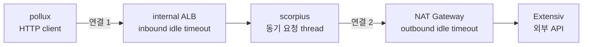
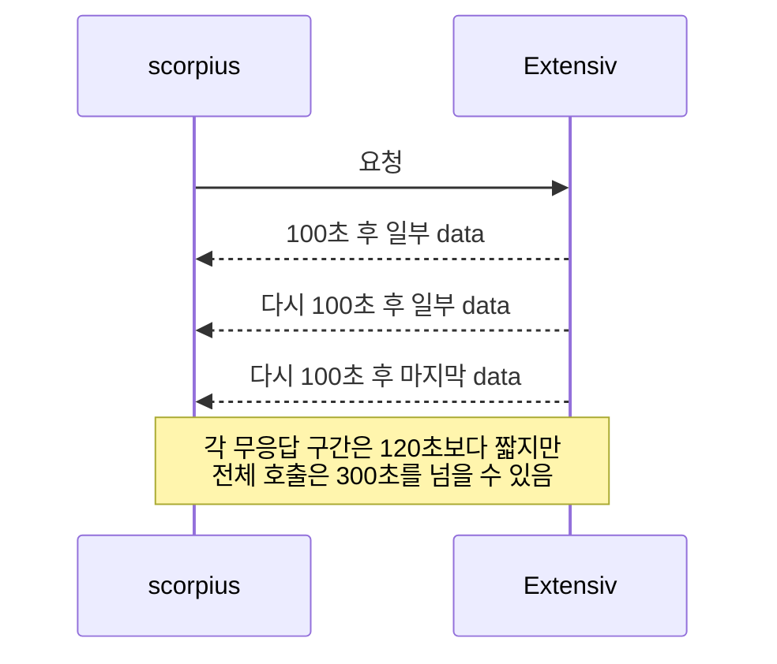
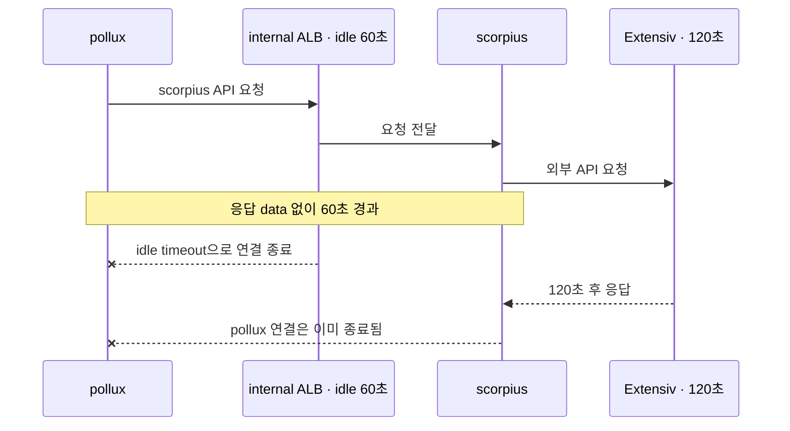
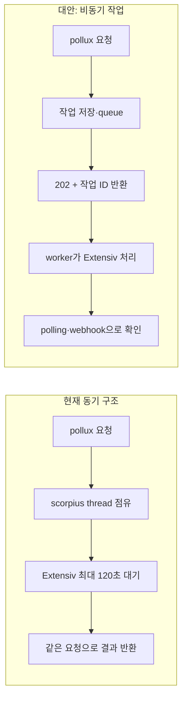

# 실무 사례: 동기 외부 API와 계층별 Timeout

> [외부 연동이 문제일 때 살펴봐야 할 것들](./README.md)

> [!WARNING]
> **Socket Timeout을 전체 호출 Deadline으로 오해하지 마세요**
>
> ALB·NAT·OS와 HTTP client의 제한은 서로 다른 연결과 유휴 구간에 적용되므로 실제 요청 경로별로 해석해야 합니다.

## 빠른 복습

- `pollux → ALB → scorpius`와 `scorpius → NAT → Extensiv`는 서로 다른 두 HTTP 연결이다.
- 공유된 코드의 30초는 connect timeout이고 120초는 전체 deadline이 아닌 socket timeout이다.
- ALB·NAT·OS·application에는 고정 우선순위가 없고 각 종료 조건을 먼저 만족한 timer가 실패를 만든다.
- Timeout을 늘리면 오류는 줄 수 있지만 thread·connection 점유와 pool 대기는 커질 수 있다.
- 정상적으로 수분 걸리는 작업이라면 ALB만 늘리기보다 queue 기반 비동기 구조를 검토한다.

> `pollux → scorpius → Extensiv` 동기 호출의 timeout을 조정하면서 오간 대화를 기술 원리 중심으로 재구성했다. 개인 이름은 제외하고 서비스와 역할만 남겼다.

## 이 논의는 무엇에 관한 것이었나

scorpius가 외부 API 응답을 기다리는 시간을 기존 값보다 늘리려는 과정에서 다음 질문이 나왔다.

1. 외부 API timeout을 애플리케이션 대신 AWS나 container에서 관리할 수 있는가?
2. 애플리케이션 값을 바꾸면 ALB·NAT Gateway·OS timeout과 충돌하는가?
3. scorpius의 대기시간을 늘리면 internal ALB도 변경해야 하는가?

최종적으로 scorpius의 대기시간을 약 2분으로 늘리고, pollux와 scorpius 사이 internal ALB의 idle timeout을 180초로 늘리는 방향으로 논의됐다. 이를 이해하려면 **하나의 요청에 서로 다른 두 HTTP 연결이 존재한다**는 사실부터 봐야 한다.



- 연결 1은 pollux가 ALB를 거쳐 scorpius를 호출하는 내부 통신이다.
- 연결 2는 scorpius가 NAT Gateway를 거쳐 Extensiv를 호출하는 외부 통신이다.
- scorpius는 연결 2의 응답을 받을 때까지 연결 1에 최종 응답을 보내지 않는다.

따라서 Extensiv 응답이 120초 걸리면 scorpius만 기다리는 것이 아니다. pollux의 HTTP client, internal ALB, scorpius의 요청 thread와 HTTP connection도 결과를 기다린다.

## 왜 AWS가 아니라 애플리케이션에서 관리하는가

외부 API 호출 timeout은 업무 정책과 연결된다.

- 조회 API는 얼마나 빨리 실패해야 하는가?
- 재고 동기화는 정상적으로 90초가 걸릴 수 있는가?
- timeout 후 재시도해도 안전한가?
- 특정 dependency만 더 오래 기다려야 하는가?
- timeout을 오류, 재시도 또는 비동기 처리 상태 중 무엇으로 바꿀 것인가?

ALB와 NAT Gateway는 이런 의미를 모른다. 해당 장비의 idle timeout은 **연결에서 data가 오가지 않을 때 network flow를 얼마나 유지할지**를 정한다. Endpoint별 업무 처리시간을 제한하는 application deadline이 아니다.

SSM Parameter Store 같은 외부 configuration store에 값을 저장할 수는 있다. 그래도 값을 읽어 특정 호출에 적용하고 오류를 해석하는 주체는 애플리케이션이다. **설정의 저장 위치**와 **timeout을 집행하는 계층**을 구분해야 한다.

## 제공된 HTTP client 설정을 정확히 읽기

```kotlin
.setMaxConnTotal(200)
.setMaxConnPerRoute(20)
.setDefaultConnectionConfig(
    ConnectionConfig.custom()
        .setConnectTimeout(30, TimeUnit.SECONDS)
        .setSocketTimeout(120, TimeUnit.SECONDS)
        .setValidateAfterInactivity(1, TimeUnit.MINUTES)
        .build()
)
```

| 설정 | 의미 | 의미하지 않는 것 |
| --- | --- | --- |
| `maxConnTotal = 200` | pool 전체의 최대 connection | 같은 외부 서비스에 동시 200개 호출 가능 |
| `maxConnPerRoute = 20` | 같은 route의 최대 connection | 외부 서비스가 동시 호출 20개를 감당한다는 보장 |
| `connectTimeout = 30초` | 새 connection 수립 대기 | 연결 후 응답을 최대 30초 기다린다는 뜻 |
| `socketTimeout = 120초` | socket I/O 정체에 적용되는 기본 timeout | 호출 시작부터 종료까지 정확히 120초인 deadline |
| `validateAfterInactivity = 1분` | 오래 놀던 connection의 재검증 기준 | connection을 1분 뒤 폐기한다는 뜻 |

### 코드와 “응답을 최대 30초 대기” 설명은 일치하지 않는다

공유된 코드에서 30초는 **connection 수립 timeout**이고 socket timeout은 120초다. “응답을 최대 30초 기다린다”는 설명은 다음 중 하나일 수 있다.

- 배포된 코드가 공유된 코드와 다르다.
- Endpoint별 `RequestConfig`가 response timeout을 덮어쓴다.
- 상위 client나 proxy가 30초에 연결을 끊는다.
- connect timeout과 response·read timeout을 혼동했다.
- 서로 다른 timeout에서 발생한 예외를 같은 `SocketTimeoutException`으로 해석했다.

변경 전에는 실행 중인 버전의 **effective configuration과 실제 exception 발생 시각**을 확인해야 한다.

### Socket timeout은 전체 호출 deadline이 아니다

Socket timeout은 socket I/O의 대기와 관련된다. 상대가 timeout보다 짧은 간격으로 데이터를 계속 보낸다면 전체 호출은 120초를 넘을 수 있다.



Apache HttpClient의 response timeout도 자동 재실행 등이 포함되면 절대적인 전체 deadline과 같지 않을 수 있다. Pool 대기, 연결, retry와 body 읽기까지 포함해 반드시 120초 안에 끝내려면 별도의 전체 deadline을 설계해야 한다. 자세한 구분은 [Timeout의 종류](./1-timeout.md#timeout의-종류)를 참고한다.

### 이 코드에는 동시성 병목도 있다

`maxConnPerRoute = 20`이면 HTTP/1.1의 같은 Extensiv route로 동시에 사용할 connection은 최대 20개다. 20개가 각각 120초 동안 기다리면 뒤 요청은 HTTP pool에서 connection을 기다린다.

```text
route connection 20개 ÷ 호출당 120초
≈ 0.167 TPS
≈ 분당 10건
```

이는 호출이 정말 120초씩 걸리고 connection 하나가 요청 하나를 처리한다는 단순 모델이다. 실제 값은 latency 분포와 protocol 등에 따라 달라진다. 그래도 timeout을 30초에서 120초로 늘리면 같은 pool에서 최악의 점유시간이 네 배가 된다는 방향은 분명하다.

HTTP pool에서 connection을 얻기 위한 `connectionRequestTimeout`도 확인해야 한다. 이 값이 bounded되지 않으면 외부 호출 전 pool queue에서도 요청 thread가 오래 대기할 수 있다. HTTP pool은 [HTTP Connection pool](./7-http-connection-pool.md#http-connection-pool), DB pool과의 공통점은 [DB 커넥션 풀](../02-느려진-서비스-어디부터-봐야-할까/2-서버-성능-개선-기초.md#db-커넥션-풀)에서 이어진다.

## “가장 짧은 Timeout이 이긴다”의 정확한 의미

대화에서는 network device, OS, application 순서의 우선순위가 있다고 설명됐다. 그러나 **고정된 계층 우선순위는 없다.** 각 timer가 서로 다른 조건을 감시하고, 종료 조건을 먼저 충족한 계층이 연결이나 요청을 끝낸다.

| 상황 | 먼저 끝내는 계층 |
| --- | --- |
| Application response timeout 30초, ALB idle 60초, 응답 없음 | Application |
| Application timeout 120초, ALB idle 60초, byte 없음 | ALB |
| Application timeout 120초, NAT idle 350초, byte 없음 | Application |
| Socket timeout 120초, 100초마다 byte 수신 | Socket timer가 계속 갱신될 수 있음 |
| NAT idle 350초, 300초마다 traffic 발생 | NAT idle timer가 갱신됨 |

더 정확한 원칙은 다음과 같다.

> 각 timeout은 적용 구간과 시작·갱신 조건이 다르다. 해당 조건을 가장 먼저 충족한 timer가 관측되는 실패를 만든다.

Connect timeout 30초와 socket timeout 120초는 서로 우선순위를 다투는 같은 timer가 아니라 서로 다른 처리 구간을 제한한다.

## ALB 60초와 NAT Gateway 350초의 의미

### ALB idle timeout

Application Load Balancer의 기본 connection idle timeout은 60초이며 설정 가능하다. Client 또는 target connection에서 **data가 전혀 송수신되지 않은 시간**을 제한하지 API 전체 처리시간을 직접 제한하지는 않는다.



이 때문에 “pollux가 결과를 즉시 기다리는 동기 호출인가?”라는 질문이 중요했다. Queue에 작업을 넣고 `202 Accepted`를 반환하는 구조라면 internal ALB가 외부 처리 완료까지 기다릴 이유가 없다.

Internal ALB를 180초로 늘린 것은 연결 1이 scorpius의 외부 대기시간을 견디게 하기 위한 조치다. 다음 값도 함께 맞아야 한다.

- pollux HTTP client의 전체 response·call timeout
- scorpius의 외부 호출 전체 deadline
- scorpius server request timeout
- 경로상의 추가 proxy·ingress timeout
- 외부 호출 이후 JSON 가공과 응답 전송에 필요한 여유

### NAT Gateway idle timeout

AWS NAT Gateway는 TCP connection에 traffic이 없는 상태가 350초 이상 지속되면 연결을 timeout시킨다. 이는 “외부 API는 최대 350초까지만 실행 가능하다”는 뜻이 아니다. 350초보다 짧은 간격으로 traffic이 발생하면 idle timer가 갱신될 수 있다.

Scorpius의 socket timeout이 120초이고 byte가 전혀 오지 않는다면 application이 NAT Gateway보다 먼저 호출을 끝낼 가능성이 높다. 반대로 120초보다 짧은 간격으로 data가 오면서 전체 호출만 길어진다면 둘 다 호출 전체를 제한하지 못할 수 있다.

AWS 공식 문서 기준으로 ALB 기본 idle timeout은 60초이고 유효 범위는 1~4,000초다. NAT Gateway의 TCP idle timeout은 350초다. 이는 회사의 API timeout 표준이 아니라 network connection 관리값이다.

## TCP Keepalive 값에 대한 교정

- `tcp_keepalive_time = 7200`: connection이 유휴가 된 뒤 첫 keepalive probe까지의 시간
- `tcp_keepalive_intvl = 75`: probe 사이의 간격
- `tcp_keepalive_probes = 9`: 응답이 없을 때 연결 종료 전 probe 수

`tcp_keepalive_time = 7200`은 **최대 연결 가능 시간이 2시간**이라는 뜻이 아니다. 정상 traffic이 있거나 probe에 응답하면 connection은 더 오래 유지될 수 있다.

첫 probe가 7,200초 뒤라면 350초 유휴인 NAT flow를 살리는 데 너무 늦다. NAT idle timeout을 피하려고 TCP keepalive를 사용한다면 AWS 안내처럼 350초보다 짧게 실제 socket에 적용되는지 검증해야 한다.

TCP keepalive는 죽은 connection을 감지하거나 network idle flow를 유지하기 위한 기능이다. 특정 API의 업무상 허용시간을 정하는 application timeout을 대체하지 않는다.

## 왜 동기 호출 여부를 반복해서 확인했는가

외부 API가 정상적으로 2분까지 걸린다면 동기 HTTP 요청으로 계속 기다리는 구조가 적합한지 검토해야 한다. Blocking 방식에서는 scorpius의 요청 thread가 외부 응답을 기다리는 동안 점유될 수 있다.



동기 구조가 항상 잘못은 아니다. 즉시 결과가 필요하고 정상 latency가 충분히 짧으며 자원을 감당할 수 있다면 단순하고 적절하다. 그러나 정상 작업이 수십 초~수분이고 dashboard가 나중에 결과를 표시해도 된다면 비동기 job은 다음 장점이 있다.

- pollux와 ALB connection을 수분 동안 유지하지 않는다.
- Request thread와 긴 작업을 분리한다.
- Retry, 진행 상태, 실패 이력과 재처리를 관리할 수 있다.
- Durable queue를 쓰면 일시 장애와 배포 중에도 작업을 이어갈 수 있다.

반면 상태 저장, 중복 방지, polling·webhook과 운영 화면이 필요해 복잡도가 증가한다. 회의에서 동기 호출인지 확인한 것은 ALB 값만 바꾸기 전에 이 구조적 선택을 확인하려는 질문이었다.

## Timeout을 늘렸을 때 생기는 용량 변화

외부 timeout을 30초에서 120초로 늘리면 timeout 오류는 줄 수 있지만, 외부 서비스가 느릴 때 자원 점유시간은 최대 네 배가 된다.

> `평균 동시 점유량 ≈ 유입 RPS × 평균 대기시간(초)`

| 외부 호출 유입 | 대기시간 | 추정 동시 점유 |
| ---: | ---: | ---: |
| 1 RPS | 30초 | 약 30개 |
| 1 RPS | 120초 | 약 120개 |
| 5 RPS | 30초 | 약 150개 |
| 5 RPS | 120초 | 약 600개 |

Blocking request thread pool이 200개이고 모든 요청이 외부 호출을 거친다면 `5 RPS × 120초 = 600`은 thread pool을 크게 초과한다. 이 설정에서는 HTTP route pool 20개가 먼저 병목이 되어 나머지가 connection 대기열에 쌓일 가능성도 있다.

이 관계는 [처리량](../02-느려진-서비스-어디부터-봐야-할까/1-처리량과-응답-시간.md#처리량), [thread pool 포화](./1-timeout.md#timeout이-없을-때-발생하는-일), [동시 요청 제한](./3-rate-limit과-동시-요청-제한.md#rate-limit과-동시-요청-제한)과 연결된다.

## 이 사례에서 추가로 확인해야 했던 것

### 모든 timeout의 실효값

- pollux의 전체 call timeout
- Internal ALB와 추가 proxy의 idle·request timeout
- Scorpius의 pool acquisition, connect, socket·response와 전체 deadline
- 자동 retry를 포함한 실제 최장 수행시간

### 긴 timeout을 감당할 자원

- scorpius의 active request thread와 queue
- HTTP pool의 leased·available·pending connection
- Extensiv route 최대 connection 20개의 근거
- 외부 API의 분당 quota와 허용 동시성
- 변경 전후 p95·p99, timeout과 pool 대기시간

### Retry의 실제 동작

공유된 설정은 `DefaultHttpRequestRetryStrategy`를 사용한다. 어떤 exception과 method를 몇 번 재시도하는지는 실제 Apache HttpClient 버전과 override를 확인해야 한다. 첫 시도가 120초 후 실패하고 자동 retry까지 수행되면 전체 시간과 호출 수는 예상보다 커진다.

상태 변경 API는 timeout 뒤에도 외부에서 성공했을 수 있다. 안전한 retry 조건은 [Retry](./2-retry.md#retry)를 따른다.

### 오류 응답의 의미

`SocketTimeoutException`은 Java exception이지 HTTP status code가 아니다. 이를 `500`으로 반환하는지는 exception mapping이 결정한다. 다음 실패를 구분해 관측해야 한다.

- Pool acquisition timeout
- Connect timeout
- Response·socket timeout
- ALB·NAT·peer의 connection reset
- 외부 API의 `429`·`5xx`
- Pollux가 먼저 요청을 취소한 경우

`500` 하나로 합치면 장애 원인과 retry 가능 여부를 판단하기 어렵다. Proxy 성격이라면 `504 Gateway Timeout`을 고려할 수 있지만 내부 error code와 trace도 함께 남겨야 한다.

### Client가 먼저 포기한 뒤에도 작업은 남을 수 있다

Pollux나 ALB가 먼저 timeout되어도 scorpius와 Extensiv의 작업이 즉시 중단된다고 보장할 수 없다.

1. Pollux는 실패로 판단한다.
2. Scorpius는 취소를 감지하지 못하고 계속 기다린다.
3. Pollux 또는 사용자가 재시도한다.
4. 이전 호출과 새 호출이 동시에 Extensiv를 압박한다.

따라서 cancellation 전파, bounded queue, bulkhead, circuit breaker와 retry budget을 함께 설계해야 한다.

## 더 안전한 설정 원칙

1. Dependency·operation별 timeout을 두고 모든 외부 API를 120초로 통일하지 않는다.
2. Pool acquisition, connect, response·socket과 전체 deadline을 구분한다.
3. 상위 요청의 시간 budget 안에 하위 호출과 후처리 시간을 넣는다.
4. Network idle timeout을 application timeout 대신 사용하지 않는다.
5. Timeout을 늘리기 전에 thread·HTTP pool·quota를 계산한다.
6. Pool과 queue 대기를 bounded하고 포화 시 빠르게 실패시킨다.
7. Retry는 전체 deadline과 멱등성 안에서만 수행한다.
8. 정상적으로 오래 걸리는 작업은 queue 기반 비동기 job을 검토한다.
9. `500` 건수 대신 timeout 단계, pool pending과 dependency latency를 관측한다.
10. 무응답, 느린 body, connection reset, pool 포화와 client 취소를 각각 시험한다.

## 회의 내용을 한 문장씩 해석하면

| 대화의 표현 | 기술적인 의미 |
| --- | --- |
| “AWS에서 외부 API 대기시간을 관리할 수 있는가?” | Network idle timeout과 application call timeout의 책임 경계 확인 |
| “Container 값과 충돌하지 않는가?” | OS TCP timer, proxy timer와 HTTP client timer 중 어느 조건이 실패를 만드는지 확인 |
| “ALB를 180초로 늘려 달라” | 동기 외부 호출 동안 pollux–scorpius 연결이 먼저 idle 종료되지 않도록 조정 |
| “pollux가 동기로 결과를 기다리는가?” | 긴 작업을 HTTP lifecycle에 둘지 queue 기반으로 분리할지 확인 |
| “scorpius 코드에서 관리한다” | 업무별 timeout·오류·retry 정책의 집행 주체는 application이라는 결론 |

## 핵심 정리

- 이 사례에는 `pollux → scorpius`와 `scorpius → Extensiv`라는 두 HTTP 연결이 있다.
- 동기 호출이므로 외부 지연이 internal ALB, pollux와 scorpius request thread까지 전파된다.
- 공유된 코드에서 30초는 connect timeout이고 120초는 socket timeout이다.
- Socket timeout과 ALB·NAT idle timeout은 전체 호출 deadline이 아니다.
- 고정된 계층 우선순위는 없으며 각 조건을 먼저 충족한 timer가 실패를 만든다.
- ALB 기본 60초와 NAT Gateway 350초는 API 표준이 아니라 network idle 값이다.
- `tcp_keepalive_time = 7200`은 최대 연결시간이 아니라 첫 keepalive probe 전 유휴시간이다.
- 외부 timeout을 네 배 늘리면 최악의 thread·connection 점유시간도 네 배가 될 수 있다.
- ALB 180초 조정과 함께 pollux client timeout, 전체 deadline과 pool 용량도 검증해야 한다.
- 정상적으로 수분 걸리는 작업이라면 queue 기반 비동기 구조를 검토한다.

## 참고 자료

- [AWS: Application Load Balancer connection idle timeout](https://docs.aws.amazon.com/elasticloadbalancing/latest/application/edit-load-balancer-attributes.html)
- [AWS: NAT Gateway의 350초 idle timeout](https://docs.aws.amazon.com/vpc/latest/userguide/nat-gateway-troubleshooting.html#nat-gateway-troubleshooting-timeout)
- [Apache HttpClient 5.6: ConnectionConfig.Builder](https://hc.apache.org/httpcomponents-client-5.6.x/current/httpclient5/apidocs/org/apache/hc/client5/http/config/ConnectionConfig.Builder.html)
- [Apache HttpClient 5: RequestConfig.Builder](https://hc.apache.org/httpcomponents-client-5.6.x/current/httpclient5/apidocs/org/apache/hc/client5/http/config/RequestConfig.Builder.html)
- [Spring: HttpComponentsClientHttpRequestFactory](https://docs.spring.io/spring-framework/docs/current/javadoc-api/org/springframework/http/client/HttpComponentsClientHttpRequestFactory.html)
- [외부 연동이 문제일 때 살펴봐야 할 것들](./README.md)
