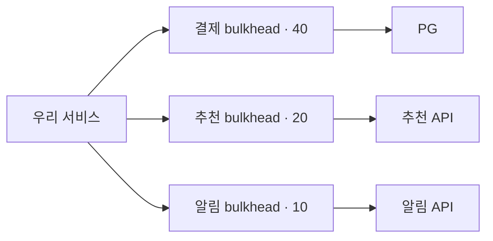

# Rate limit과 동시 요청 제한

> [외부 연동이 문제일 때 살펴봐야 할 것들](./README.md)

> [!IMPORTANT]
> **호출 속도와 동시 실행 수는 서로 다른 제한입니다**
>
> Rate limit으로 시작 빈도를, bulkhead로 점유 중인 호출 수를 제한해 한 의존성의 지연이 전체 자원을 고갈시키지 않게 합니다.

## 빠른 복습

- Rate limit은 단위 시간당 시작 수를, bulkhead는 동시에 실행 중인 호출 수를 제한한다.
- 필요한 동시성은 대략 `RPS × 평균 응답시간`으로 추정한다.
- Bulkhead가 차면 즉시 실패, 짧은 bounded queue 또는 비동기 처리를 선택한다.
- 무제한 queue는 장애를 해결하지 않고 지연과 메모리 사용을 뒤로 미룬다.
- Bulkhead 비교 실험으로 차이를 확인한다.

원본 노트의 TPS Lab은 외부 연동 장애 모드에서 bulkhead의 **동시 호출 수**를, 통합 시스템 모드에서 외부 API의 단순화한 **RPS 호출 한도**를 실험한다. 공급자의 실제 `429`, window 방식과 `Retry-After`까지 재현하는 모델은 아니므로 두 실험을 rate limit 구현 자체의 검증으로 사용해서는 안 된다. 해당 Lab 자료는 현재 이 저장소에 포함되어 있지 않다.

외부 서비스가 동시에 100개 요청을 처리할 수 있는데 300개를 한꺼번에 보내면 queue와 응답 시간이 증가한다. 공급자가 초당 호출량도 제한한다면 동시성 제한만으로는 충분하지 않다.

- **Rate limit**: 초당·분당 시작할 수 있는 요청 수를 제한한다.
- **Concurrency limit·bulkhead**: 동시에 실행 중인 요청 수를 제한한다.

예를 들어 호출이 10초씩 걸린다면 10 RPS만 보내도 정상 상태에서 동시 요청은 약 100개가 될 수 있다.

> `필요 동시성 ≈ 요청률(RPS) × 평균 응답 시간(초)`

이는 평균을 이용한 단순 추정이므로 실제 설계에는 tail latency와 순간 burst를 포함한다.

## Bulkhead Pattern

배의 격벽처럼 dependency별 자원을 분리하면 한 연동의 장애가 전체 thread·connection을 사용하지 못하게 할 수 있다.

bulkhead가 포화됐을 때 선택할 수 있는 동작은 다음과 같다.

- 즉시 거절하고 빠른 오류 반환
- 매우 짧고 제한된 시간만 대기
- bounded queue에 넣고 queue가 차면 거절
- 핵심이 아닌 기능은 생략하거나 fallback 사용
- 비동기로 처리할 수 있으면 durable queue에 저장

무제한 queue는 실패를 해결하지 않고 지연과 메모리 사용을 뒤로 미룬다. 제한값은 downstream의 계약 용량, 실제 latency와 우리 API deadline을 기준으로 부하 테스트한다.

## 참고 자료

- [Resilience4j Bulkhead](https://resilience4j.readme.io/docs/bulkhead)
- [AWS Builders' Library: Timeouts, Retries and Backoff](https://aws.amazon.com/builders-library/timeouts-retries-and-backoff-with-jitter/)
