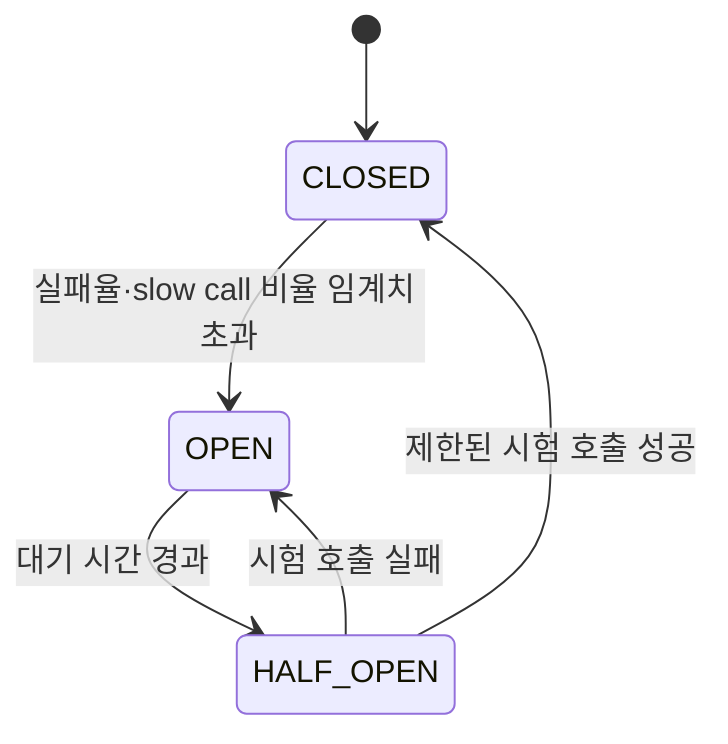

# Circuit breaker

> [외부 연동이 문제일 때 살펴봐야 할 것들](./README.md)

> [!IMPORTANT]
> **Circuit breaker는 실패를 빠르게 격리하는 장치입니다**
>
> 실패율과 느린 호출 기준, 최소 표본, OPEN 시간과 HALF_OPEN probe 수를 실제 트래픽에 맞춰 조정해야 합니다.

## 빠른 복습

- Circuit breaker는 반복 실패 시 실제 호출을 생략해 빠르게 실패시키는 장치다.
- CLOSED에서 실패를 관측하고, OPEN에서 차단하며, HALF_OPEN에서 제한된 probe로 회복을 확인한다.
- 최소 표본과 실패·slow-call 기준을 함께 설정하고 validation 오류는 장애율에서 구분한다.
- Circuit breaker는 동시성을 제한하지 않으므로 bulkhead를 대체하지 않는다.
- 원본 노트의 Lab 비교 실험에서는 sliding window·최소 호출 수·실패율과 open 시간을 바꿔 상태 전환을 확인하지만, 해당 Lab 자료는 현재 이 저장소에 포함되어 있지 않다.

downstream이 계속 timeout이나 오류를 반환한다면 매 요청을 끝까지 기다릴 이유가 없다. Circuit breaker는 최근 호출 결과를 관찰하다 장애 기준을 넘으면 호출을 잠시 차단해 빠르게 실패시킨다.

## CLOSED

정상 상태로 모든 허용 요청을 downstream에 전달한다. 시간 기반 또는 개수 기반 sliding window로 결과를 집계할 수 있다.

- 최근 10초의 실패율이 50% 이상
- 최근 100건의 실패율이 50% 이상
- 일정 시간보다 느린 slow call 비율이 임계치 이상

표본이 너무 적은데 한 건 실패했다고 circuit이 열리지 않도록 최소 호출 수를 함께 설정한다. Validation 오류 같은 우리 요청의 잘못을 downstream 장애로 집계하면 안 된다.

## OPEN

실제 호출을 수행하지 않고 즉시 오류나 fallback을 반환한다. 호출 thread와 connection을 절약하고 downstream에 회복할 시간을 줄 수 있다. 다만 circuit이 열렸다고 downstream이 자동으로 복구되는 것은 아니며 다른 client의 트래픽은 계속될 수 있다.

## HALF_OPEN

지정된 시간이 지나면 소수의 시험 호출만 허용한다. 시험 호출의 실패율과 slow call 비율이 정상 범위면 `CLOSED`, 그렇지 않으면 다시 `OPEN`으로 전환한다. 동시에 너무 많은 probe를 보내면 회복 중인 서비스를 다시 압박할 수 있으므로 허용 수를 제한한다.

Circuit breaker는 동시 요청 수를 제한하지 않는다. `CLOSED`일 때 1,000개 요청이 동시에 들어오면 모두 통과할 수 있으므로 bulkhead와 함께 사용해야 한다.

dependency와 API 성격별로 circuit을 분리하고 다음 지표를 관측한다.

- 상태 전환 시각과 원인
- 실패율과 slow call 비율
- 차단된 호출 수
- half-open probe 결과
- fallback 성공·실패율
- 수동 `FORCED_OPEN`과 복구 절차

## 참고 자료

- [Resilience4j CircuitBreaker](https://resilience4j.readme.io/docs/circuitbreaker)
