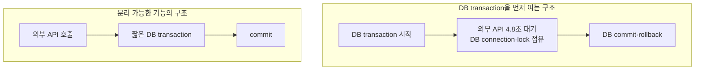

# 외부 연동과 DB Transaction

> [외부 연동이 문제일 때 살펴봐야 할 것들](./README.md)

> [!WARNING]
> **로컬 DB Transaction은 외부 성공을 되돌리지 못합니다**
>
> 멱등 키, 상태 조회, outbox와 보상 작업으로 외부 성공·내부 실패 같은 부분 실패를 추적해야 합니다.

## 빠른 복습

- DB와 외부 시스템의 dual-write는 로컬 transaction만으로 원자성을 보장할 수 없다.
- 외부 timeout은 실제 성공 여부를 모르는 상태일 수 있고, 외부 성공 후 DB rollback도 가능하다.
- 상태 조회, webhook, 보상, outbox와 대사 절차로 최종 일관성을 만든다.
- 외부 호출 동안 DB transaction을 열어두면 connection과 lock까지 함께 점유한다.

DB 작업과 외부 호출을 함께 수행하면 두 시스템을 하나의 로컬 트랜잭션으로 묶을 수 없는 dual-write 문제가 생긴다.

| 외부 연동 | DB transaction | 필요한 대응 |
| --- | --- | --- |
| 명확한 실패 | rollback | 안전한 조건이면 retry |
| timeout·응답 유실 | 결과 불명 | 상태 확인 API·webhook·대사 |
| 외부 성공 | DB rollback | 취소·환불 같은 보상 작업 |
| DB commit | 후속 외부 실패 | outbox·재시도·후보정 |

외부 호출이 4.8초이고 전체 처리가 5초라면 DB transaction을 먼저 열어둔 구조는 그동안 connection과 lock을 점유한다.

외부 호출과 DB 변경의 순서를 바꿀 수 있다면 transaction 밖에서 외부 호출을 수행해 DB connection 점유를 줄일 수 있다. 그러나 commit 후 외부 호출 실패, 외부 성공 후 DB 실패 문제가 생기므로 기능에 맞는 다음 방법을 설계해야 한다.

- idempotency key와 처리 상태 machine
- 성공 확인 API와 webhook
- 취소·환불 같은 보상 transaction
- transactional outbox와 durable queue
- 주기적인 reconciliation과 수동 복구 도구

구체적인 트랜잭션 경계와 outbox는 [실패와 트랜잭션 고려하기](../03-성능을-좌우하는-db-설계와-쿼리/4-실패와-트랜잭션-고려하기.md#실패와-트랜잭션-고려하기)에서 정리한 내용을 따른다.

## 참고 자료

- [AWS Prescriptive Guidance: Transactional Outbox](https://docs.aws.amazon.com/prescriptive-guidance/latest/cloud-design-patterns/transactional-outbox.html)
- [실패와 트랜잭션 고려하기](../03-성능을-좌우하는-db-설계와-쿼리/4-실패와-트랜잭션-고려하기.md)
