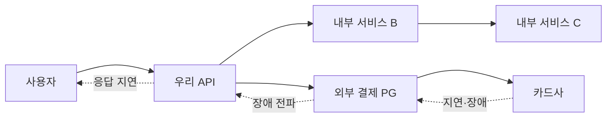

# 외부 연동이 문제일 때 살펴봐야 할 것들

> [주니어 백엔드 개발자가 반드시 알아야 할 실무 지식](../README.md)

> [!IMPORTANT]
> **외부 의존성의 실패는 우리 서비스의 용량과 장애가 됩니다**
>
> Timeout, retry, 동시성 제한과 관측을 하나의 실패 예산 안에서 함께 설계해야 장애 전파를 줄일 수 있습니다.

## 우리는 문제가 없는데 왜 서비스가 느릴까

마이크로서비스와 외부 SaaS·결제·인증·검색 API 사용이 늘면서 하나의 사용자 요청이 여러 서비스를 거치는 경우가 많아졌다. 우리 API 서버와 DB가 정상이어도 호출 대상이 느리거나 실패하면 전체 요청이 영향을 받는다.

가상의 A 은행 사례를 생각해보자. 은행 서버는 이벤트 트래픽을 감당할 수 있었지만 필수 외부 연동 서비스의 허용 처리량이 더 작아 전체 행사가 실패할 수 있다. 이때 시스템의 최대 처리량은 우리 서버가 아니라 요청이 반드시 거치는 외부 병목이 결정한다.

이 병목 관계를 수치로 판단하는 TPS·RPS의 정의는 [처리량](../02-느려진-서비스-어디부터-봐야-할까/1-처리량과-응답-시간.md#처리량), 서버 확장 전에 dependency 여유를 확인하는 방법은 [서버를 추가하기 전에 확인할 것](../02-느려진-서비스-어디부터-봐야-할까/2-서버-성능-개선-기초.md#서버를-추가하기-전에-확인할-것)을 참고한다.

연동 서비스의 장애를 완전히 막을 수는 없다. 대신 다음 장치를 조합해 장애 전파 범위와 시간을 줄여야 한다.

- timeout과 전체 deadline
- 안전한 retry와 backoff·jitter
- rate limit과 bulkhead
- circuit breaker와 fallback
- HTTP connection pool
- 멱등성, 보상과 reconciliation
- dependency별 관측과 필요할 경우 공급자 이중화

## 함께 읽기

- 외부 연동 시간이 전체 응답 시간에 포함되는 과정은 [API 요청 처리 구간](../02-느려진-서비스-어디부터-봐야-할까/1-처리량과-응답-시간.md#api-요청은-어떻게-처리되는가)에서 확인한다.
- 외부 API가 전체 최대 TPS를 제한하는 원리는 [최대 TPS와 필수 의존성](../02-느려진-서비스-어디부터-봐야-할까/2-서버-성능-개선-기초.md#최대-tps는-가장-느린-구간이-결정한다)에서 다룬다.
- 외부 성공·DB 실패 같은 일관성 문제는 [실패와 트랜잭션 고려하기](../03-성능을-좌우하는-db-설계와-쿼리/4-실패와-트랜잭션-고려하기.md#실패와-트랜잭션-고려하기)를 함께 읽는다.
- ALB·NAT Gateway·OS keepalive와 Apache HttpClient timeout을 함께 조정한 논의는 [동기 외부 API와 계층별 Timeout](./10-실무-사례-동기-외부-api와-계층별-timeout.md)에서 해석한다.
- 원본 노트는 Thread 포화, tail latency, retry 증폭과 bulkhead·circuit의 차이를 외부 연동 장애 Lab에서 비교하지만, 해당 Lab 자료는 현재 이 저장소에 포함되어 있지 않다.
- 보호 장치가 사용자의 과업 완료율에 미치는 영향은 [『AI 시대의 엔지니어링 전략』의 가용성](../../ai-시대의-엔지니어링-전략/09-프로덕트-아키텍처/4-가용성.md)과 함께 본다.

## 목차

1. [Timeout](./1-timeout.md)

2. [Retry](./2-retry.md)

3. [Rate limit과 동시 요청 제한](./3-rate-limit과-동시-요청-제한.md)

4. [Circuit breaker](./4-circuit-breaker.md)

5. [Fallback과 기능 저하](./5-fallback과-기능-저하.md)

6. [외부 연동과 DB Transaction](./6-외부-연동과-db-transaction.md)

7. [HTTP Connection pool](./7-http-connection-pool.md)

8. [연동 서비스 이중화](./8-연동-서비스-이중화.md)

9. [외부 연동 관측과 점검](./9-외부-연동-관측과-점검.md)

10. [실무 사례: 동기 외부 API와 계층별 Timeout](./10-실무-사례-동기-외부-api와-계층별-timeout.md)
